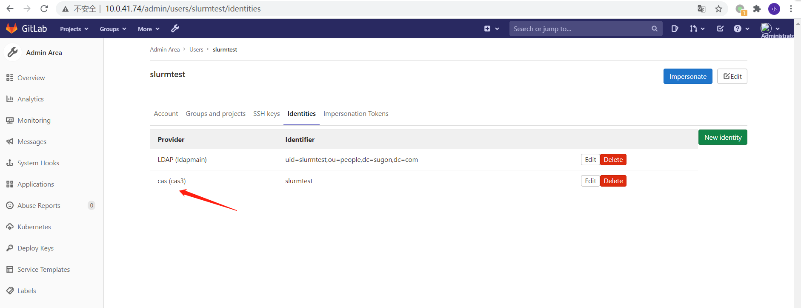

# CAS 集成gitlab

<!-- TOC -->

- [CAS 集成gitlab](#cas-集成gitlab)
  - [参考](#参考)
  - [更新配置](#更新配置)
  - [gitlab账号与CAS账号之间的关系](#gitlab账号与cas账号之间的关系)
  - [gitlab 账号 与 CAS 账号的关联。](#gitlab-账号-与-cas-账号的关联)
  - [自动跳转CAS 登录](#自动跳转cas-登录)

<!-- /TOC -->


## 参考
- https://docs.gitlab.com/ee/integration/cas.html


## 更新配置

编辑 gitlab 的配置文件 /etc/gitlab/gitlab.rb。

新增如下配置

```ruby
gitlab_rails['omniauth_allow_single_sign_on'] = false
gitlab_rails['omniauth_block_auto_created_users'] = false
# 自动跳转到 CAS 来实现SSO 登录，为了调试方便，可以先关掉它
gitlab_rails['omniauth_auto_sign_in_with_provider'] = 'cas3'

gitlab_rails['omniauth_providers'] = [
  {
      "name"=> "cas3",
      "label"=> "cas",
      "args"=> {
          "url"=> 'http://10.0.41.74:8090',
          "login_url"=> '/cas/login',
          "service_validate_url"=> '/cas/p3/serviceValidate',
          "logout_url"=> '/cas/logout'
      }
  }
]
```

执行 `gitlab-ctl reconfigure`。执行完成后，重新启动 gitlab。


##  gitlab账号与CAS账号之间的关系

gitlab自己本身维护一套用户系统，cas服务也一套用户系统，gitlab可以将两者关联起来，然后用户可以选择其中一种方式进行登录就可以了。

根据用户是否有gitlab账号，可以分为两种情况：

1. 已有gitlab账号的，用户可按原来的登录方式进行登录，然后在用户设置里关联cas账号，也可以由root账号进行统一的关联。

2. 没有gitlab账号的，在直接使用cas服务登录的时候，根据参数的配置，分为以下几种情况：


- 自动创建同名的gitlab账号，锁定该账号。需要登录root账号，解锁该账号，然后完善个人信息以后，可以使用。配置如下

```ruby
gitlab_rails['omniauth_allow_single_sign_on'] = ['cas3']
gitlab_rails['omniauth_block_auto_created_users'] = true
```

- 自动创建同名的gitlab账号，不锁定该账号。完善个人信息以后，就可以使用。

```ruby
gitlab_rails['omniauth_allow_single_sign_on'] = ['cas3']
gitlab_rails['omniauth_block_auto_created_users'] = false
```

- 不创建账号，直接提示”需要绑定已有的账号"。

```ruby
gitlab_rails['omniauth_allow_single_sign_on'] = false
```


## gitlab 账号 与 CAS 账号的关联。

使用 gitlab 管理员账号，登陆gitlab。然后切换到用户管理界面。添加一个identity。将CAS账户，与gitlab账户绑定就可以了。



## 自动跳转CAS 登录

在一些应用场景中，要求用户处于未登录状态下的时候，自动跳转CAS 登录。这时 可以使用下面的配置。

```ruby
# 自动跳转到 CAS 来实现SSO 登录，为了调试方便，可以先关掉它
gitlab_rails['omniauth_auto_sign_in_with_provider'] = 'cas3'
```

这时 访问 gitlab 的地址，就能直接跳转到 CAS 的登陆页面。

