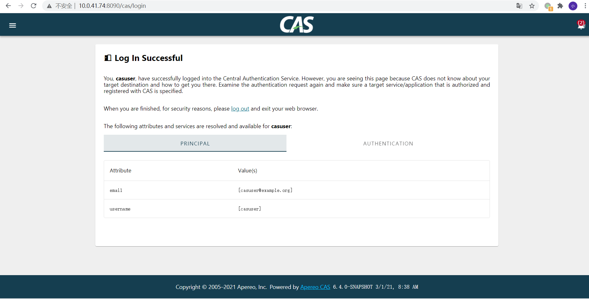

# 1. CAS 安装

<!-- TOC -->

- [1. CAS 安装](#1-cas-安装)
  - [参考](#参考)
  - [下载cas](#下载cas)
  - [构建CAS Server War](#构建cas-server-war)
  - [修改配置](#修改配置)
  - [部署CAS War](#部署cas-war)
    - [方法一： 使用 tomcat  部署](#方法一-使用-tomcat--部署)
    - [方法二：  使用内置的 web server （也是tocmat） 部署](#方法二--使用内置的-web-server-也是tocmat-部署)

<!-- /TOC -->

## 参考

- https://stackoverflow.com/questions/59560367/setup-apereo-cas-management-integrated-with-cas-server
- https://apereo.github.io/cas-management/6.3.x/installation/Installing-ServicesMgmt-Webapp.html
- https://apereo.github.io/cas/6.3.x/
- https://github.com/apereo/cas


**cas-overlay-template** 下载 地址 [https://github.com/hdeadman/cas-overlay-template](https://github.com/hdeadman/cas-overlay-template)

**cas-management** 下载地址 [https://github.com/apereo/cas-management](https://github.com/apereo/cas-management)


## 下载cas


下载 [cas overlay template](https://github.com/hdeadman/cas-overlay-template) 项目。 

通过 查看代码配置发现，内置的tomcat 版本为 9.0 为了保持一致，我们也下载 9.0 版本的tomcat。


## 构建CAS Server War
最新版本的cas 部署，推荐使用overlay 方式.

也就是说，我们下载的 `cas-overlay-template` 项目，并不是项目本身，相反，他是一个单独的overlay 项目。可以用来发布cas.
 
1. 进入到 java workspace 目录下，下载 `cas-overlay-template` 项目。

`git clone https://github.com/apereo/cas-overlay-template.git`


2. 手动指定 gradle 的java home,在gradle.properties 文件中添加下面一行。

`org.gradle.java.home=/usr/lib/jdk-11.0.10`


3. 指定本地的gradle，避免每次都下载,在gradle-wrapper.properties 文件中，修改下面一行。如果是

`distributionUrl=file:///mnt/d/download/gradle-6.8.3-bin.zip`


4. 执行 ./gradlew clean build 就可以 构建出一个 cas war 包了。


## 修改配置


修改 项目目录下的 /etc/cas/config/cas.properties


```properties

cas.server.name=http://10.0.41.74:8090
cas.server.prefix=${cas.server.name}/cas

logging.config: file:/etc/cas/config/log4j2.xml
server.port=8090
server.ssl.enabled=false

cas.service-registry.core.init-from-json=true
cas.serviceRegistry.json.location=file:/etc/cas/services

cas.authn.oauth.grants.resourceOwner.requireServiceHeader=true
cas.authn.oauth.userProfileViewType=NESTED

cas.authn.policy.requiredHandlerAuthenticationPolicyEnabled=false

cas.authn.attributeRepository.stub.attributes.email=casuser@example.org
#REST API JSON
cas.rest.attributeName=email
cas.rest.attributeValue=.+example.*

# cas.authn.accept.users=

```

将 cas 目录 拷贝到  系统的 /etc 目录下


## 部署CAS War

构建出来的cas.war 包，既可以单独部署，又可以部署到tomcat 中去。

### 方法一： 使用 tomcat  部署

将cas.war 拷贝到 tomcat 的 webapps 目录下,修改 tomcat server.xml 文件 ，新增下面的配置

```xml
 <Connector port="8443" protocol="HTTP/1.1" SSLEnabled="true"
    maxThreads="150" scheme="https" secure="true"
    clientAuth="false" sslProtocol="TLS"
    keystoreFile="/etc/cas/thekeystore"
    keystorePass="changeit" />  
```

启动 tomcat 

由于 cas.war 比较大，启动过程需要花费一些时间。

启动完成后，cas.war 就被解压了。


这时 访问 https://10.0.41.74:8443/cas  使用 casuser Mellon 就可以登陆了


### 方法二：  使用内置的 web server （也是tocmat） 部署


将 cas.war 拷贝到服务器的指定目录下。

运行 `java -jar -server -noverify -Xmx2048M -XX:+TieredCompilation -XX:TieredStopAtLevel=1 cas.war ` 命令。


这时 访问 https://10.0.41.74:8443/cas  使用 casuser Mellon 就可以登陆了

在默认配置下，日志的输出可以从 /etc/cas/config/log4j2.xml

登录成功之后，截图如下：


