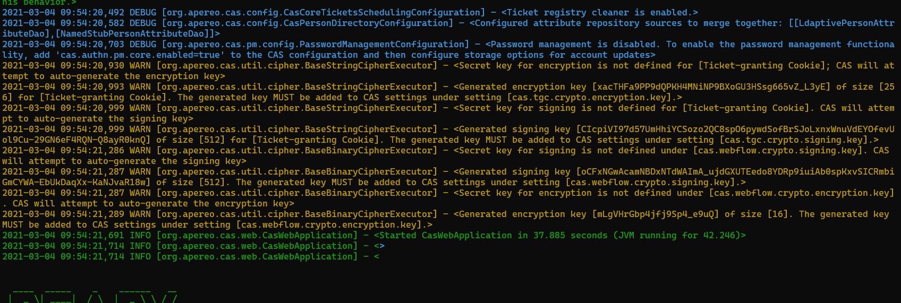
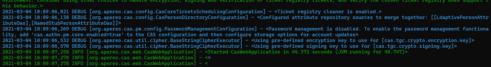

# CAS 集成 ldap

<!-- TOC -->

- [CAS 集成 ldap](#cas-集成-ldap)
  - [环境介绍](#环境介绍)
  - [参考](#参考)
  - [重新构建CAS Server War](#重新构建cas-server-war)
  - [生成CAS encryption and signing keys](#生成cas-encryption-and-signing-keys)
  - [更新CMS Server 配置](#更新cms-server-配置)

<!-- /TOC -->

接下来我们配置 CAS 与本地的LDAP 服务进行集成。

## 环境介绍

- CAS 6.4.0 (小版本之间差异也很大)
- CentOS 7.5
- JDK 11
- Tomcat 9.0

## 参考


- https://apereo.github.io/cas/6.3.x/planning/Installation-Requirements.html
- https://apereo.github.io/cas-management/6.3.x/installation/Configuration-Properties.html#ldap-authorization
- https://apereo.github.io/tags/
- https://apereo.github.io/2019/02/18/cas61-saml2-idp-gitlab/


## 重新构建CAS Server War

在 cas-overlay-template 项目中添加下面的依赖文件。

```gradle
implementation "org.apereo.cas:cas-server-support-ldap:${project.'cas.version'}"
```
这是 引入了  LDAP 的support，执行 `gradle clean build` 重新构建，cas.war 包。


## 生成CAS encryption and signing keys

进入到 cas-overlay-template 项目目录下，执行下面的命令,就可以构建一个本地的cas shell 终端了。

```shell
gradlew downloadShell
java -jar build/libs/cas-server-support-shell-6.4.0-SNAPSHOT.jar
```
敲击 电脑的 tab 键，可以提示命令。

输入`help [COMMAND]` 可以显示命令帮助。

也可以参考 [https://apereo.github.io/2017/10/30/intro-cas-cli-shell/](https://apereo.github.io/2017/10/30/intro-cas-cli-shell/)

然后分别生成下面的五个参数。

```shell
cas.tgc.crypto.encryption.key=
cas.tgc.crypto.signing.key=
cas.webflow.crypto.signing.key=
cas.webflow.crypto.encryption.key=
cas.webflow.crypto.encryption.key=
```

如果 不会生成也没有关系，后面cas 启动的过程中，能够看到相应的日志，将自动生成的key 拷贝出来，添加到配置文件中，再重新启动也可以。

启动CAS 时候，注意观察 启动日志，会发现有下面这样的WARN 提醒。



如果提前配置好了这些key，或者将日志中的key 复制添加到配置文件中并重新启动CAS之后，这时的日志输出是。



## 更新CMS Server 配置

- [https://apereo.github.io/cas/6.2.x/configuration/Configuration-Properties.html#ldap-authentication](https://apereo.github.io/cas/6.2.x/configuration/Configuration-Properties.html#ldap-authentication)
- [https://apereo.github.io/2019/02/18/cas61-saml2-idp-gitlab/](https://apereo.github.io/2019/02/18/cas61-saml2-idp-gitlab/)
- [https://apereo.github.io/cas/5.2.x/installation/Configuration-Properties.html#ldap-authentication-1](https://apereo.github.io/cas/5.2.x/installation/Configuration-Properties.html#ldap-authentication-1)

以上三条可以供参考学习。

- **最重要** [https://apereo.github.io/cas/development/authentication/LDAP-Authentication.html#ldap-authentication](https://apereo.github.io/cas/development/authentication/LDAP-Authentication.html#ldap-authentication)

    **提醒**： 这里笔者试了很长一段时间，在网上google了很多的资料，即便是借鉴了其他的成功案例，依然一直出错。直到最后认真查看了最新版本的帮助文档，仔细尝试了一下，才真正的实验成功。这里有一个小小的忠告，CAS的帮助文档，即便是一个小版本的变化，差异也非常大。例如这里部署的是CAS 6.4.0. 我看了 6.3.x 系列的帮助文档，一直出错，并且帮助文档写的不明不白。

编辑 `/etc/cas/config/cas.properties` 文件，添加如下的配置。

```properties
cas.server.name=http://10.0.41.74:8090
cas.server.prefix=${cas.server.name}/cas

logging.config: file:/etc/cas/config/log4j2.xml
server.port=8090
server.ssl.enabled=false


cas.service-registry.core.init-from-json=true
cas.serviceRegistry.json.location=file:/etc/cas/services

#cas.authn.oauth.grants.resourceOwner.requireServiceHeader=true
#cas.authn.oauth.userProfileViewType=NESTED
#
#cas.authn.policy.requiredHandlerAuthenticationPolicyEnabled=true
#
#cas.authn.attributeRepository.stub.attributes.email=casuser@example.org

# 开启debug 模式
logging.level.org.apereo.cas=DEBUG

# don't allow login of built-in users
cas.authn.accept.users=

## 下面这些key ，如果暂时没有生成，先不用填。启动过程中注意查看日志，会自动生成。
cas.tgc.crypto.encryption.key=xacTHFa9PP9dQPKH4MNiNP9BXoGU3HSsg665vZ_L3yE
cas.tgc.crypto.signing.key=CIcpiVI97d57UmHhiYCSozo2QC8spO6pywdSofBrSJoLxnxWnuVdEYOfevUol9Cu-29GN6eF4RQN-Q8ayR0knQ
cas.webflow.crypto.signing.key=oCFxNGwAcamNBDxNTdWAImA_ujdGXUTEedo8YDRp9iuiAb0spKxvSICRmbiGmCYWA-EbUkDaqXx-KaNJvaR18w
cas.webflow.crypto.encryption.key=mLgVHrGbp4jfj9Sp4_e9uQ

ldap-url=ldap://10.0.41.74:389
ldap-dnformat=uid=%s,ou=People,dc=sugon,dc=com
ldap-base-dn=dc=sugon,dc=com
ldap-bind-dn=cn=ldapadm,dc=sugon,dc=com
ldap-bind-credential=root;123

cas.authn.ldap[0].password-policy.groovy.location=
cas.authn.ldap[0].principal-transformation.groovy.location=
cas.authn.ldap[0].base-dn=${ldap-base-dn}
cas.authn.ldap[0].bind-dn=${ldap-bind-dn}
cas.authn.ldap[0].bind-credential=${ldap-bind-credential}
cas.authn.ldap[0].dn-format=${ldap-dnformat}
cas.authn.ldap[0].ldap-url=${ldap-url}
cas.authn.ldap[0].search-filter=(uid={user})
cas.authn.ldap[0].type=DIRECT
cas.authn.ldap[0].password-encoder.encoding-algorithm=
cas.authn.ldap[0].password-encoder.type=NONE

```

重新启动 CAS，然后就可以在 `http://10.0.41.74:8090/cas/login` 使用ldap用户去登录啦。


<!-- --------------------------------------------------------------------------------------------------------
下面的这部分内容不一定正确暂时先注销掉
--------------------------------------------------------------------------------------------------------


## CAS Management 参考

- [https://jasigcas.readthedocs.io/en/latest/cas-server-documentation/installation/LDAP-Service-Management.html](https://jasigcas.readthedocs.io/en/latest/cas-server-documentation/installation/LDAP-Service-Management.html)
- [https://apereo.github.io/cas-management/6.3.x/installation/Installing-ServicesMgmt-Webapp.html](https://apereo.github.io/cas-management/6.3.x/installation/Installing-ServicesMgmt-Webapp.html)
  


## 重新build CAS Management war


在gradle.properties 文件中添加下面一行。

```properties
cas.version=6.4.0
```

这里的版本之所以是6.4.0,是需要与我们之前部署的CAS 保持版本一致。

在 `cas-management-overlay` 项目中，添加下面的依赖。其他配置，与之前介绍的内容保持一致。

```gradle
dependencies {
    // Other CAS Management dependencies/modules may be listed here...
    compile "org.apereo.cas:cas-management-webapp-support-ldap:${project.'cas.version'}"
}
```

重新执行 `./build.sh package` 命令，构建 cas-management.war

## 更新CAS Management 配置


编辑 `/etc/cas/config/cas-management.properties` 文件，添加如下的配置。

```properties


ldap-url=ldap://10.0.41.74:389
ldap-dnformat=uid=%s,ou=People,dc=sugon,dc=com
ldap-base-dn=dc=sugon,dc=com
ldap-bind-dn=cn=ldapadm,dc=sugon,dc=com
ldap-bind-credential=root;123


mgmt.ldap.ldap-url = ${ldap-url}
mgmt.ldap.bind-dn = ${ldap-bind-dn}
mgmt.ldap.bind-credential =${ldap-bind-credential}
# mgmt.ldap.use-ssl = false

# mgmt.ldap.trust-certificates =
# mgmt.ldap.keystore = 
# mgmt.ldap.keystore-password =
# mgmt.ldap.keystore-type = 

# mgmt.ldap.min-pool-size = 3
mgmt.ldap.max-pool-size = 20
# mgmt.ldap.pool-passivator = BIND
# mgmt.ldap.validate-on-checkout = true
# mgmt.ldap.validate-periodically = true 
# mgmt.ldap.validate-timeout = PT5S
# mgmt.ldap.validate-period = PT5M 

# mgmt.ldap.fail-fast = true
# mgmt.ldap.idle-time = PT10M
# mgmt.ldap.prune-period = PT2H
# mgmt.ldap.block-wait-time = PT3S
# mgmt.ldap.connection-strategy =
# mgmt.ldap.use-start-tls = 
# mgmt.ldap.connect-timeout = PT5S
# mgmt.ldap.response-timeout = PT5S
# mgmt.ldap.provider-class = 
# mgmt.ldap.allow-multiple-dns = false
# mgmt.ldap.sasl-realm = 
# mgmt.ldap.sasl-mechanism = 
# mgmt.ldap.sasl-authorization-id = 
# mgmt.ldap.sasl-security-strength = 
# mgmt.ldap.sasl-mutual-auth = 
# mgmt.ldap.sasl-quality-of-protection = 


# mgmt.ldap.ldap-authz.role-attribute = uugid
# mgmt.ldap.ldap-authz.role-prefix = ROLE_
# mgmt.ldap.ldap-authz.allow-multiple-results =
# mgmt.ldap.ldap-authz.group-attribute =
# mgmt.ldap.ldap-authz.group-prefix =
# mgmt.ldap.ldap-authz.group-filter =
# mgmt.ldap.ldap-authz.group-base-dn =
mgmt.ldap.ldap-authz.base-dn = ${ldap-base-dn}
mgmt.ldap.ldap-authz.search-filter = (uid={user})

```
 -->
