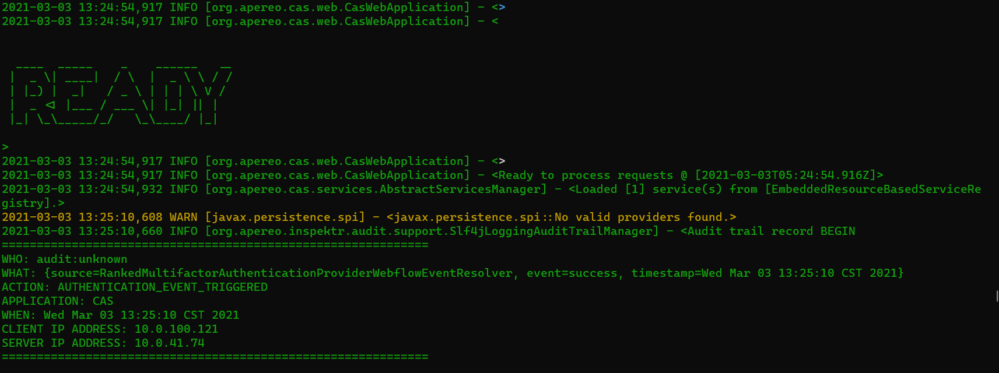
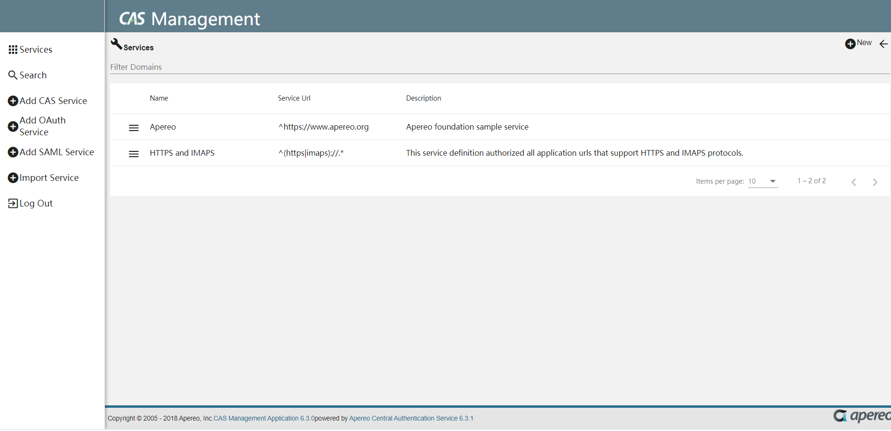

# CAS Serivce Management

<!-- TOC -->

- [CAS Serivce Management](#cas-serivce-management)
  - [参考](#参考)
  - [下载 cas  management overlay template](#下载-cas--management-overlay-template)
  - [构建CAS Management war](#构建cas-management-war)
  - [修改配置](#修改配置)
  - [部署 CAS Management War](#部署-cas-management-war)
  - [将CAS Management 服务注册到 CAS Server上](#将cas-management-服务注册到-cas-server上)
  - [登录 CAS Management](#登录-cas-management)

<!-- /TOC -->


**CAS Service management** 是 CAS 单独独立出来的一款应用。用来管理哪些服务能够接入到CAS中。

## 参考

- https://apereo.github.io/cas-management/6.3.x/installation/Installing-ServicesMgmt-Webapp.html
- https://apereo.github.io/cas/6.3.x/


**CAS management** 项目地址 [https://github.com/apereo/cas-management](https://github.com/apereo/cas-management)
**CAS management overlay** 项目地址 [https://github.com/apereo/cas-management-overlay](https://github.com/apereo/cas-management-overlay)


## 下载 cas  management overlay template

下载 [cas  management overlay template](https://github.com/apereo/cas-management-overlay) 项目。 

通过 查看代码配置发现，内置的tomcat 版本为 9.0 为了保持一致，我们也下载 9.0 版本的tomcat。


## 构建CAS Management war

1. 编辑gradle.properties 文件,修改 `casmgmt.version=6.3.0` 因为已经没有snapshot版本了


2. 手动指定 gradle 的java home,在gradle.properties 文件中添加下面一行。
  `org.gradle.java.home=/usr/lib/jdk-11.0.10`

3. 指定本地的gradle，避免每次都下载,在gradle-wrapper.properties 文件中，修改下面一行。
  `distributionUrl=file:///mnt/d/download/gradle-6.8.3-bin.zip`

4. 执行 build.sh package 就可以构建出cas-management.war 了。


## 修改配置

修改项目目录下 的/etc/cas/config/management.properties 

如果与CAS Server 部署在同一台机器上，其中 的cas 的路径 以及 `server.port` 需要格外注意，避免引起端口冲突。
```

cas.server.name=http://10.0.41.74:8090
cas.server.prefix=${cas.server.name}/cas
mgmt.serverName=http://10.0.41.74:8091
mgmt.adminRoles[0]=ROLE_ADMIN
mgmt.userPropertiesFile=file:/etc/cas/config/users.json
server.port=8091
server.ssl.enabled=false
logging.config=file:/etc/cas/config/log4j2-management.xml
```

将 /etc/cas/config/ 目录下的内容，拷贝到系统的 同目录下。

## 部署 CAS Management War

在服务器上执行 下面的命令，就可以启动 CAS  Management 服务了。

`nohup  java -Xdebug -Xrunjdwp:transport=dt_socket,address=5001,server=y,suspend=n -jar cas-management.war > cas-management.log 2>&1 &`


## 将CAS Management 服务注册到 CAS Server上

CAS Server 是用来为集成进来的服务提供 SSO 登录服务的。

CAS Management 是用来管理哪些服务可以通过CAS Server 单点登录。

那这样来看的话，CAS Management 也可以是一个需要通过CAS Server来单点登录的服务。

所以，接下来，我们将 CAS Management 注册到 CAS Server 上。

参考文档 [json-syntax](https://apereo.github.io/cas/6.3.x/services/JSON-Service-Management.html?#json-syntax)

在前面的CAS Server 安装过程中，我们指定了一个配置`cas.service-registry.core.init-from-json=true`,这个配置的含义是CAS Server 在启动的时候，从json 配置文件中加载注册的服务。 **注意：** 通过json这种来存储注册服务方式仅限于演示环境，正式环境需要采用数据库来存储。

进入到 `/etc/cas/service` 目录下，添加下面的文件，**注意** 文件的名称有详细的规则，可以参考前面给出的文档。

```shell
]# cat web-10000001.json
{
  "@class" : "org.apereo.cas.services.RegexRegisteredService",
  "serviceId" : "^(https|imaps|http)://.*",
  "name" : "web",
  "id" : 10000001,
  "evaluationOrder" : 10
}
```

这是用正则表达式，配置的一个服务注册。

重新启动cas，通过查看日志就可以发现，已经有1个服务被加载进来了。




## 登录 CAS Management

在浏览器中输入 `http://10.0.41.74:8091/cas-management` ,这时，由于 CAS Management 处于未登录状态，会自动跳转到 CAS Server 的集成登录界面，仔细观察这时浏览器的地址是 `http://10.0.41.74:8090/cas/login?service=http://10.0.41.74:8091/cas-management/`。 这也意味着，虽然登录是在CAS server 端，登录成功之后，就会跳转到CAS Management 端。

使用 casuser Mellon 登录成功后，会自动跳转回 CAS management 的管理首页。


