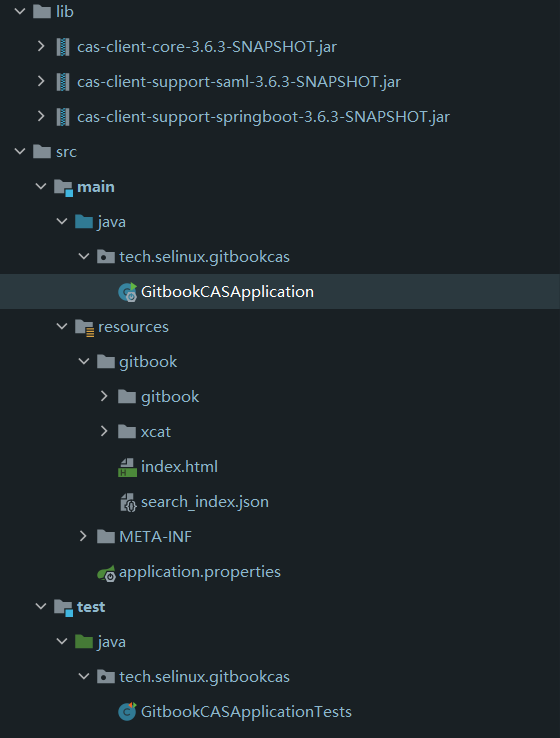
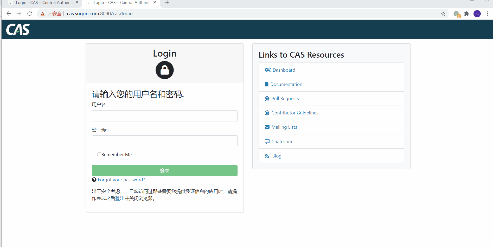

# SpringBoot 集成CAS 与Gitbook

<!-- TOC -->

- [SpringBoot 集成CAS 与Gitbook](#springboot-集成cas-与gitbook)
  - [Gibook 与 CAS 的集成](#gibook-与-cas-的集成)
  - [参考](#参考)
  - [Springboot 项目](#springboot-项目)
    - [初始化项目](#初始化项目)
    - [添加CAS Client的依赖。](#添加cas-client的依赖)
    - [修改gradle配置](#修改gradle配置)
    - [修改application.properties](#修改applicationproperties)
    - [修改代码](#修改代码)
    - [项目结构](#项目结构)
  - [注册服务](#注册服务)
  - [启动Gitbook Service](#启动gitbook-service)

<!-- /TOC -->

关于Gitbook的介绍这里不再赘述。只说明一点，**gitbook是将一系列组织好的markdown文件，生成对应静态文件的框架** 。有了gitbook生成的静态文件，我们就可以将其单独部署在nginx或者apache下，来单独进行访问。当然也可以直接使用gitbook的命令来搭建一个gitbook站点。

## Gibook 与 CAS 的集成

前面说到，gitbook 本质上就是一系列的静态文件，而且不支持RBAC等功能。一般来说我们在技术类社区看到的gitbook其实都是开放性的，由于应用场景的特殊性，我们需要将Gitbook与CAS 结合，为用户提供基于CAS的认证访问方式。并且与前面文章中介绍到的WordPress以及Gitlab打通。

这样的话，我们就可以通过Springboot集成CAS Client ，然后将 Gitbook build 之后的静态文件与Springboot 结合，就可以构建出一个基于CAS的JAVA应用。

## 参考

- [CAS Client](https://github.com/apereo/java-cas-client/releases)

## Springboot 项目

### 初始化项目
 
初始化一个 springboot 项目，在项目目录 resources 下创建一个 gitboot 目录。将 gitbook build 之后的内容放在这个目录下面。

### 添加CAS Client的依赖。

截止到本地实验的时候，官方发布的版本是 `cas-client-support-springboot:3.6.0`,经过实验以及查看源代码发现，这个版本中还没有将 Sing Logout 的功能包含进去，所以我们需要单独从源码进行构建依赖包。
   
下载[java-cas-client](https://github.com/apereo/java-cas-client) 项目到本地workspace，然后 本别构建 **cas-client-core**，**cas-client-support-saml**，**cas-client-support-springboot**,这三个项目。

在项目目录下，创建一个lib目录，将构建好的jar吧，拷贝到这个lib 目录下。


### 修改gradle配置

在build.gradle中添加如下的配置。

```gradle
dependencies {
    compile fileTree(dir: 'lib', includes: ['*.jar'])
    implementation 'org.springframework.boot:spring-boot-starter-web'
    implementation 'org.springframework.boot:spring-boot-starter-thymeleaf'
//    implementation 'org.jasig.cas.client:cas-client-support-springboot:3.6.0'
    testImplementation 'org.springframework.boot:spring-boot-starter-test'
    testImplementation 'io.projectreactor:reactor-test'
}
```

### 修改application.properties

新增如下的配置

```properties
cas.server-url-prefix=https://cas.domain.com:8090/cas
cas.server-login-url=https://cas.domain.com:8090/cas/login
cas.client-host-url=http://cas.domain.com:8092

# 这个配置如果想生效，应该需要重新构建 jar包
cas.single-logout.enabled=true
cas.validation-type=CAS3

server.port=8092

spring.web.resources.static-locations=classpath:/gitbook/,classpath:/test/

#cas.authentication-url-patterns
#cas.validation-url-patterns
#cas.request-wrapper-url-patterns
#cas.assertion-thread-local-url-patterns
#cas.gateway
#cas.use-session
#cas.attribute-authorities
#cas.redirect-after-validation
#cas.allowed-proxy-chains
#cas.proxy-callback-url
#cas.proxy-receptor-url
#cas.accept-any-proxy
#server.context-parameters.renew
```

### 修改代码

修改程序入口文件。

```java
package tech.selinux.gitbookcas;

import org.jasig.cas.client.boot.configuration.EnableCasClient;
import org.springframework.boot.SpringApplication;
import org.springframework.boot.autoconfigure.SpringBootApplication;

@SpringBootApplication
@EnableCasClient
public class GitbookCASApplication {

    public static void main(String[] args) {

        SpringApplication.run(GitbookCASApplication.class, args);
    }

}

```

### 项目结构

整个项目结构非常简单，完全采用CAS Client的自动配置就可以完成。项目目录如下图所示。



项目的实力代码 可以点击连接进行下载 [gitbook-cas](code/gitbook-cas.tar.gz)


## 注册服务

将新开发的服务，注册到CAS Service中。在 `/etc/cas/services/` 目录中，添加一个 Gitbook-10000006.json 的文件。

```json
{
  "@class": "org.apereo.cas.services.RegexRegisteredService",
  "serviceId": "^http://cas.domain.com:8092/.*",
  "name": "Gitbook",
  "id": 10000006,
  "description": "Gitbook sample service",
  "singleSignOnParticipationPolicy": {
    "@class": "org.apereo.cas.services.DefaultRegisteredServiceSingleSignOnParticipationPolicy",
    "createCookieOnRenewedAuthentication": "TRUE"
  },
  "evaluationOrder": 30000,
  "usernameAttributeProvider": {
    "@class": "org.apereo.cas.services.DefaultRegisteredServiceUsernameProvider"
  },
  "logoutType": "BACK_CHANNEL",
  "attributeReleasePolicy": {
    "@class": "org.apereo.cas.services.ReturnAllowedAttributeReleasePolicy",
    "principalAttributesRepository": {
      "@class": "org.apereo.cas.authentication.principal.DefaultPrincipalAttributesRepository"
    },
    "authorizedToReleaseCredentialPassword": true,
    "authorizedToReleaseProxyGrantingTicket": true
  },
  "accessStrategy": {
    "@class": "org.apereo.cas.services.DefaultRegisteredServiceAccessStrategy",
    "unauthorizedRedirectUrl" : "http://cas.domain.com",
    "enabled": true,
    "ssoEnabled": true
  },
  "properties" : {
    "@class" : "java.util.HashMap",
    "skipRequiredServiceCheck" : {
      "@class" : "org.apereo.cas.services.DefaultRegisteredServiceProperty",
      "values" : [
        "java.util.HashSet",
        [
          "true" ] ]
    }
  }
}

```

## 启动Gitbook Service

启动gitbook Service ，然后访问服务地址，就可以实现基于CAS 的单点登录了。

