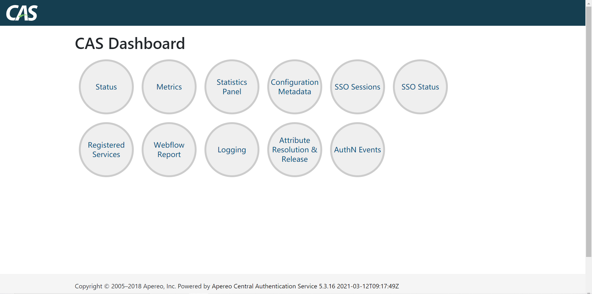

# SSO & SLO

在前面我们介绍了CAS Server 以及CAS Management。还介绍了CAS 结合LDAP来进行验证。

众所周知，CAS 本身是一个SSO 与 SLO 框架，接下来我们就来记录一下如何使用CAS 来实现SSO 和 SLO.
<!-- TOC -->

- [SSO & SLO](#sso--slo)
  - [环境介绍](#环境介绍)
  - [安装包的准备](#安装包的准备)
    - [cas](#cas)
    - [cas-management](#cas-management)
  - [HTTPS](#https)
    - [生成证书](#生成证书)
  - [更新配置](#更新配置)
    - [CAS](#cas-1)
    - [CAS Management](#cas-management-1)
    - [CAS Service](#cas-service)
    - [WordPress](#wordpress)
    - [gitlab](#gitlab)
  - [Actuator 界面](#actuator-界面)
  - [提升](#提升)

<!-- /TOC -->


## 环境介绍

前面的介绍中，我们已经实现了gitlab 集成CAS+ LDAP 来实现登录验证，接下来我们还是采用gitlab，再加上WordPress 的方式实现和模拟SSO 以及SLO。

整体的方案如下图所示。


在之前的文章中，我们介绍CAS 都是使用的目前的最新版本 6.4.0。截止笔者整理这篇教程的时候，CAS 6.4.0 还未正式发布。也正式因为如此，在实验过程遇到了很多无法解决的问题，查遍全网也没有找到原因以及对应的解决方案。

因此，我们将CAS 的版本降低，来满足我们的实验要求。CAS应该降低到哪一个版本，这里也没有很好的依据。最终是根据Wordpress 的CAS 插件支持的最高版本决定了。

因此最终的 实验环境如下

- WP-cassify (WordPress 的CAS插件。截止实验时，这个插件最高支持CAS 5.3.x，因此我们的CAS也选择在5.3.x)
- CAS 5.3.x
- Gitlab CE 13.8.2
- openldap-2.4.44-20.el7.x86_64
- JDK 8

## 安装包的准备

由于 CAS 的版本降低到了 5.3.x。 所以需要重新构建cas.war,以及cas-management.war。 

### cas

clone 下来 cas-overlay-template。 参照之前的介绍修改cas.properties 和 maven 的配置。

在pom.xml 中添加如下的依赖。这些依赖在使用过程中，都需要用到。

```xml
<dependency>
    <groupId>org.apereo.cas</groupId>
    <artifactId>cas-server-support-ldap</artifactId>
    <version>${cas.version}</version>
</dependency>
<dependency>
    <groupId>org.apereo.cas</groupId>
    <artifactId>cas-server-support-json-service-registry</artifactId>
    <version>${cas.version}</version>
</dependency>
<dependency>
    <groupId>org.apereo.cas</groupId>
    <artifactId>cas-server-webapp-config-security</artifactId>
    <version>${cas.version}</version>
</dependency>
```

然后构建出来 cas.war 文件。

### cas-management

clone 下来 cas-management-overlay 项目。参照之前的介绍修改 management.properties 和maven 配置。

然后构建出来 cas-management.war 文件。

## HTTPS

CAS 框架作为一个认证登录框架，安全是首位重要的。在实验过程中，可以使用http来进行。我们这里配置一下 HTTPS .

.


### 生成证书

生成证书的时候，[需要注意要使用域名进行生成，使用ip生成的话，会有问题](https://www.oschina.net/question/106294_112887)。


```
What is your first and last name?
  [Unknown]:  cas.sugon.com
What is the name of your organizational unit?
  [Unknown]:  sugon.com
What is the name of your organization?
  [Unknown]:  sugon
What is the name of your City or Locality?
  [Unknown]:  qingdao
What is the name of your State or Province?
  [Unknown ]:  shandong
What is the two-letter country code for this unit?
  [Unknown]:  zh
Is CN=cas.sugon.com, OU=sugon.com, O=sugon, L=qingdao, ST=shandong, C=zh correct?
  [no]:  yes
```

启用生成的这个证书

```
# Export the certificate into a file
keytool -export -file /etc/cas/keys/cas.crt -keystore /etc/cas/keys/the-cas-ssl-keystore -alias cas

# Import the certificate into the global keystore
sudo keytool -import -file /etc/cas/keys/cas.crt -alias cas -keystore $JAVA_HOME/lib/security/cacerts
```


## 更新配置

### CAS 

CAS 5.3.x 版本的配置，与 后来版本的配置有着巨大的差异。这里将所有的配置罗列下来，以备参考。

```properties
cas.server.name=https://10.0.41.74:8090
cas.server.prefix=${cas.server.name}/cas
logging.config=file:/etc/cas/config/log4j2.xml
server.port=8090
server.ssl.enabled=true
server.ssl.key-store=file:/etc/cas/keys/the-cas-ssl-keystore
server.ssl.key-store-password=changeit
server.ssl.key-password=changeit
server.ssl.key-alias=cas

spring.main.allow-bean-definition-overriding=true


# sso 配置
cas.sso.allowMissingServiceParameter=true
cas.sso.createSsoCookieOnRenewAuthn=true
cas.sso.proxyAuthnEnabled=true
cas.sso.renewAuthnEnabled=true

cas.tgc.crypto.enabled=true
cas.tgc.max-age=-1
cas.tgc.httpOnly=false
cas.tgc.secure=false
cas.tgc.pinToSession=true
cas.tgc.rememberMeMaxAge=P14D

cas.slo.disabled=false
cas.slo.asynchronous=true

cas.logout.followServiceRedirects=true
cas.logout.redirectParameter=service
cas.logout.confirmLogout=false
cas.logout.removeDescendantTickets=false

cas.serviceRegistry.initFromJson=true
cas.serviceRegistry.watcherEnabled=true
cas.serviceRegistry.json.location=file:/etc/cas/services

cas.authn.oauth.grants.resourceOwner.requireServiceHeader=true
cas.authn.oauth.userProfileViewType=NESTED
cas.authn.policy.any.try-all=false
cas.authn.policy.any.enabled=true

cas.ticket.tgt.rememberMe.enabled=true
cas.ticket.tgt.rememberMe.timeToKillInSeconds=1209600


# 开启debug 模式
logging.level.org.apereo.cas=DEBUG

# don't allow login of built-in users
cas.authn.accept.users=

## 下面这些key ，如果暂时没有生成，先不用填。启动过程中注意查看日志，会自动生成。

cas.tgc.crypto.signing.key=CIcpiVI97d57UmHhiYCSozo2QC8spO6pywdSofBrSJoLxnxWnuVdEYOfevUol9Cu-29GN6eF4RQN-Q8ayR0knQ
cas.tgc.crypto.signing.key-size=512

cas.tgc.crypto.encryption.key=xacTHFa9PP9dQPKH4MNiNP9BXoGU3HSsg665vZ_L3yE
cas.tgc.crypto.encryption.key-size=256
cas.tgc.crypto.alg=AES
cas.tgc.crypto.enabled=false

cas.authn.token.crypto.encryption.key=NIPZxwVwveB017VDuZTcZnR1MaCqscSaJmivFOA7d_c
cas.authn.token.crypto.signing.key=heX91m6vPc2Miu3iPD-HlOBqsA_LwQMKDlfPp0pLelPeRHmllJrrd99ThrltYcLZCQ05TC2OaPxSyE6HnsyqLw

cas.webflow.crypto.signing.key=oCFxNGwAcamNBDxNTdWAImA_ujdGXUTEedo8YDRp9iuiAb0spKxvSICRmbiGmCYWA-EbUkDaqXx-KaNJvaR18w
cas.webflow.crypto.encryption.key=mLgVHrGbp4jfj9Sp4_e9uQ

# ldap 的验证配置
ldap-dnformat=uid=%s,ou=People,dc=sugon,dc=com


cas.authn.ldap[0].ldap-url=ldap://10.0.41.74:389
cas.authn.ldap[0].bindDn=cn=ldapadm,dc=sugon,dc=com
cas.authn.ldap[0].bindCredential=root;123
cas.authn.ldap[0].baseDn=dc=sugon,dc=com
ldap-dnformat=uid=%s,ou=People,dc=sugon,dc=com

cas.authn.ldap[0].dnFormat=${ldap-dnformat}

cas.authn.ldap[0].searchFilter=(uid={user})
cas.authn.ldap[0].type=DIRECT
cas.authn.ldap[0].useSsl=false
cas.authn.ldap[0].useStartTls=false


# cas 的监控界面

cas.adminPagesSecurity.ip=.+
cas.monitor.endpoints.enabled=true
cas.monitor.endpoints.dashboard.enabled=true
cas.monitor.endpoints.discovery.enabled=true
cas.monitor.endpoints.auditEvents.enabled=true
cas.monitor.endpoints.authenticationEvents.enabled=true
cas.monitor.endpoints.configurationState.enabled=true
cas.monitor.endpoints.healthCheck.enabled=true
cas.monitor.endpoints.loggingConfig.enabled=true
cas.monitor.endpoints.metrics.enabled=true
cas.monitor.endpoints.attributeResolution.enabled=true
cas.monitor.endpoints.singleSignOnReport.enabled=true
cas.monitor.endpoints.statistics.enabled=true
cas.monitor.endpoints.trustedDevices.enabled=true
cas.monitor.endpoints.status.enabled=true
cas.monitor.endpoints.singleSignOnStatus.enabled=true
cas.monitor.endpoints.springWebflowReport.enabled=true
cas.monitor.endpoints.registeredServicesReport.enabled=true
cas.monitor.endpoints.configurationMetadata.enabled=true

cas.monitor.endpoints.sensitive=false
cas.monitor.endpoints.dashboard.sensitive=false
cas.monitor.endpoints.discovery.sensitive=false
cas.monitor.endpoints.auditEvents.sensitive=false
cas.monitor.endpoints.authenticationEvents.sensitive=false
cas.monitor.endpoints.configurationState.sensitive=false
cas.monitor.endpoints.healthCheck.sensitive=false
cas.monitor.endpoints.loggingConfig.sensitive=false
cas.monitor.endpoints.metrics.sensitive=false
cas.monitor.endpoints.attributeResolution.sensitive=false
cas.monitor.endpoints.singleSignOnReport.sensitive=false
cas.monitor.endpoints.statistics.sensitive=false
cas.monitor.endpoints.trustedDevices.sensitive=false
cas.monitor.endpoints.status.sensitive=false
cas.monitor.endpoints.singleSignOnStatus.sensitive=false
cas.monitor.endpoints.springWebflowReport.sensitive=false
cas.monitor.endpoints.registeredServicesReport.sensitive=false
cas.monitor.endpoints.configurationMetadata.sensitive=false

```

### CAS Management

更新一下 cas-management的配置

```properties

cas.server.name=https://10.0.41.74:8090
cas.server.prefix=${cas.server.name}/cas
mgmt.serverName=http://10.0.41.74:8091
mgmt.adminRoles[0]=ROLE_ADMIN
mgmt.userPropertiesFile=file:/etc/cas/config/users.json
server.port=8091
logging.config=file:/etc/cas/config/log4j2-management.xml


cas.serviceRegistry.json.location=file:/etc/cas/services
mgmt.defaultLocale=zh

```

### CAS Service

将 CAS Management， WordPress ， Gitlab的服务注册到 CAS 中。本次实验采用 JSON 存储，手动配置的方式来注册这些服务。

**CasManagement-10000003.json**

```json
{
    "@class": "org.apereo.cas.services.RegexRegisteredService",
    "serviceId": "^http://10.0.41.74:8091/cas-management/.*",
    "name": "CasManagement",
    "id": 10000003,
    "description": "CAS Management sample service.",
    "evaluationOrder": 10000,
    "usernameAttributeProvider": {
        "@class": "org.apereo.cas.services.DefaultRegisteredServiceUsernameProvider"
    },
    "logoutType": "BACK_CHANNEL",
    "attributeReleasePolicy": {
        "@class": "org.apereo.cas.services.ReturnAllowedAttributeReleasePolicy",
        "principalAttributesRepository": {
            "@class": "org.apereo.cas.authentication.principal.DefaultPrincipalAttributesRepository"
        },
        "authorizedToReleaseCredentialPassword": true,
        "authorizedToReleaseProxyGrantingTicket": true
    },
    "singleSignOnParticipationPolicy": {
        "@class": "org.apereo.cas.services.DefaultRegisteredServiceSingleSignOnParticipationPolicy",
        "createCookieOnRenewedAuthentication": "TRUE"
    },
    "accessStrategy": {
        "@class": "org.apereo.cas.services.DefaultRegisteredServiceAccessStrategy",
        "enabled": true,
        "ssoEnabled": true
    }
}
```

**Gitlab-10000004.json**

```json
{
  "@class": "org.apereo.cas.services.RegexRegisteredService",
  "serviceId": "^http://10.0.41.74/.*",
  "name": "Gitlab",
  "id": 10000004,
  "description": "Gitlab sample service",
  "singleSignOnParticipationPolicy": {
    "@class": "org.apereo.cas.services.DefaultRegisteredServiceSingleSignOnParticipationPolicy",
    "createCookieOnRenewedAuthentication": "TRUE"
  },
  "evaluationOrder": 20000,
  "usernameAttributeProvider": {
    "@class": "org.apereo.cas.services.DefaultRegisteredServiceUsernameProvider"
  },
  "logoutType": "BACK_CHANNEL",
  "attributeReleasePolicy": {
    "@class": "org.apereo.cas.services.ReturnAllowedAttributeReleasePolicy",
    "principalAttributesRepository": {
      "@class": "org.apereo.cas.authentication.principal.DefaultPrincipalAttributesRepository"
    },
    "authorizedToReleaseCredentialPassword": true,
    "authorizedToReleaseProxyGrantingTicket": true
  },
  "accessStrategy": {
    "@class": "org.apereo.cas.services.DefaultRegisteredServiceAccessStrategy",
    "unauthorizedRedirectUrl" : "http://10.0.41.74",
    "enabled": true,
    "ssoEnabled": true
  },
  "properties" : {
    "@class" : "java.util.HashMap",
    "skipRequiredServiceCheck" : {
      "@class" : "org.apereo.cas.services.DefaultRegisteredServiceProperty",
      "values" : [
        "java.util.HashSet",
        [
          "true" ] ]
    }
  }
}
```

**Wordpress-10000005.json**

```json
{
    "@class": "org.apereo.cas.services.RegexRegisteredService",
    "serviceId": "^http://10.0.41.74:8002/wp-.*",
    "name": "Wordpress",
    "id": 10000005,
    "description": "Wordpress sample service.",
    "evaluationOrder": 10000,
    "usernameAttributeProvider": {
        "@class": "org.apereo.cas.services.DefaultRegisteredServiceUsernameProvider"
    },
    "logoutType": "BACK_CHANNEL",
    "logoutUrl":"http://10.0.41.74:8002/wp-login.php?loggedout=true&wp_lang=zh_CN",
    "attributeReleasePolicy": {
        "@class": "org.apereo.cas.services.ReturnAllowedAttributeReleasePolicy",
        "principalAttributesRepository": {
            "@class": "org.apereo.cas.authentication.principal.DefaultPrincipalAttributesRepository"
        },
        "authorizedToReleaseCredentialPassword": true,
        "authorizedToReleaseProxyGrantingTicket": true
    },
    "singleSignOnParticipationPolicy": {
        "@class": "org.apereo.cas.services.DefaultRegisteredServiceSingleSignOnParticipationPolicy",
        "createCookieOnRenewedAuthentication": "TRUE"
    },
    "accessStrategy": {
        "@class": "org.apereo.cas.services.DefaultRegisteredServiceAccessStrategy",
        "unauthorizedRedirectUrl" : "http://10.0.41.74:8002/",
        "enabled": true,
        "ssoEnabled": true
    },
"properties" : {
    "@class" : "java.util.HashMap",
    "skipRequiredServiceCheck" : {
      "@class" : "org.apereo.cas.services.DefaultRegisteredServiceProperty",
      "values" : [ "java.util.HashSet", [ "true" ] ]
    }
  }
}
```

**NOTE:**在后面服务正常启动后，可以在 /etc/cas/services-repo 目录下，看到这些服务被以json文件的形式存储在磁盘上。

### WordPress

Wordpress 中关于CAS 的配置是基于 WP Cassify 插件来的。可以查看下面的一个截图。


### gitlab 

gitlab 的配置与之前没有什么大的不同。依然贴在下面供参考。

```ruby
gitlab_rails['omniauth_enabled'] = true
gitlab_rails['omniauth_allow_single_sign_on'] = ['cas3']
gitlab_rails['omniauth_block_auto_created_users'] = false
gitlab_rails['omniauth_sync_email_from_provider'] = 'cas3'
gitlab_rails['omniauth_sync_profile_from_provider'] = ['cas3']
gitlab_rails['omniauth_sync_profile_attributes'] = ['email']
gitlab_rails['omniauth_auto_sign_in_with_provider'] = 'cas3'
gitlab_rails['omniauth_providers'] = [
  {
      "name"=> "cas3",
      "label"=> "cas",
      "args"=> {
          "url"=> 'https://10.0.41.74:8090',
          "ssl": true,
          "disable_ssl_verification": true,
          "login_url"=> '/cas/login',
          "service_validate_url"=> '/cas/p3/serviceValidate',
          "logout_url"=> '/cas/logout'
      }
  }
]
```

上面说的这些 配置都更新好以后，就可以进行 SSO & SLO 测试了。

## Actuator 界面

CAS 框架本身提供了 可以用于管理SSO Session 以及 查看 服务运行状态的接口。 在前面的配置中已经涵盖了，这里我们主要是贴一下截截图，仅供参考。



参考

- https://apereo.github.io/2018/06/15/cas53-admin-endpoints-security/
- https://apereo.github.io/cas/5.3.x/installation/Monitoring-Statistics.html

## 提升

- Service 注册尽量采用DB 来存储
- 管理界面要加上权限验证
- 集群部署
- tomcat session 高可用
  
