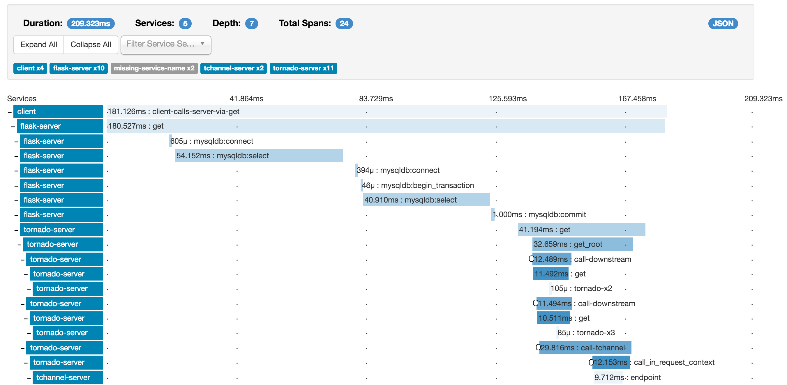

# Jaeger && ZipKin

Jaeger 和 Zipkin 是目前业界使用比较多的分布式追踪工具，同时他们也各有各的优点，关于他们具体的使用，我们这里并不会进行具体的介绍，只会会结合二者的官网进行一下对比，为我们实际工作中的选型进行一些准备。

首先我们来看下二者的UI界面，对他们有一个直观的了解。

[**Jaeger**](https://www.jaegertracing.io/docs/)

[**ZipKin**](https://zipkin.io/)

## 编程语言支持

首先我们来看下 [Jaeger](https://www.jaegertracing.io/docs/1.12/client-libraries/#supported-libraries)

Language | GitHub Repo
-|-
Go | [jaegertracing/jaeger-client-go](https://github.com/jaegertracing/jaeger-client-go)
Java | [jaegertracing/jaeger-client-java](https://github.com/jaegertracing/jaeger-client-java)
Node.js | [jaegertracing/jaeger-client-node](https://github.com/jaegertracing/jaeger-client-node)
Python | [jaegertracing/jaeger-client-python](https://github.com/jaegertracing/jaeger-client-python)
C++ | [jaegertracing/jaeger-client-cpp](https://github.com/jaegertracing/jaeger-client-cpp)
C# | [aegertracing/jaeger-client-csharp](https://github.com/jaegertracing/jaeger-client-csharp)

同时Jaeger对其他编程语言的支持正在进行开发，可以查看 [Github issue #366](https://github.com/jaegertracing/jaeger/issues/366)，以及一些其他的特性，可以查看一下官方的介绍。

接下来看下 [ZipKin](https://zipkin.io/pages/tracers_instrumentation)。

ZipKin 官方的支持能够比Jaeger丰富一些，同时有很多社区版的实现。 [ZipKin tracer instrumentation](https://zipkin.io/pages/tracers_instrumentation)

Language | GitHub Repo
-|-
C# | [Zipkin4net](https://github.com/openzipkin/zipkin4net)
Go | [zipkin-go](https://github.com/openzipkin/zipkin-go)
Java | [brave](https://github.com/openzipkin/brave)
JavaScript | [zipkin-js](https://github.com/openzipkin/zipkin-js)
Ruby | [zipkin-ruby](https://github.com/openzipkin/zipkin-ruby)
Scala | [zipkin-finagle](https://github.com/openzipkin/zipkin-finagle)
PHP | [zipkin-php](https://github.com/openzipkin/zipkin-php)

综上来看，二者都对一些主流的编程语言进行了支持，但是也都缺乏对某些编程语言的支持，或者正在支持中。所以实际使用中需要根据实际情况进行相应的选型。

## 部署和运维

首先来看下 [Jaeger](https://www.jaegertracing.io/docs) 的架构图:

然后我们来看下 ZipKin 的架构图：

从上面的两张图中可以看出，二者的架构有些类似。都是由嵌入到代码中的client来收集数据，并传输到Collector端进行存储，然后集中通过UI进行展示。

数据的存储部分可以选择ElasticSearch和Cassandra。这在选型上需要注意。

Jaeger是CNCF中的一员，现在的基于Istio的ServiceMesh已经直接采用Jaeger来进行服务链路追踪。

ZipKin 也提供了基于容器的部署和扩展方式，在实际生产中可以进行考虑使用，但是与ServiceMesh的结合似乎还没有得到有效的验证。

## 开源社区

Jaeger 和 ZipKin 都在github上进行了开源。接下来，我们比较一下二者的社区发展，为选型提供一些建议。

_ |Jaeger|Zipkin
-|-|-
**Contributors** | 98 | 79
**Open Issues** | 258 | 240
**Open PRs**  | 30 | 9
**GitHub Stars** | 8286 | 11169

## 结论

综合上面几个方面的比较能够发现，其实二者的差别并不是很大，实际选型中一般需要根据自己的技术栈，以及公司的整体架构进行选型确定。例如编程语言，容器，kubernetes，存储等多方面的因素。
