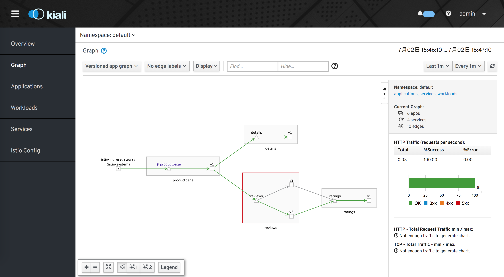

# Service Mesh: 基于 Istio 的落地实践（一）

<!-- TOC -->

- [Service Mesh: 基于 Istio 的落地实践（一）](#Service-Mesh-%E5%9F%BA%E4%BA%8E-Istio-%E7%9A%84%E8%90%BD%E5%9C%B0%E5%AE%9E%E8%B7%B5%E4%B8%80)
  - [init Kubernetes](#init-Kubernetes)
  - [安装istio](#%E5%AE%89%E8%A3%85istio)
    - [下载安装](#%E4%B8%8B%E8%BD%BD%E5%AE%89%E8%A3%85)
    - [初始化自定义资源](#%E5%88%9D%E5%A7%8B%E5%8C%96%E8%87%AA%E5%AE%9A%E4%B9%89%E8%B5%84%E6%BA%90)
  - [安装BookInfo](#%E5%AE%89%E8%A3%85BookInfo)
    - [安装](#%E5%AE%89%E8%A3%85)
    - [确定 Ingress 的 IP 和端口](#%E7%A1%AE%E5%AE%9A-Ingress-%E7%9A%84-IP-%E5%92%8C%E7%AB%AF%E5%8F%A3)
  - [Prometheus 指标数据](#Prometheus-%E6%8C%87%E6%A0%87%E6%95%B0%E6%8D%AE)
  - [Grafana Dashboard](#Grafana-Dashboard)
  - [分布式链路追踪 Jaeger](#%E5%88%86%E5%B8%83%E5%BC%8F%E9%93%BE%E8%B7%AF%E8%BF%BD%E8%B8%AA-Jaeger)
  - [网格可视化kiali](#%E7%BD%91%E6%A0%BC%E5%8F%AF%E8%A7%86%E5%8C%96kiali)
  - [删除Istio 以及Demo示例](#%E5%88%A0%E9%99%A4Istio-%E4%BB%A5%E5%8F%8ADemo%E7%A4%BA%E4%BE%8B)
  - [总结](#%E6%80%BB%E7%BB%93)

<!-- /TOC -->

## init Kubernetes

传送门  [二进制安装 kubernetes](../../kubernetes/k8s/install.md)

## 安装istio

### 下载安装

下载istio 安装

进入 [Istio release](https://github.com/istio/istio/releases) 页面，下载对应目标操作系统的安装文件。在 macOS 或者 Linux 系统中，还可以运行下面的命令，进行下载和自动解压缩：

```shell

$ curl -L https://git.io/getLatestIstio | ISTIO_VERSION=1.2.2 sh -

$ cd istio-1.2.2

$ export PATH=$PWD/bin:$PATH
```

### 初始化自定义资源

istio 本身进行了很多的资源自定义。 首先需要将这些自定义的资源创建出来。

```shell

$ for i in install/kubernetes/helm/istio-init/files/crd*yaml; do kubectl apply -f $i; done

$ kubectl get crd | grep istio
adapters.config.istio.io               2019-06-29T04:49:22Z
attributemanifests.config.istio.io     2019-06-29T04:49:22Z
authorizationpolicies.rbac.istio.io    2019-06-29T04:49:22Z
clusterrbacconfigs.rbac.istio.io       2019-06-29T04:49:22Z
destinationrules.networking.istio.io   2019-06-29T04:49:21Z
envoyfilters.networking.istio.io       2019-06-29T04:49:22Z
gateways.networking.istio.io           2019-06-29T04:49:22Z
handlers.config.istio.io               2019-06-29T04:49:22Z
httpapispecbindings.config.istio.io    2019-06-29T04:49:22Z
httpapispecs.config.istio.io           2019-06-29T04:49:22Z
instances.config.istio.io              2019-06-29T04:49:22Z
meshpolicies.authentication.istio.io   2019-06-29T04:49:22Z
policies.authentication.istio.io       2019-06-29T04:49:22Z
quotaspecbindings.config.istio.io      2019-06-29T04:49:22Z
quotaspecs.config.istio.io             2019-06-29T04:49:22Z
rbacconfigs.rbac.istio.io              2019-06-29T04:49:22Z
rules.config.istio.io                  2019-06-29T04:49:22Z
serviceentries.networking.istio.io     2019-06-29T04:49:22Z
servicerolebindings.rbac.istio.io      2019-06-29T04:49:22Z
serviceroles.rbac.istio.io             2019-06-29T04:49:22Z
sidecars.networking.istio.io           2019-06-29T04:49:22Z
templates.config.istio.io              2019-06-29T04:49:22Z
virtualservices.networking.istio.io    2019-06-29T04:49:21Z
```

执行istio-demo的安装,因为需要下载很多的镜像，而且大部分在国外，耗时比较长。

```shell
$ kubectl apply -f install/kubernetes/istio-demo.yaml

```

确认下列 Kubernetes 服务已经部署并都具有各自的 `CLUSTER-IP`

```shell
$ kubectl get svc -n istio-system
NAME                     TYPE           CLUSTER-IP       EXTERNAL-IP   PORT(S)                                                                                                                                     AGE
grafana                  ClusterIP      10.254.33.222    <none>        3000/TCP                                                                                                                                    97s
istio-citadel            ClusterIP      10.254.211.95    <none>        8060/TCP,15014/TCP                                                                                                                          97s
istio-egressgateway      ClusterIP      10.254.42.123    <none>        80/TCP,443/TCP,15443/TCP                                                                                                                    97s
istio-galley             ClusterIP      10.254.229.63    <none>        443/TCP,15014/TCP,9901/TCP                                                                                                                  98s
istio-ingressgateway     LoadBalancer   10.254.145.221   <pending>     15020:14115/TCP,80:31380/TCP,443:31390/TCP,31400:31400/TCP,15029:14870/TCP,15030:9447/TCP,15031:14863/TCP,15032:10432/TCP,15443:15781/TCP   97s
istio-pilot              ClusterIP      10.254.92.10     <none>        15010/TCP,15011/TCP,8080/TCP,15014/TCP                                                                                                      97s
istio-policy             ClusterIP      10.254.106.5     <none>        9091/TCP,15004/TCP,15014/TCP                                                                                                                97s
istio-sidecar-injector   ClusterIP      10.254.35.98     <none>        443/TCP                                                                                                                                     97s
istio-telemetry          ClusterIP      10.254.119.223   <none>        9091/TCP,15004/TCP,15014/TCP,42422/TCP                                                                                                      97s
jaeger-agent             ClusterIP      None             <none>        5775/UDP,6831/UDP,6832/UDP                                                                                                                  97s
jaeger-collector         ClusterIP      10.254.167.118   <none>        14267/TCP,14268/TCP                                                                                                                         97s
jaeger-query             ClusterIP      10.254.10.189    <none>        16686/TCP                                                                                                                                   97s
kiali                    ClusterIP      10.254.19.166    <none>        20001/TCP                                                                                                                                   97s
prometheus               ClusterIP      10.254.177.180   <none>        9090/TCP                                                                                                                                    97s
tracing                  ClusterIP      10.254.237.37    <none>        80/TCP                                                                                                                                      97s
zipkin                   ClusterIP      10.254.188.138   <none>        9411/TCP                                                                                                                                    97s


```

**如果你的集群在一个没有外部负载均衡器支持的环境中运行，istio-ingressgateway 的 EXTERNAL-IP 会是 `<pending>`。要访问这个网关，只能通过服务的 NodePort 或者使用端口转发来进行访问。**

这一点很重要，这与后面访问应用时有着紧密的联系。

确认必要的 Kubernetes Pod 都已经创建并且其 `STATUS` 的值是 `Running`：

```shell
$ kubectl get pods -n istio-system
NAME                                      READY   STATUS             RESTARTS   AGE
grafana-97fb6966d-7n2dn                   1/1     Running            0          4m43s
istio-citadel-7c7c5f5c99-9ctwx            1/1     Running            0          4m43s
istio-cleanup-secrets-1.2.2-qnd5p         0/1     Completed          0          4m44s
istio-egressgateway-f7b8cc667-lfwx4       0/1     Running            0          4m43s
istio-galley-585fc86678-pkhzn             1/1     Running            0          4m43s
istio-grafana-post-install-1.2.2-76sgq    1/1     Running            1          4m44s
istio-ingressgateway-cfbf989b7-b8rx7      1/1     Running            0          4m43s
istio-pilot-68f587df5d-qjmf4              2/2     Running            0          4m43s
istio-policy-76cbcc4774-dlrvt             2/2     Running            6          4m43s
istio-security-post-install-1.2.2-t75bl   1/1     Running            1          4m44s
istio-sidecar-injector-97f9878bc-mfbvf    1/1     Running            0          4m42s
istio-telemetry-5f4575974c-gr8qw          2/2     Running            2          4m43s
istio-tracing-595796cf54-q5z9d            1/1     Running            0          4m42s
kiali-55fcfc86cc-8wr9t                    1/1     Running            0          4m43s
prometheus-5679cb4dcd-jxn2x               1/1     Running            0          4m43s

```

如果上面 的pod 运行不正常，尤其是 `istio-policy` 和  `istio-telemetry` ，这两个pod 在构造上是一样的。其中  `istio-telemetry` 是专门用于收集遥测数据的Mixer服务组件。`istio-policy`  是另一个Mixer服务，和 `istio-telemetry` 基本上是完全相同的机制和流程，Data Plane在转发服务的请求前调用 `istio-policy` 的Check 接口检查是否允许访问。Mixer 根据配置将请求转发到对应的Adapter做对应检查。给代理返回允许访问还是拒绝。

关于这些组件，我们后期还会有详细的介绍。这里暂且略过。

如果运行过程中出现了什么错误的话，可以去check一下 docker image 是否有多个版本存在的问题。

例如笔者曾经以 官方 istio-1.2.0 进行实验，一直出错。后来换成了 isito-1.2.2,又把集群中每个node 上的 docker image 检查了一遍，把 tag:1.2.0 的镜像全部删除掉了。详见 文末 **删除Istio 以及Demo示例** 部分。


## 安装BookInfo

### 安装

在使用 kubectl apply 进行应用部署的时候，如果目标命名空间已经打上了标签 `istio-injection=enabled`，`Istio sidecar injector` 会自动把 Envoy 容器注入到你的应用 Pod 之中。

这里，我们采用默认的 namespace dafault 避免出错之后不好排查。

```shell

$ kubectl create namespace bookinfo

$ kubectl label namespace bookinfo istio-injection=enabled

$ kubectl apply -f samples/bookinfo/platform/kube/bookinfo.yaml -n bookinfo

```

验证一下bookinfo 的 `service`  `pod` 运行状况

```shell
$ kubectl get services -n bookinfo
NAME          TYPE        CLUSTER-IP       EXTERNAL-IP   PORT(S)    AGE
details       ClusterIP   10.254.254.166   <none>        9080/TCP   114s
productpage   ClusterIP   10.254.59.59     <none>        9080/TCP   114s
ratings       ClusterIP   10.254.245.84    <none>        9080/TCP   114s
reviews       ClusterIP   10.254.37.253    <none>        9080/TCP   114s


$ kubectl get pods -n bookinfo
NAME                              READY   STATUS    RESTARTS   AGE
details-v1-7964b4bb49-rzrs4       2/2     Running   0          45s
productpage-v1-6c668694dc-v6685   2/2     Running   0          45s
ratings-v1-7bb4dbd557-d44d5       2/2     Running   0          45s
reviews-v1-597f899bf6-fg6hh       2/2     Running   0          45s
reviews-v2-664994896d-694tw       2/2     Running   0          45s
reviews-v3-fc984656d-mx48l        2/2     Running   0          45s

```

要确认 Bookinfo 应用程序正在运行，请通过某个 pod 中的 curl 命令向其发送请求，例如来自 ratings:

不要忘记，我们默认的的namespace 已经换成了bookinfo

```shell

$ kubectl exec -it $(kubectl get pod -n bookinfo -l app=ratings -o jsonpath='{.items[0].metadata.name}') -n bookinfo  -c ratings -- curl productpage:9080/productpage | grep -o "<title>.*</title>"

<title>Simple Bookstore App</title>
```

### 确定 Ingress 的 IP 和端口

为应用程序定义入口网关：

```shell

$ kubectl apply -f samples/bookinfo/networking/bookinfo-gateway.yaml  -n bookinfo

```

确认网关创建完成：

```shell
$ kubectl get gateway -n bookinfo
NAME               AGE
bookinfo-gateway   47s
```

接下来，确定 `INGRESS_HOST` 和 `INGRESS_PORT` 变量.

**确定入口 IP 和端口**,执行以下命令以确定 Kubernetes 集群是否在支持外部负载均衡器的环境中运行

```shell
$ kubectl get svc istio-ingressgateway -n istio-system
NAME                   TYPE           CLUSTER-IP       EXTERNAL-IP   PORT(S)                                                                                                                                     AGE
istio-ingressgateway   LoadBalancer   10.254.145.221   <pending>     15020:14115/TCP,80:31380/TCP,443:31390/TCP,31400:31400/TCP,15029:14870/TCP,15030:9447/TCP,15031:14863/TCP,15032:10432/TCP,15443:15781/TCP   60m
```

如果 `EXTERNAL-IP` 有值（IP 地址或主机名），则说明环境具有可用于 `Ingress` 网关的外部负载均衡器。如果 `EXTERNAL-IP` 值是 `<none>`（或一直是 `<pending>` ），则说明可能环境并没有为 `Ingress` 网关提供外部负载均衡器的功能。在这种情况下，可以使用 `Service` 的 `node port` 方式访问网关。

```shell

$ export INGRESS_PORT=$(kubectl -n istio-system get service istio-ingressgateway -o jsonpath='{.spec.ports[?(@.name=="http2")].nodePort}')
$ export SECURE_INGRESS_PORT=$(kubectl -n istio-system get service istio-ingressgateway -o jsonpath='{.spec.ports[?(@.name=="https")].nodePort}')

$ export INGRESS_HOST=$(kubectl get po -l istio=ingressgateway -n istio-system -o 'jsonpath={.items[0].status.hostIP}')

$ export GATEWAY_URL=$INGRESS_HOST:$INGRESS_PORT

```

**确认应用在运行中**

可以用 curl 命令来确认 Bookinfo 应用的运行情况

```shell

$  curl -s http://${GATEWAY_URL}/productpage | grep -o "<title>.*</title>"
<title>Simple Bookstore App</title>


```

**应用缺省目标规则**

在使用 Istio 控制 Bookinfo 版本路由之前，你需要在目标规则中定义好可用的版本，命名为 subsets 。
```shell

$ kubectl apply -f samples/bookinfo/networking/destination-rule-all.yaml -n bookinfo

```

可以使用以下命令查看目标规则

```shell

kubectl get destinationrules -o yaml

```

**访问我们的应用**

输入下面的地址，返回 200 的话，就说明部署成功

```shell
$ curl -o /dev/null -s -w "%{http_code}\n" http://${GATEWAY_URL}/productpage
200
```

当然也可以通过 http://${GATEWAY_URL}/productpage 来访问。如下的界面。


## Prometheus 指标数据

前面的示例中，官方默认安装了一系列的可测试组件。

可以执行下面的命令，就可以在浏览器 使用 `http://hostip:9090/graph` 中打开promethues UI 界面了。

```shell

$  kubectl -n istio-system port-forward --address 0.0.0.0 $(kubectl -n istio-system get pod -l app=prometheus -o jsonpath='{.items[0].metadata.name}') 9090:9090 &

```


详细的测试数据可以参考官方的教程。

## Grafana Dashboard

首先确保 Prometheus 和 Grafana 在集群中运行

```shell
$  kubectl -n istio-system get svc prometheus
NAME         TYPE        CLUSTER-IP       EXTERNAL-IP   PORT(S)    AGE
prometheus   ClusterIP   10.254.177.180   <none>        9090/TCP   3d2h
$  kubectl -n istio-system get svc grafana
NAME      TYPE        CLUSTER-IP      EXTERNAL-IP   PORT(S)    AGE
grafana   ClusterIP   10.254.33.222   <none>        3000/TCP   3d2h

```

执行下面的命令，在 浏览器中打开 `http://hostip:3000/dashboard/db/istio-mesh-dashboard`

```shell

$ kubectl -n istio-system port-forward --address 0.0.0.0 $(kubectl -n istio-system get pod -l app=grafana -o jsonpath='{.items[0].metadata.name}') 3000:3000 &

```


## 分布式链路追踪 Jaeger 

执行下面的命令，在浏览器中打开 `http://hostip:15032`，就可以访问到分布式链路追踪的UI了。

```shell

$ kubectl -n istio-system port-forward --address 0.0.0.0 $(kubectl -n istio-system get pod -l app=jaeger -o jsonpath='{.items[0].metadata.name}') 15032:16686

```


## 网格可视化kiali

确定kiali在集群中运行

```shell
$ kubectl -n istio-system get svc kiali
NAME    TYPE        CLUSTER-IP      EXTERNAL-IP   PORT(S)     AGE
kiali   ClusterIP   10.254.19.166   <none>        20001/TCP   3d3h
```

执行下面的命令，浏览器界面打开 `http://hostip:20001/kiali/console/`就可以对服务网格进行可视化查看了。

默认账户密码 `admin:admin`

isito 官方还有 如何创建secret的详细教程可以参考。




## 删除Istio 以及Demo示例

删除路由规则，并终结应用的 Pod
samples/bookinfo/platform/kube/cleanup.sh

确认应用已经关停

```shell

$ kubectl get virtualservices   #-- there should be no virtual services
$ kubectl get destinationrules  #-- there should be no destination rules
$ kubectl get gateway           #-- there should be no gateway
$ kubectl get pods               #-- the Bookinfo pods should be deleted
```

删除 Gateway 和 VirtualService，并关闭 httpbin 服务：

```shell

$ kubectl delete gateway httpbin-gateway
$ kubectl delete virtualservice httpbin
$ kubectl delete --ignore-not-found=true -f samples/httpbin/httpbin.yaml
```

删除自定义资源

```shell
for i in install/kubernetes/helm/istio-init/files/crd*yaml; do kubectl delete  -f $i  -n bookinfo ; done
```

删除镜像 ,找到相应的image 版本，替换掉 `1.2.0` 执行下面的命令

```shell
for i in $(docker image ls  | grep 1.2.0 | cut -f 1 -d " "); do docker rmi  $i:1.2.0 ;done
```

## 总结

本文虽然说是实践，但是更多的却是将官方的例子跑了起来，没有什么特殊的地方，争取以后详细地输出落地实践的学习心得。
