# Service Mesh : Istio详解
<!-- TOC -->

- [Service Mesh : Istio详解](#Service-Mesh--Istio%E8%AF%A6%E8%A7%A3)
  - [两个平面](#%E4%B8%A4%E4%B8%AA%E5%B9%B3%E9%9D%A2)
  - [Data Plane](#Data-Plane)
    - [xDS-API](#xDS-API)
    - [服务负载 && 流量控制 && 服务发现](#%E6%9C%8D%E5%8A%A1%E8%B4%9F%E8%BD%BD--%E6%B5%81%E9%87%8F%E6%8E%A7%E5%88%B6--%E6%9C%8D%E5%8A%A1%E5%8F%91%E7%8E%B0)
    - [Ingress 和 Egress](#Ingress-%E5%92%8C-Egress)
    - [故障处理机制](#%E6%95%85%E9%9A%9C%E5%A4%84%E7%90%86%E6%9C%BA%E5%88%B6)
  - [Control Plane](#Control-Plane)
    - [Pilot](#Pilot)
    - [Mixer](#Mixer)
    - [Citadel](#Citadel)
    - [可靠性和延迟](#%E5%8F%AF%E9%9D%A0%E6%80%A7%E5%92%8C%E5%BB%B6%E8%BF%9F)
    - [属性](#%E5%B1%9E%E6%80%A7)
    - [安全控制](#%E5%AE%89%E5%85%A8%E6%8E%A7%E5%88%B6)
  - [kubernetes 服务组网示意](#kubernetes-%E6%9C%8D%E5%8A%A1%E7%BB%84%E7%BD%91%E7%A4%BA%E6%84%8F)
  - [总结](#%E6%80%BB%E7%BB%93)

<!-- /TOC -->


本篇文章是基于 [官方网站](https://istio.io/zh/docs/concepts/what-is-istio/) 和 《Service Mesh实战用Istio软负载实现服务网格》的学习笔记

## 两个平面

首先还是来看Istio官方给出的架构。

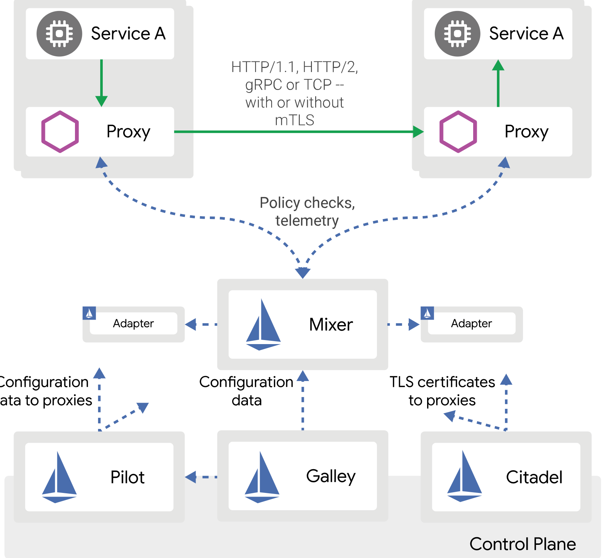

从架构图以及官方文档的解释来看，整体逻辑可以分为上下两层：

- **Data Plane**: 由一系列的网关构成(官方是Envoy,不强耦合),这与Nginx作为代理最大的区别就是可以通过API配置实时生效，实现动态化的流量代理。
- **Control Plane**: 对 **Data Plane** 中 代理网关的统一配置与维护平台，不仅包括请求路由，还包括限流降级，熔断，日志收集，性能监控等各种请求。被分成了Pilot,Galley,Citadel 和Mixer四个模块。

## Data Plane

### xDS-API

[Envoy 官方文档中文版](http://www.servicemesher.com/envoy/)

在Envoy中，xDS-API中的xDS其实是一类发现服务的统称，包括下面这些：

- **SDS/EDS(Service/Endpoint(v2) Discovery Service)**: 节点发现服务，针对的是那些提供服务的节点(可能是一个pod 或者其他),让节点可以聚合成服务的方式提供给调用方。V2版本API中，Service 升级为Endpoint.
- **CDS(Cluster Discovery Service)**:集群发现服务，集群指的是Envoy接管的集群。Istio可以利用这个接口创建虚拟机集群，例如一个应用可以划分不同版本的部署结构。
- **RDS(Route Discovery Service)**: 路由规则发现服务，路由规则的作用就是动态转发，基于此可以实现请求漂移，蓝绿发布等。
- **LDS(Listener Discovery Service)**: 监听器发现服务，监听器主要作用于Envoy的链接状态，如链接总数，活动的连接数等。

### 服务负载 && 流量控制 && 服务发现

同样还是以官方网站的示意图为例：

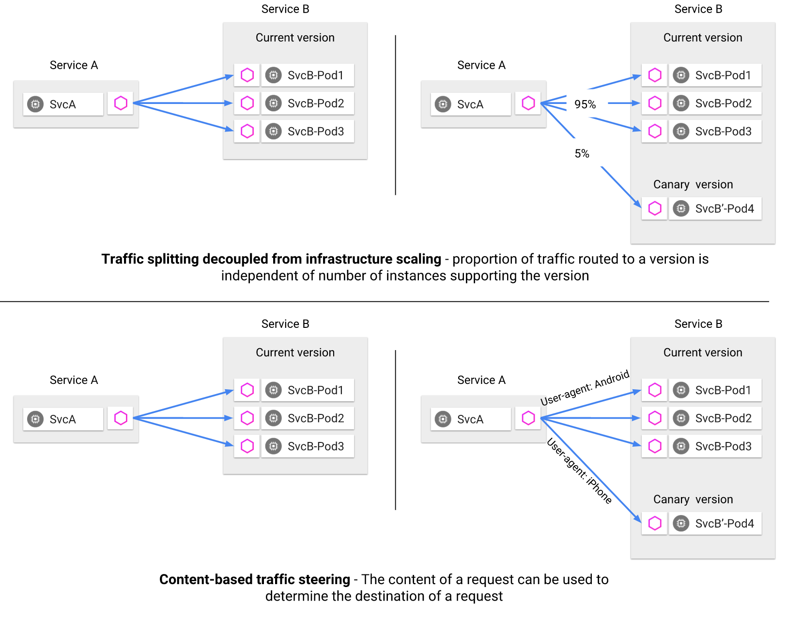

通过 控制平面发送 配置规则，就可以将流量进行分配，或按照版本（金丝雀发布），或按照其他规则（User-agent）就能够轻松地实现某种转发规则。简直爽歪歪。

Istio中的服务关系都是维护在Pilot中的。但Pilot本身不做服务发现，而是提供接口和标准，由第三方来实现。

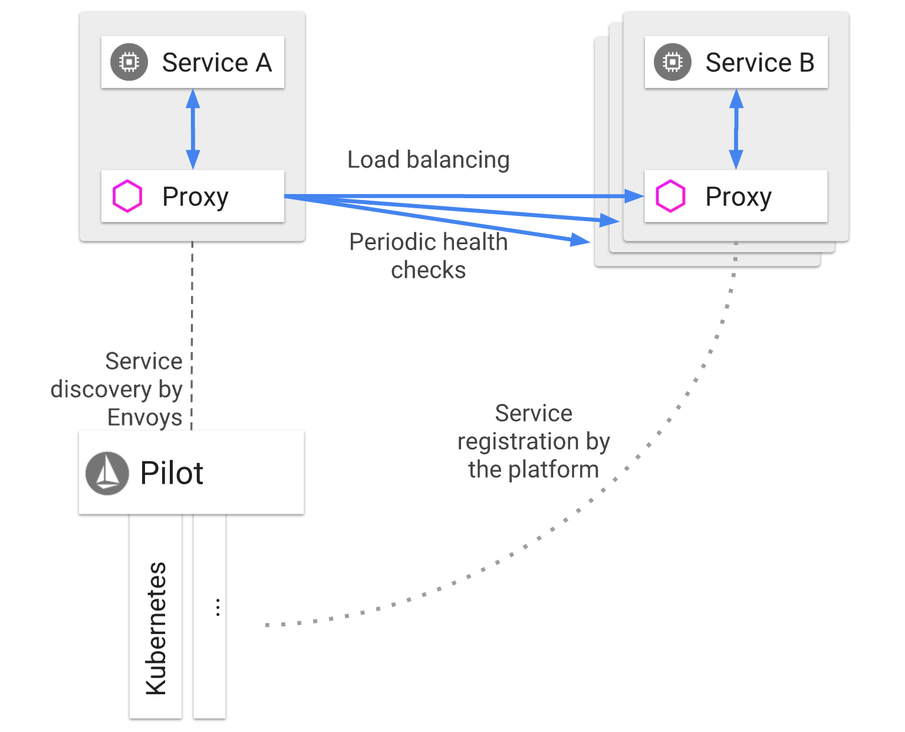

网格中的服务使用其 DNS 名称访问彼此。服务的所有 HTTP 流量都会通过 Envoy 自动重新路由。Envoy 在负载均衡池中的实例之间分发流量。虽然 Envoy 支持多种复杂的负载均衡算法，但 Istio 目前仅允许三种负载均衡模式：轮询、随机和带权重的最少请求。

除了负载均衡外，Envoy 还会定期检查池中每个实例的运行状况。Envoy 遵循熔断器风格模式，根据健康检查 API 调用的失败率将实例分类为不健康和健康两种。换句话说，当给定实例的健康检查失败次数超过预定阈值时，将会被从负载均衡池中弹出。类似地，当通过的健康检查数超过预定阈值时，该实例将被添加回负载均衡池。

服务可以通过使用 HTTP 503 响应健康检查来主动减轻负担。在这种情况下，服务实例将立即从调用者的负载均衡池中删除。

### Ingress 和 Egress

Istio 假定进入和离开服务网络的所有流量都会通过 Envoy 代理进行传输。通过将 Envoy 代理部署在服务之前，运维人员可以针对面向用户的服务进行 A/B 测试、部署金丝雀服务等。类似地，通过使用 Envoy 将流量路由到外部 Web 服务（例如，访问 Maps API 或视频服务 API）的方式，运维人员可以为这些服务添加超时控制、重试、断路器等功能，同时还能从服务连接中获取各种细节指标。

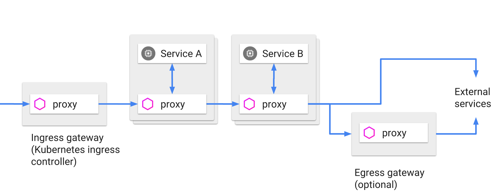

### 故障处理机制

Envoy 提供了一系列的开箱即用，可选的故障解决方案：

- **超时机制**: 在服务请求总时间超过一个阈值时，直接返回错误，避免卡死。
- **重试机制**: 采用随机重试时间间隔（可变抖动），并限制重试次数，最大限度保证服务调用的顺昌性。
- **并行链接控制**: 对下游的并发连接数和上游服务请求数限制，避免过载
- **健康检测**: 负载均衡池中的每个成员主动（定期）运行健康检查,支持主动和被动（平台提供的health check)
- **细粒度熔断器（被动健康检查)**:——适用于负载均衡池中的每个实例

Envoy 之所以提供两种形式的健康性检查，是为了避免将不可用的服务纳入Mesh，两种检查结果相结合，能够最大限度保证故障节点及时被移出，最大限度减少因为检测延时，导致的错误调用。

## Control Plane

控制平面是Istio的另外一个核心架构点。由四大核心部件组成。 Pilot , Mixer , Citadel , Galley

### Pilot

    Pilot 为 Envoy sidecar 提供服务发现功能，为智能路由（例如 A/B 测试、金丝雀部署等）和
    弹性（超时、重试、熔断器等）提供流量管理功能。它将控制流量行为的高级路由规则转换为特定于 
    Envoy 的配置，并在运行时将它们传播到 sidecar。

    Pilot 将平台特定的服务发现机制抽象化并将其合成为符合 Envoy 数据平面 API 的任何 sidecar 
    都可以使用的标准格式。这种松散耦合使得 Istio 能够在多种环境下运行（例如，Kubernetes、Consul、Nomad），
    同时保持用于流量管理的相同操作界面。

也就是说，在Istio架构中，Pilot是对多种容器平台的抽象，通过适配器模式形成统一接口，官方可以支持K8S,Cloud Foundry,Apache Mesos。

Pilot 为Data Plane 的SideCar 提供服务发现能力，但是本身不做服务注册，只提供接口，，对接已有的注册系统，Eureka(2.x不再开源）,etcd,consul...

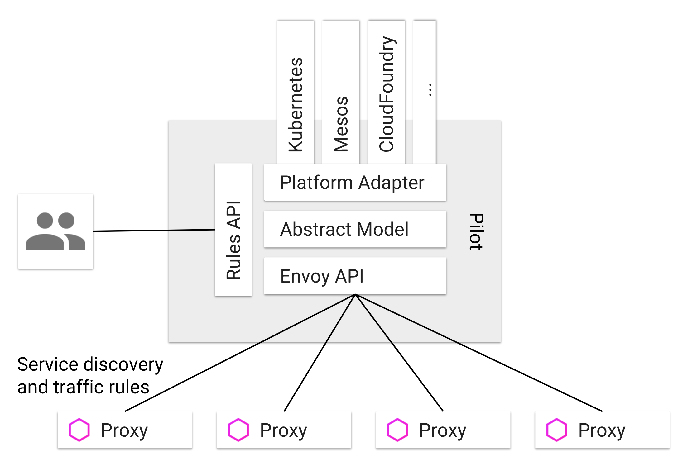

### Mixer

    Mixer 是一个独立于平台的组件，负责在服务网格上执行访问控制和使用策略，并从 Envoy 代理
    和其他服务收集遥测数据。代理提取请求级属性，发送到 Mixer 进行评估。

    Mixer 中包括一个灵活的插件模型，使其能够接入到各种主机环境和基础设施后端，从这些细节
    中抽象出 Envoy 代理和 Istio 管理的服务。

从逻辑上可以看出 Mixer 可以提供 两种服务, **后端逻辑抽象 +  中心化的控制**

为了实现 **后端逻辑抽象 +  中心化的控制**  ，每个请求到达sidecar的时候，都需要向Mixer 发送一次请求，前置检查。请求结束之后再向Mixer做一次汇报。

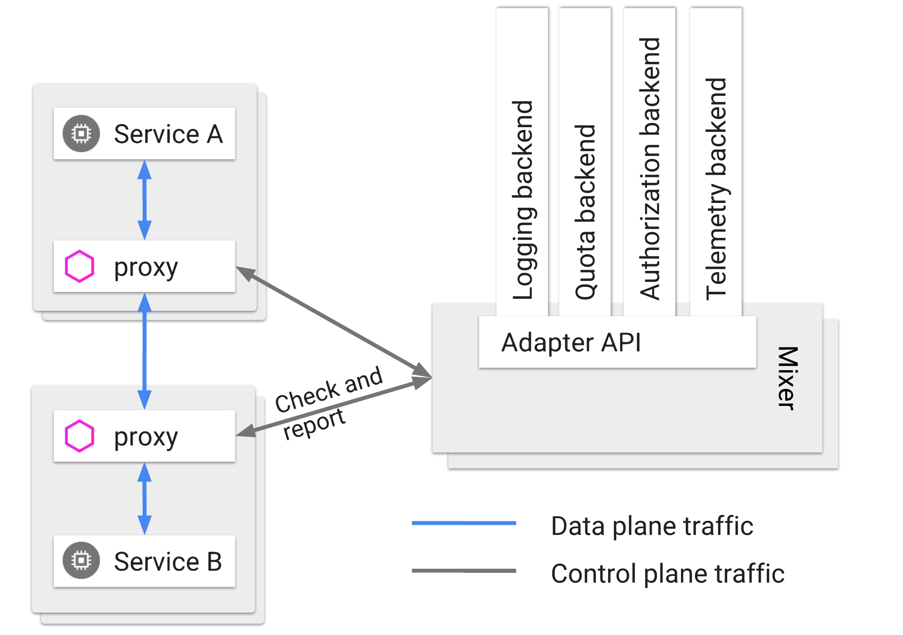

当处理请求到达 Mixer时，其就会一次执行通过适配器注册的各种处理器，例如日志，服务遥测，鉴权等。

**正是因为有了Mixer的这种设计**，将基础层的逻辑从业务代码中剥离了开来。业务工程师只要关心业务，基础架构工程师只要关心基础架构就好了。

**但是**

**是否会存在一个问题，本来一次就可以完成的请求，在这里却要分三次请求来执行，这不是非常耗时，而且效率低下吗？**

官方在这个问题上提供了两级缓存的方案，第一级缓存在sidecar，第二级缓存在Mixer。

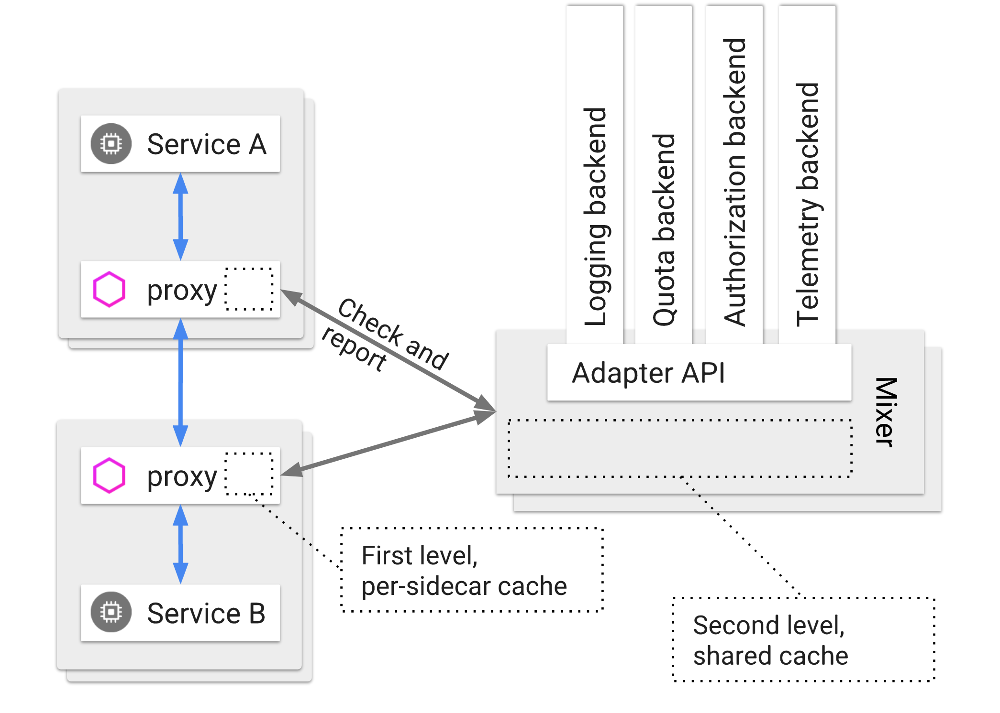

Mixer 提供了丰富的接口，为众多组件提供了强大的扩展支持，让其以插件的形式运行与Istio平台之上，如链路追踪ZipKin，分布式日志Fluentd，监控告警Prometheus，性能遥测 StatsD.

Mixer 就是整个大系统的链路数据以及分析中心。

### Citadel

[Citadel](https://istio.io/zh/docs/concepts/security/) 通过内置身份和凭证管理赋能强大的服务间和最终用户身份验证。可用于升级服务网格中未加密的流量，并为运维人员提供基于服务标识而不是网络控制的强制执行策略的能力。从 0.5 版本开始，Istio 支持基于角色的访问控制，以控制谁可以访问您的服务，而不是基于不稳定的三层或四层网络标识。

从 Istio 0.6 开始，Citadel 具备了一个可选的健康检查功能。缺省情况下的 Istio 部署过程没有启用这一特性。目前健康检查功能通过周期性的向 API 发送 CSR 的方式，来检测 Citadel CSR 签署服务的故障。很快会实现更多的健康检查方法。

Citadel 包含了一个检测器模块，它会周期性的检查 Citadel 的状态（目前只是 gRPC 服务器的健康情况）。如果 Citadel 是健康的，检测器客户端会更新健康状态文件（文件内容始终为空）的更新时间。否则就什么都不做。

### 可靠性和延迟

- **无状态** : Mixer 本身无状态，自身不存储任何数据
- **99.999%可用性**: Mixer 本身被设计成高度可靠的组件。设计目标是为任何单独的 Mixer 实例实现 > 99.999％ 的正常运行时间。
- **缓存与缓冲**: Sidecar 会将Mixer的缓存策略做一次缓存（caching），再对需要汇报的数据做一次缓冲（Buffering）,以最大限度地减少对Mixer的直接依赖。

网格中每个服务都会有对应的 Sidecar 代理在运行，因此在内存消耗方面，Sidecar 必须厉行节约，这就限制了本地缓存和缓冲的可能数量。然而，独立运行 的 Mixer 可以使用相当大的缓存和输出缓冲区。因此，Mixer 可用作 Sidecar 的高度扩展且高度可用的二级缓存。

### 属性

属性是 Istio 策略和遥测功能中的基本概念。属性是用于描述特定服务请求或请求环境的属性的一小段数据。例如，属性可以被赋值为特定请求的大小、操作的响应代码、请求来自的 IP 地址等。

属性也是控制平面的数据元，每个Sidecar 在处理数据流动的时候，会向Mixer提供一个 "请求属性的（Attributes）"的键值，他的作用是描述请求体与对应的环境情况，让控制平面掌握请求的每项指标。

每个属性都有一个名称和一个类型。该类型定义了该属性所持有的数据的种类。例如，属性可以是 STRING 类型，这意味着它的值是文本类型；或者可以是 INT64 类型，指示它的值是 64 位整数。

以下是一些具有相关值的示例属性:

```yaml

request.path: xyz/abc
request.size: 234
request.time: 12:34:56.789 04/17/2017
source.ip: [192 168 0 1]
destination.service.name: example

```

Mixer 本质上是一个属性处理机。每个经过 Envoy sidecar 的请求都会调用 Mixer，为 Mixer 提供一组描述请求和请求周围环境的属性。基于 Envoy sidecar 的配置和给定的特定属性集，Mixer 会调用各种基础设施后端。

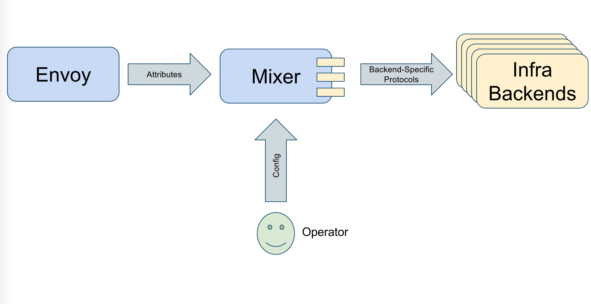

### 安全控制

首先还是来看下 Istio的 官方安全总览图。

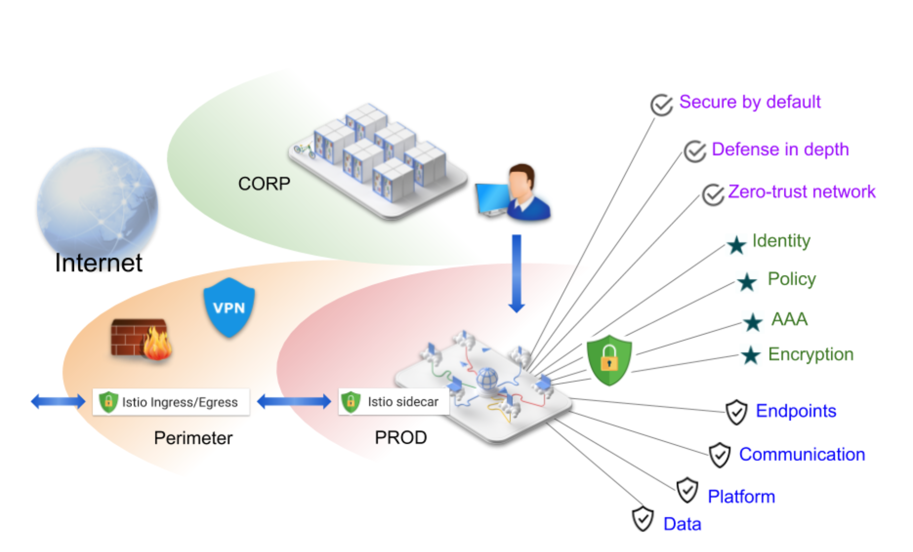

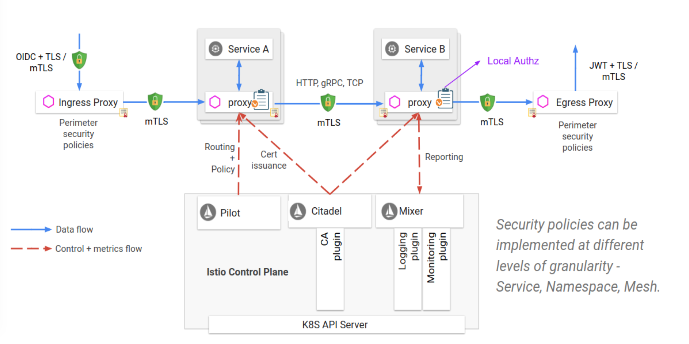

[**补充：OAuth 2.0 和 OIDC 工作流程**](https://www.ibm.com/support/knowledgecenter/zh/SSPREK_9.0.4/com.ibm.isam.doc/config/concept/con_oauth20_workflow.html)

从上面可以看出，整个安全体系架构是由多个模块联合起来，一起实现的。

- Citadel 用于密钥和证书管理

- Sidecar 和周边代理， 实现客户端和服务器之间的安全通信

- Pilot 将授权策略和安全命名信息分发给代理

- Mixer 对链路请求进行鉴权和审计

点击 官方网站查看详细内容 [Istio 安全](https://istio.io/zh/docs/concepts/security/)

## kubernetes 服务组网示意

kubernets 本身就是一款非常复杂的产品，其本身的学习难度也是有目共睹，Istio 本身也是由众多组件组件，学习起来比较复杂，再与Kubernetes一结合，估计就会有很多人望而却步了。不过，胖子不是一天吃成的，学习永无止境的。

接下来，我们看下 Istio 与 Kubernetes 结合之后的一个简图，这也是现在主流的ServiceMesh组网全图。看完之后，应该就会有一个全局的概念了。

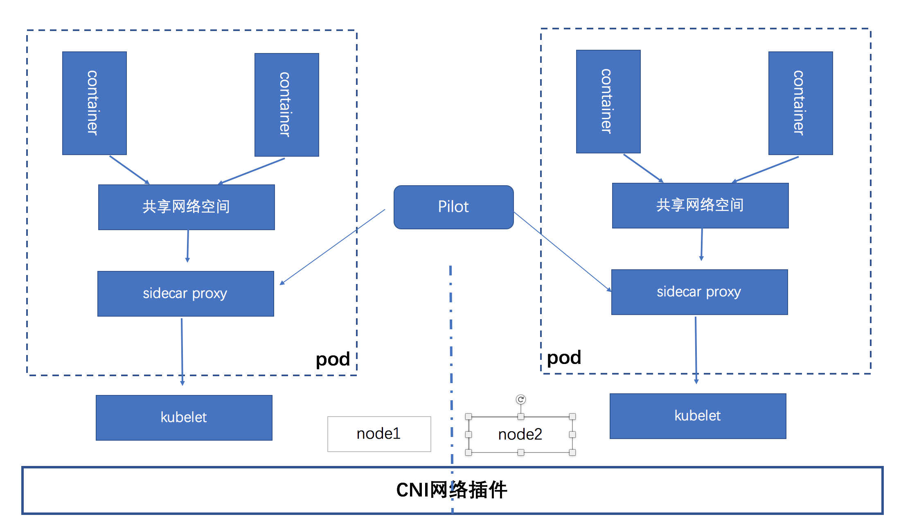

## 总结

仅仅通过一篇两篇文章来学习和了解ServiceMesh，就像盲人摸象一样，完全不能窥其全貌。还需要很多时间和实践才能让人完全理解和应用ServiceMesh。

因此这里列举了一些国内在ServiceMesh领域走在前列的一些组织或者网站，留作参考和以后学习。

- [敖小剑的技术博客](https://skyao.io/post/)
- [Kubernetes Handbook——Kubernetes中文指南/云原生应用架构实践手册](https://jimmysong.io/kubernetes-handbook/)
- [Service Mesher 社区](http://www.servicemesher.com/)
- [蚂蚁金服基于Istio的ServiceMesh解决方案](https://github.com/sofastack/sofa-mesh)

到底什么是服务网格，或许概念已经不重要了，重要的是，就像docker带来的虚拟化浪潮一样，ServiceMesh 将改变我们的软件架构与基础架构，为我们的IT领域带来一种风潮上的变革。让我们继续学习拭目以待吧。
