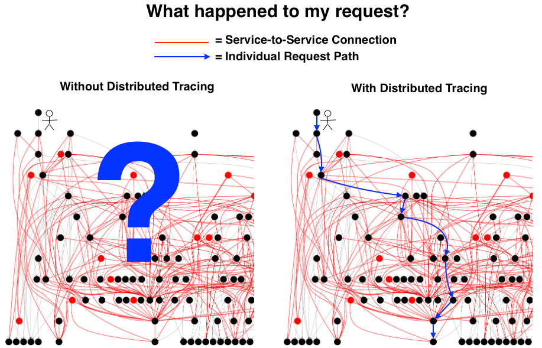
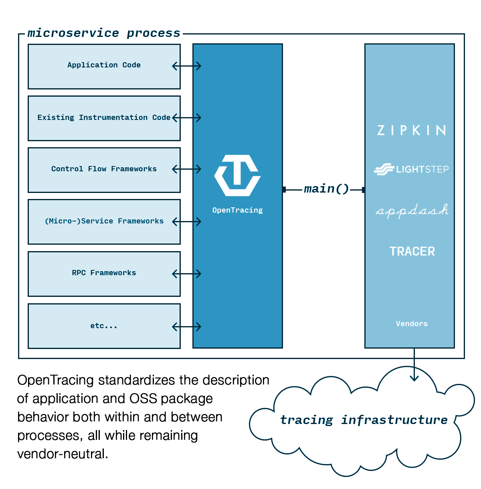

# Opentracing

​Opentracing 是[CNCF](https://www.cncf.io/)基金会中的一员，同样在这个组织中的还有Kubernetes，Prometheus等明星成员。

​Opentracing 并不是某种应用框架，而是一种中立的（厂商无关、平台无关）分布式追踪的 API 标准定义。他们是一个组织，有自己的委员会和工作组. 通过定义OpenTracing语义规范，以及提供统一的追踪接口，让开发人员可以在自己的系统中根据自己的需要进行不同的分布式追踪了。

## Distributed Tracing

**Distributed Tracing**（也称为分布式请求跟踪）是一种用于分析和监视应用程序的方法，尤其是那些使用微服务架构构建的应用程序。分布式跟踪有助于查明故障发生的位置以及导致性能低下的原因.

设想一种应用场景，如下面这张图：

我们的微服务架构中有几十上百个微服务一起构成了现有的产品，并且我们进行了日志收集以及每个请求的状态响应监控，也就是说，我们能够监控到每一次请求的状态码(200,404...)以及每次请求的我们服务的Log Level(ERROR,WARN,....),那么，当我们的某一次请求响应出错，或者耗时比较长，而服务之间的调用链路又错综复杂的时候，我们应该如何去解决这个问题？



或许我们可以通过查看分析这次请求的每条日志，一条一条的跟踪，但是这种方式总是效率低下，而且有点盲人摸象的感觉。所以，如果我们能拥有上帝视角，可以监视每一条请求的所有执行链路的话，此时又是怎样一种场景呢？这就是 Tracing的作用。

首先来看下Jaeger官方的一张图。


这张图很好的诠释了一个链路追踪的细节，同时能够以UI的形式让开发人员来进行分析，找出系统瓶颈点，或者轻松的进行问题分析。

这也就解决了我们上面那张图中纷繁复杂的服务调用关系导致我们头大的问题。

同时如果我们的服务架构中包含了很多历史服务，例如由不同编程语言构造的服务，而分布式链路追踪又恰恰支持这些编程语言的话，那我们很容易就能够分析出现在的架构中具体有哪些问题。所以，分布式追踪很有必要。

### 分布式追踪原理

分布式追踪的原理，与监控系统，大数据埋点采集有些类似，大体上就是数据采集，数据存储，展示分析。只不过，分布式追踪的每条数据都上下关联，形成一个有向无环的链条，这也正式分布式追踪的核心所在。

要想做到这一点，就需要有一个条件，那就是每一个请求，从进入我们系统开始，就必须具备一个全局的，各个服务间通用的一个ID，我们称之为 Trace ID.通过这个trace id，追踪系统就能够跟踪到，一个请求在微服务架构中所有的行踪轨迹了。

[Google 学术论文 《Dapper, a Large-Scale Distributed Systems Tracing Infrastructure》](https://static.googleusercontent.com/media/research.google.com/zh-CN//archive/papers/dapper-2010-1.pdf)

## OpenTracing

OpenTracing 前面我们介绍过，它通过提供平台无关、厂商无关的API，使得开发人员能够方便的添加（或更换）追踪系统的实现。

OpenTracing定义了一系列的语义规范，这指导其他厂商参考这个语义规范来进行自己的实现。[The OpenTracing Semantic Specification](https://github.com/opentracing/specification/blob/master/specification.md)

使用下面这张图来解释应该就能明白Opentracing的作用。



下面我们进行简要的语义介绍，这有助于我们在具体的使用中更好的理解追踪系统的原理。

具体的可点击 [opentracing 官方中文文档](https://wu-sheng.gitbooks.io/opentracing-io/content/pages/spec.html) 进行查看。

### OpenTracing数据模型

```

        一个tracer过程中，各span的关系


        [Span A]  ←←←(the root span)
            |
     +------+------+
     |             |
 [Span B]      [Span C] ←←←(Span C 是 Span A 的孩子节点, ChildOf)
     |             |
 [Span D]      +---+-------+
               |           |
           [Span E]    [Span F] >>> [Span G] >>> [Span H]
                                       ↑
                                       ↑
                                       ↑
                         (Span G 在 Span F 后被调用, FollowsFrom)
```

这些Span 之间时间线性的逻辑关系如下。

```

上述tracer与span的时间轴关系


––|–––––––|–––––––|–––––––|–––––––|–––––––|–––––––|–––––––|–> time

 [Span A···················································]
   [Span B··············································]
      [Span D··········································]
    [Span C········································]
         [Span E·······]        [Span F··] [Span G··] [Span H··]
```

### Tracer

一个trace代表一个潜在的，分布式的，存在并行数据或并行执行轨迹（潜在的分布式、并行）的系统。一个trace可以认为是多个span的有向无环图（DAG）

### Span

每个Span封装以下状态：

- 操作名称
- 起始时间
- 结束时间
- 一组 KV 值，作为阶段的标签（Span Tags）
- 阶段日志（Span Logs）
- 阶段上下文（SpanContext），其中包含 Trace ID 和 Span ID
- 引用关系（References）

### SpanContext

每个span必须提供方法访问SpanContext。SpanContext代表跨越进程边界，传递到下级span的状态。(例如，包含<trace_id, span_id, sampled>元组)，并用于封装Baggage (关于Baggage的解释，可以参考[官方文档](https://opentracing.io/specification/#references-between-spans))。SpanContext在跨越进程边界，和在追踪图中创建边界的时候会使用。(ChildOf关系或者其他关系，[References between Spans](https://opentracing.io/specification/#references-between-spans) )。

## Opentracing 的使用

目前针对分布式应用系统结合Opentracing来构建分布式追踪系统一共有两种实现方式。一种是选定一种追踪工具，按照其官方文档在我们的服务代码中加入链路追踪的实现代码，然后配合官方UI，进行链路追踪分析。另外一种就是直接构建下一代分布式微服务架构ServiceMesh，这种架构对于我们现有的服务是无侵入性的，就是不用修改现有代码，就能够实现分布式链路追踪。不过这种方式目前一般是基于Kubernetes打造的云原生应用系统，有着很高的应用门槛，需要结合实际情况进行选择。后面我们会对这种方式进行一个详细的介绍。

下面列举了OpenTracing目前支持的一些分布式追踪的工具，实际应用中可以根据自己的实际情况进行取舍。

- CNCF Jaeger
- LightStep
- Instana
- Apache SkyWalking
- inspectIT
- stagemonitor
- Datadog
- Wavefront by VMware
- Elastic APM

## 参考

- [opentracing.io](https://opentracing.io/)
- [OpenTracing 详解](https://pjw.io/articles/2018/05/08/opentracing-explanations/#section-5)
- [opentracing中文文档](https://wu-sheng.gitbooks.io/opentracing-io/content/)
