# ServiceMesh 下一代微服务
<!-- TOC -->

- [ServiceMesh 下一代微服务](#servicemesh-%E4%B8%8B%E4%B8%80%E4%BB%A3%E5%BE%AE%E6%9C%8D%E5%8A%A1)
  - [What's a service mesh](#whats-a-service-mesh)
  - [Linkerd](#linkerd)
    - [Control Plane](#control-plane)
    - [DataPlane](#dataplane)
    - [Proxy](#proxy)
    - [CLI](#cli)
    - [Dashboard](#dashboard)
    - [Grafana](#grafana)
    - [Prometheus](#prometheus)
  - [Istio](#istio)
    - [Istio 是什么](#istio-%E6%98%AF%E4%BB%80%E4%B9%88)
      - [Architecture](#architecture)
      - [Envoy](#envoy)
      - [Mixer](#mixer)
      - [Pilot](#pilot)
      - [Citadel](#citadel)
      - [Galley](#galley)
    - [策略与遥测](#%E7%AD%96%E7%95%A5%E4%B8%8E%E9%81%A5%E6%B5%8B)
      - [适配器](#%E9%80%82%E9%85%8D%E5%99%A8)
      - [可靠性和延迟](#%E5%8F%AF%E9%9D%A0%E6%80%A7%E5%92%8C%E5%BB%B6%E8%BF%9F)
      - [属性](#%E5%B1%9E%E6%80%A7)
      - [属性词汇](#%E5%B1%9E%E6%80%A7%E8%AF%8D%E6%B1%87)
      - [属性表达式](#%E5%B1%9E%E6%80%A7%E8%A1%A8%E8%BE%BE%E5%BC%8F)
      - [配置模型](#%E9%85%8D%E7%BD%AE%E6%A8%A1%E5%9E%8B)
      - [处理器（Handler）](#%E5%A4%84%E7%90%86%E5%99%A8handler)
      - [实例（Instance）](#%E5%AE%9E%E4%BE%8Binstance)
      - [规则（Rule）](#%E8%A7%84%E5%88%99rule)
  - [Linkerd Or Istio](#linkerd-or-istio)
  - [Microservices & Service Mesh](#microservices--service-mesh)
  - [参考](#%E5%8F%82%E8%80%83)

<!-- /TOC -->
## What's a service mesh

Service Mesh 这个概念最早由开发Linkerd 的 Buoyant, Inc 公司提出,而 Service Mesh 这个概念的定义则是 Buoyant, Inc 公司的 CEO William Morgan 于 2017 年 4 月 25 日 在 公司官网发布的的题 为 ["What's a service mesh? And why do I need one?"](https://buoyant.io/2017/04/25/whats-a-service-mesh-and-why-do-i-need-one/) 文章中给出的。

下面我们来看一下定义的内容。

> WHAT IS A SERVICE MESH?

> A service mesh is a dedicated infrastructure layer for handling service-to-service communication. It’s responsible for the reliable delivery of requests through the complex topology of services that comprise a modern, cloud native application. In practice, the service mesh is typically implemented as an array of lightweight network proxies that are deployed alongside application code, without the application needing to be aware. (But there are variations to this idea, as we’ll see.)

翻译过来就是：Service Mesh是用于处理服务与服务间通信的专用基础结构层。 云原生应用有复杂的服务拓扑图，Service Mesh可以保证请求在拓扑之间可靠地传递。 在实际应用中，Service Mesh 通常是由一系列轻量级的网络代理组成的，它们与应用程序部署在一起，但是应用程序并不需要知道他们的存在。

其实总结一下，无非就是下面两点：

1. Service Mesh 是一个专门负责请求可靠传输的基础架构层
2. Service Mesh 与应用部署在一起，通过网络代理来实现，应用程序无感知。

同时，William Morgan 对 Service Mesh 的概念进行了补充说明，明确了Service Mesh 的职责边界：

> The concept of the service mesh as a separate layer is tied to the rise of the cloud native application. In the cloud native model, a single application might consist of hundreds of services; each service might have thousands of instances; and each of those instances might be in a constantly-changing state as they are dynamically scheduled by an orchestrator like Kubernetes. Not only is service communication in this world incredibly complex, it’s a pervasive and fundamental part of runtime behavior. Managing it is vital to ensuring end-to-end performance and reliability.

Service Mesh 作为一个独立的基础架构层,是与云原生应用的崛起紧密相关的。在云原生模型里，一个单独的应用可能包含成百上千个服务，每个服务又可能包含成千上万个实例，每个实例可能处于不断变化的状态，因为有kubernetes这样类似的调度器存在。服务间通信不仅异常复杂，而且也是运行时行为的基础。管理好服务间通信对于保证端到端的性能和可靠性来说是非常重要的。

在笔者的理解中，Service Mesh 像本节的标题一样，是下一代微服务，它是一种架构，一种不是三言两语就能将其梳理清楚的新型架构。因此,只有结合实际的Service Mesh应用才能将其完全的理解。而目前在Service Mesh生态中，除了kubernetes，还有两个非常重要的组件。

接下来我们介绍一下ServiceMesh生态中两个非常重要的成员 Linkerd和Istio，通过对这两个成员的架构学习，尝试去搞清楚到 **What is Service Mesh?**.

## Linkerd

[官方地址](https://linkerd.io/2/overview/)

Linkerd 是一种Service Mesh (基于William Morgan的定义，因为就是他们公司的产品，所以它当然是一种Service Mesh)，它为云原生应用程序增加了可观察性，可靠性和安全性，无需更改代码。例如，Linkerd可以监控和报告每个服务的成功率和延迟，可以自动重试失败的请求，并且可以加密和验证服务之间的连接（TLS），所有这些都不需要对应用程序本身进行任何修改。

从较高层面来说，Linkerd 由 `control plane`和`data plane`组成。

`control plane` 是一组运行在特定 `namespace` (默认为linkerd)中的服务.这些服务完成各种诸如 聚合遥测数据，提供面向用户的API，向 `data plane` 代理发送控制数据等操作.这些操作共同驱动 `data plane`的行为。

`data plane`在是由与每个服务实例运行在一起的透明代理(服务无感知)组成。这些代理自动处理进出服务的所有流量。由于这些代理是透明的，所以他们充当了向 `control plane` 发送监测数据，并且从`control plane`接收控制数据的进程外控制程序。

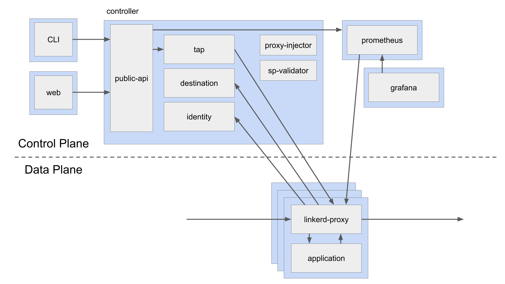

### Control Plane

Linkerd `control plane` 是一组运行在特定 `namespace` (默认为linkerd)中的服务.这些服务完成各种诸如 聚合遥测数据，提供面向用户的API，向 `data plane` 代理发送控制数据等操作.这些操作共同驱动 `data plane`的行为。

`control plane` 由四部分组成。

- Controller - `controller deployment` 由多个容器 (`public-api`, `proxy-api`, `destination`,`tap`) 组成，这些容器组合起来提供了 `control plane` 的功能.
- Web - `web deployment` 提供了 Linkerd dashboard.
- Prometheus -  Linkerd 提供的 metrics 由 Prometheus 收集和存储. 但是这个实例被配置为只用来收集和处理 Linkerd 产生的数据。如果想要与现有的Prometheus集成，可以参考这里[https://linkerd.io/2/tasks/exporting-metrics/](https://linkerd.io/2/tasks/exporting-metrics/) .
- Grafana - Linkerd 提供了许多开箱即用的 dashboard。 可以与现有的Grafana组件结合在一起。

### DataPlane

Linkerd `data plane`,由轻量级代理组成，他们作为 `sidecar`容器与服务代码部署在一起(可以理解为每个pod中，除了有一个container运行service code ，还需要有一个 sidecar container 运行 data proxy)。 为了把 现有的服务加入到 Linkerd `service mesh` 中，就需要重新发布所有的pod以便让pod中包含 `data plane proxy`(`linkerd inject`命令就可以完成这个事情)。并且可以通过 CLI 命令  [Adding Your Service](https://linkerd.io/2/tasks/adding-your-service/) 将服务添加到 `data plane`.

这些代理透明地拦截与每个pod之间的通信，并添加诸如检测和加密（TLS）之类的功能，以及根据相关策略允许和拒绝相关请求。

同时，这些代理并不需要手动进行配置，而是通过 `control plane` 来进行配置。

### Proxy

这些超轻的透明代理是由rust编写的，他们被 install 到每个 服务的pod中，成为 `data plane`的一部分。 它接收pod的所有传入流量，并通过`initContainer`拦截所有传出流量，`initContainer`配置`iptables`以正确转发流量。因为它是 `sidecar` 模式，用来拦截服务的所有传入和传出流量，所以不需要更改代码，甚至可以将其添加到正在运行的服务中。

这些代理包含以下特性:

- 对HTTP，HTTP/2和任意TCP协议透明，零配置代理。
- 自动导出HTTP 和 TCP 流量的Prometheus metric指标。
- 透明，零配置WebSocket代理。
- 自动，延迟感知，七层负载
- 针对非HTTP的4层负载均衡
- 支持TLS
- 守护进程，分类诊断API

### CLI

`Linkerd CLI` 运行在 node节点上，用来与 `control plane` 和 `data plane` 进行交互。可以用来查看统计数据，实时调试生产中的数据，和安装升级 `data plane 等`.

### Dashboard

Linkerd Dashboard 可以实时查看服务的运行状态.它可用于查看 特定 指标（成功率，请求/秒和延迟），可视化服务依赖性并了解特定服务路由的运行状况.

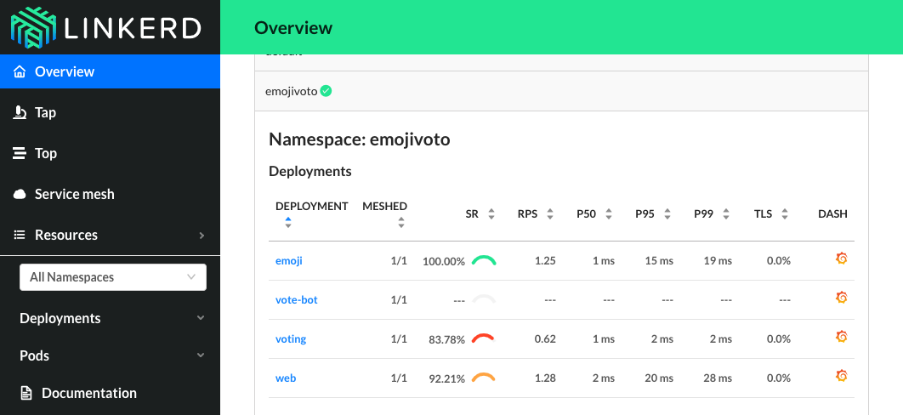

### Grafana

作为 `control plane` 的一个组件, Grafana 提供了一些开箱即用的 Dashboard。可以用来查看很多信息，例如请求状况，甚至pod内部的一些状态。

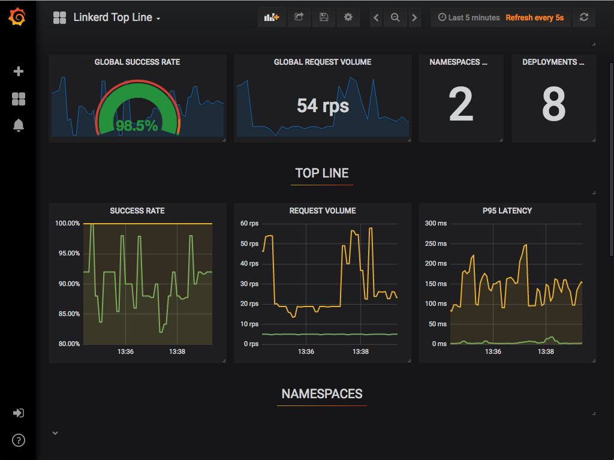

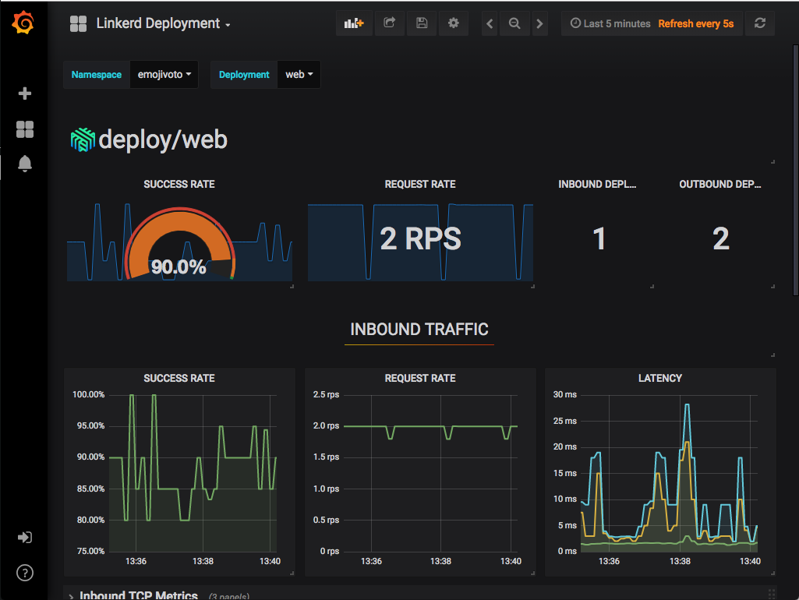

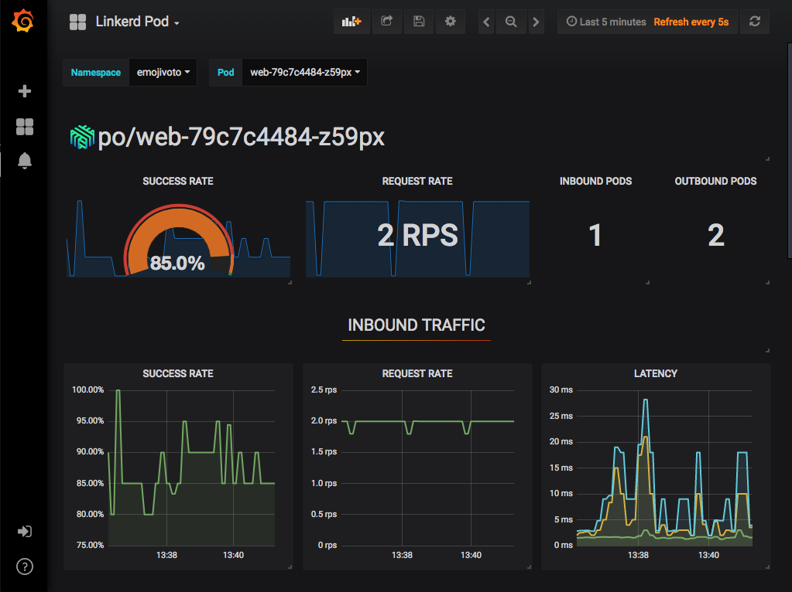

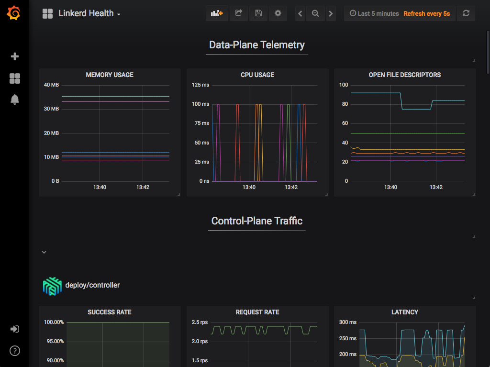

### Prometheus

Prometheus 是一种云原生的监控解决方案，用来收集和存储所有的Linkerd metrics。它作为 `control plane`的一部分，并且为 CLI,Dashboard,Grafana 提供相应的数据。

`data plane`中的代理暴露了 `4191` 的端口，用来给Prometheus收集数据，每10秒钟刷新一次。 这些指标 可以给其他的Linkerd 组件使用，例如 CLI 和dashboard。

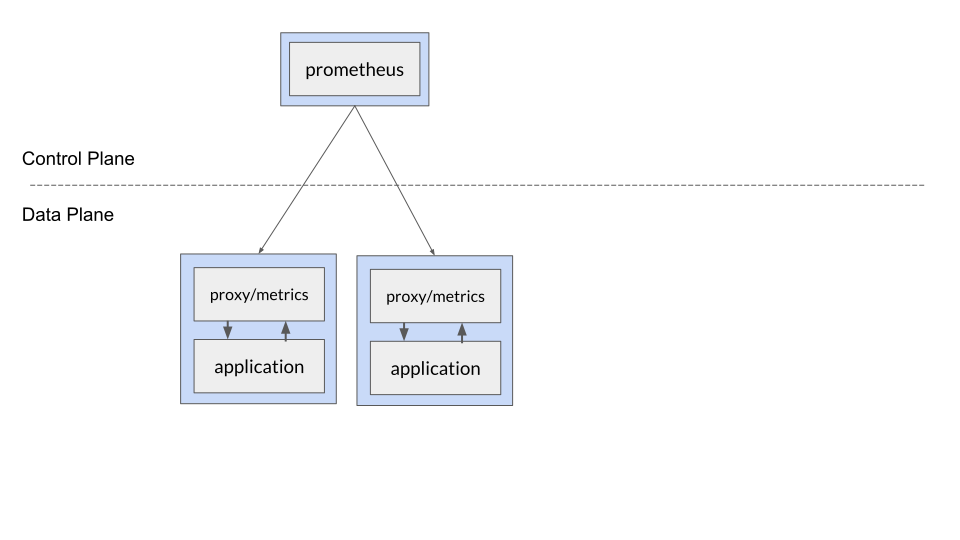{:height="400px" width="400px"}

## Istio

### Istio 是什么

#### Architecture


Istio Service Mesh 逻辑上分为`data plane`和 `control plane`。

- `data plane` 由一组以 sidecar 方式部署的智能代理（Envoy）组成。这些代理可以调节和控制微服务及 Mixer 之间所有的网络通信。
- `control plane` 负责管理和配置代理来路由流量。此外控制平面配置 Mixer 以实施策略和收集遥测数据.

#### Envoy

Istio 使用 [Envoy](https://www.envoyproxy.io/) 代理的扩展版本，Envoy 是以 C++ 开发的高性能代理，用于调解服务网格中所有服务的所有入站和出站流量。Envoy 的许多内置功能被 Istio 发扬光大，例如：

- 动态服务发现
- 负载均衡
- TLS 终止
- HTTP/2 & gRPC 代理
- 熔断器
- 健康检查、基于百分比流量拆分的灰度发布
- 故障注入
- 丰富的度量指标

Envoy 被部署为 sidecar，和对应服务在同一个 Kubernetes pod 中。这允许 Istio 将大量关于流量行为的信号作为属性提取出来，而这些属性又可以在 Mixer 中用于执行策略决策，并发送给监控系统，以提供整个网格行为的信息。

Sidecar 代理模型还可以将 Istio 的功能添加到现有部署中，而无需重新构建或重写代码。

#### Mixer

Mixer 是一个独立于平台的组件，负责在服务网格上执行访问控制和使用策略，并从 Envoy 代理和其他服务收集遥测数据。代理提取请求级属性，发送到 Mixer 进行评估。有关属性提取和策略评估的更多信息，请参见 Mixer 配置。

Mixer 中包括一个灵活的插件模型，使其能够接入到各种主机环境和基础设施后端，从这些细节中抽象出 Envoy 代理和 Istio 管理的服务。

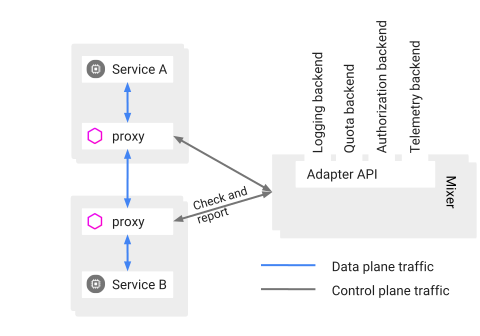{:height="400px" width="400px"}

#### Pilot

Pilot 为 Envoy sidecar 提供服务发现功能，为智能路由（例如 A/B 测试、金丝雀部署等）和弹性（超时、重试、熔断器等）提供流量管理功能。它将控制流量行为的高级路由规则转换为特定于 Envoy 的配置，并在运行时将它们传播到 sidecar。

Pilot 将平台特定的服务发现机制抽象化并将其合成为符合 Envoy 数据平面 API 的任何 sidecar 都可以使用的标准格式。这种松散耦合使得 Istio 能够在多种环境下运行（例如，Kubernetes、Consul、Nomad），同时保持用于流量管理的相同操作界面。

{:height="400px" width="400px"}

#### Citadel

Citadel 通过内置身份和凭证管理赋能强大的服务间和最终用户身份验证。可用于升级服务网格中未加密的流量，并为运维人员提供基于服务标识而不是网络控制的强制执行策略的能力。从 0.5 版本开始，Istio 支持基于角色的访问控制，以控制谁可以访问您的服务，而不是基于不稳定的三层或四层网络标识。

{:height="400px" width="400px"}

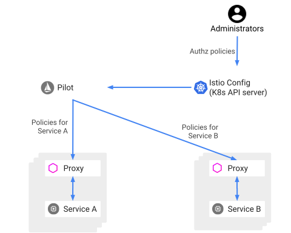{:height="400px" width="400px"}

#### Galley

Galley 将担任 Istio 的配置验证，获取配置，处理和分配组件的任务。它负责将其余的 Istio 组件与从底层平台（例如 Kubernetes）获取用户配置的细节中隔离开来。

<!-- 
### 策略与遥测

Istio 提供灵活的模型来执行授权策略，并为网格中的服务收集遥测数据。

Mixer 是负责提供策略控制和遥测收集的 Istio 组件:


在每次请求执行先决条件检查之前以及在每次报告遥测请求之后，Envoy sidecar 在逻辑上调用 Mixer。 该 Sidecar 具有本地缓存​，从而可以在缓存中执行相对较大比例的前提条件检查。此外，sidecar 缓冲出站遥测，使其实际上不需要经常调用 Mixer。

从较高层面来看,Mixer 提供了以下的内容：

- **后端抽象**，Mixer 隔离 Istio 的其余部分和各个基础设施后端的实现细节.
- **中介**，Mixer 允许运维对网格和基础设施后端之间的所有交互进行细化控制

#### 适配器

Mixer 是高度模块化和可扩展的组件。它的一个关键功能就是把不同后端的策略和遥测收集系统的细节进行抽象，完成 Istio 其余部分和这些后端的隔离.

Mixer 处理不同基础设施后端的灵活性是通过使用通用插件模型实现的。每个插件都被称为 Adapter，Mixer 通过它们与不同的基础设施后端连接，这些后端可提供核心功能，例如日志、监控、配额、ACL 检查等。通过配置能够决定在运行时使用的确切的适配器套件，并且可以轻松扩展到新的或定制的基础设施后端。

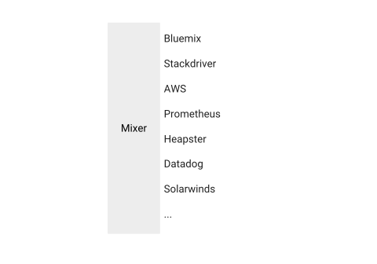

#### 可靠性和延迟

Mixer 是一个高可用的组件，其设计有助于提高整体可用性并减少网格中服务的平均延迟,这种设计会带来如下的好处：

- **无状态**。Mixer 是无状态的，因为它不管理任何自己的持久化存储。

- **加固**。Mixer 本身被设计成高度可靠的组件。设计目标是为任何单独的 Mixer 实例实现 > 99.999％ 的正常运行时间。

- **缓存和缓冲**。Mixer 被设计为累积大量瞬态短暂状态。

网格中每个服务都会有对应的 Sidecar 代理在运行，因此在内存消耗方面，Sidecar 必须厉行节约，这就限制了本地缓存和缓冲的可能数量。然而，独立运行 的 Mixer 可以使用相当大的缓存和输出缓冲区。因此，Mixer 可用作 Sidecar 的高度扩展且高度可用的二级缓存.

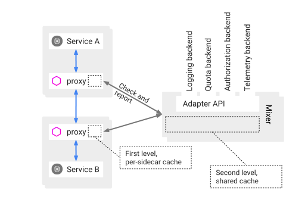

由于 Mixer 的预期可用性远高于大多数基础设施后端（通常这些可用性可能达到 99.9％）。Mixer 的本地缓存和缓冲不仅有助于减少延迟，而且即使在后端无响应时也能继续运行，从而有助于屏蔽基础设施后端故障。

#### 属性

属性是 Istio 策略和遥测功能中的基本概念。属性是用于描述特定服务请求或请求环境的属性的一小段数据。例如，属性可以被赋值为特定请求的大小、操作的响应代码、请求来自的 IP 地址等。

每个属性都有一个名称和一个类型。该类型定义了该属性所持有的数据的种类。例如，属性可以是 STRING 类型，这意味着它的值是文本类型；或者可以是 INT64 类型，指示它的值是 64 位整数。

以下是一些具有相关值的示例属性:

```yaml
request.path: xyz/abc
request.size: 234
request.time: 12:34:56.789 04/17/2017
source.ip: [192 168 0 1]
destination.service.name: example

```

Mixer 本质上是一个属性处理机。每个经过 Envoy sidecar 的请求都会调用 Mixer，为 Mixer 提供一组描述请求和请求周围环境的属性。基于 Envoy sidecar 的配置和给定的特定属性集，Mixer 会调用各种基础设施后端。

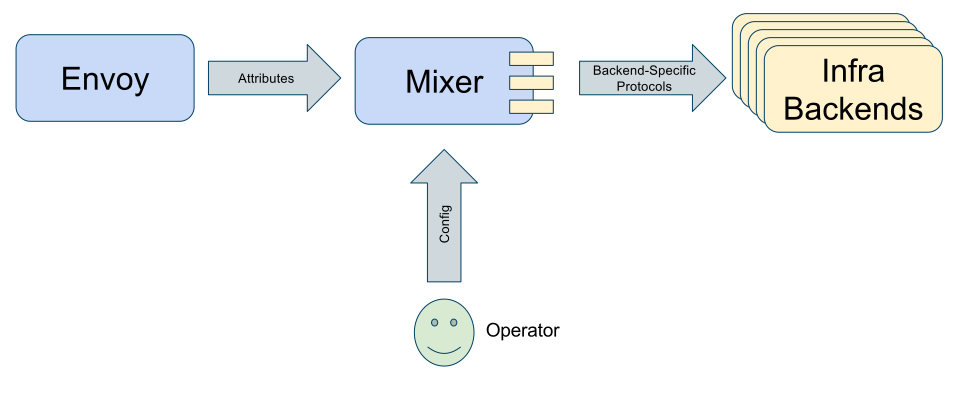

#### 属性词汇

#### 属性表达式

#### 配置模型

#### 处理器（Handler）

#### 实例（Instance）

#### 规则（Rule）
 -->

## Linkerd Or Istio

这里参考了国外网友进行的一个比较 [Linkerd or Istio?](https://itnext.io/linkerd-or-istio-2e3ce781fa3a)

## Microservices & Service Mesh

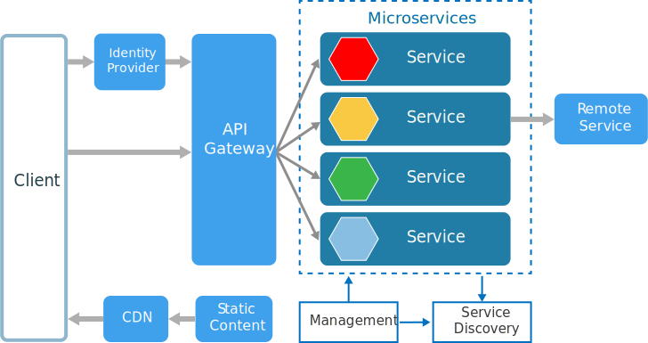


## 参考

- [What's a service mesh? And why do I need one?](https://buoyant.io/2017/04/25/whats-a-service-mesh-and-why-do-i-need-one/)
- [Istio Handbook——Istio 服务网格进阶实战](http://www.servicemesher.com/istio-handbook/)
- [Linkerd 官方地址](https://linkerd.io/2/overview/)
- [Frequently Asked Questions(Linkerd)](https://linkerd.io/2/faq/)
