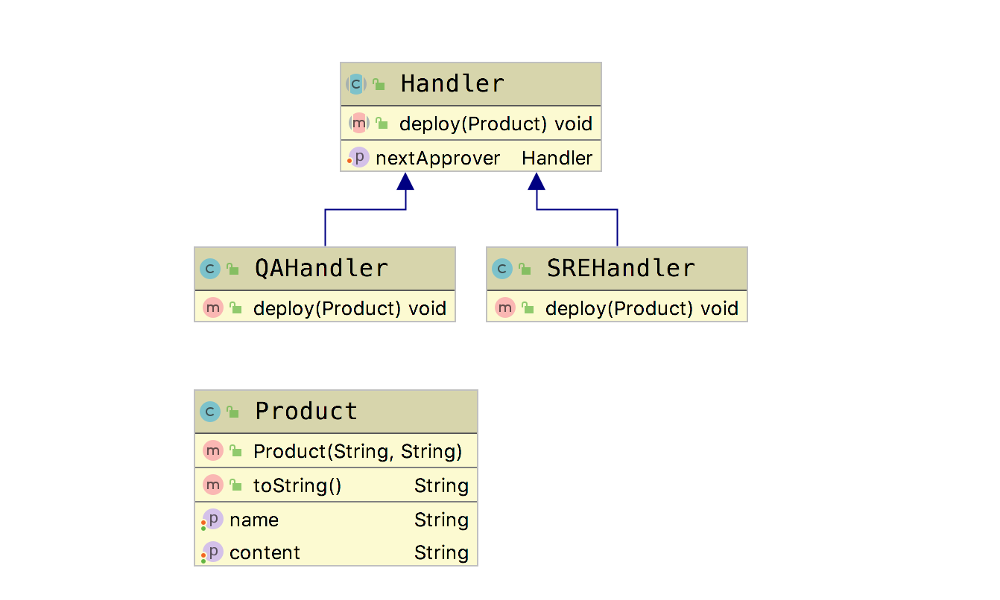

# 职责链模式(Chain of Responsibility Pattern)

**职责链模式(Chain of Responsibility  Pattern)**：避免请求发送者与接收者耦合在一起，让多个对象都有可能接收请求，将这些对象连接成一条链，并且沿着这条链传递请求，直到有对象处理它为止。  

一句话总结：为请求创建一个接收此次请求的链。

## 适用场景

一个请求的处理，需要多个对象中的一个或者多个协作处理。

## 优点

- 请求的发送者和接收者（处理者）进行解耦
- 责任链可以动态组合

## 缺点

- 如果责任链太长或者处理时间太长，影响性能
- 责任链可能太长

下面我们引入一个应用场景，在大部分公司，一个产品上线，或者bug修复上线，通常会经过以下的一个过程。开发提交代码---QA测试---SRE上线，每一个环节都有自己的责任属性，这样就形成了一个责任链。接下来，我们就用代码来实现这个责任链模式。

这里面有一个非常重要的点，就在于Handler 内部有一个自己，即handler。每个责任链节点都要去check一下这个handler是否需要继续向下传递。

## Golang Demo

```golang
package chainofresponsibility

import "fmt"

type Product struct {
    name    string
    content string
}

type IHandler interface {
    deploy(product Product)
}

type Handler struct {
    iHandler IHandler
}

func (h *Handler) setNextHandler(iHandler IHandler) {
    h.iHandler = iHandler
}

type QAHandler struct {
    Handler
}

func (qa QAHandler) deploy(product Product) {

    if product.name != "" {
        fmt.Println(product.name + "bug已经修复，QAHandler批准")
        if qa.iHandler != nil {
            qa.iHandler.deploy(product)
        }
    } else {
        fmt.Println(product.name + "没有修复bug，Over")
        return
    }

}

type SREHandler struct {
    Handler
}

func (sre SREHandler) deploy(product Product) {

    if product.name != "" {
        fmt.Println(product.name + "bug已经修复，SREHandler批准")
        if sre.iHandler != nil {
            sre.iHandler.deploy(product)
        }
    } else {
        fmt.Println(product.name + "没有修复bug，Over")
        return
    }

}

```

```golang
package chainofresponsibility

func ExampleResponsibility() {
    qaHandler := QAHandler{}
    sreHandler := SREHandler{}

    product := Product{}
    product.name = "big data"
    product.content = "bug fix"

    qaHandler.setNextHandler(sreHandler)
    qaHandler.deploy(product)
    // Output:
    // big databug已经修复，QAHandler批准
    // big databug已经修复，SREHandler批准
}

```

## Java Demo

```java
package tech.selinux.design.pattern.behavioral.chainofresponsibility;

/** 产品名称 */
public class Product {
  private String name;
  private String content;

  public String getName() {
    return name;
  }

  public void setName(String name) {
    this.name = name;
  }

  public String getContent() {
    return content;
  }

  public void setContent(String content) {
    this.content = content;
  }

  @Override
  public String toString() {
    return "Product{" + "name='" + name + '\'' + ", content='" + content + '\'' + '}';
  }
}

```

```java
package tech.selinux.design.pattern.behavioral.chainofresponsibility;

/** 定义一个类，代表责任链中的每一个环节 */
public abstract class Handler {
  protected Handler handler;

  public void setNextApprover(Handler handler) {
    this.handler = handler;
  }

  public abstract void deploy(Product product);
}

```

```java
package tech.selinux.design.pattern.behavioral.chainofresponsibility;

import org.apache.commons.lang3.StringUtils;

public class QAHandler extends Handler {

  @Override
  public void deploy(Product product) {
    if (StringUtils.isNoneEmpty(product.getContent())) {
      System.out.println(product.getName() + "bug已经修复，QAHandler批准");
      // 判断是否还有下一个责任人
      if (handler != null) {
        handler.deploy(product);
      }
    } else {
      System.out.println(product.getName() + "没有修复bug，Over");
      return;
    }
  }
}

```

```java
package tech.selinux.design.pattern.behavioral.chainofresponsibility;

import org.apache.commons.lang3.StringUtils;

public class SREHandler extends Handler {
  @Override
  public void deploy(Product product) {
    if (StringUtils.isNoneEmpty(product.getContent())) {
      System.out.println(product.getName() + "bug已经修复，SREHandler批准");
      // 判断是否还有下一个责任人
      if (handler != null) {
        handler.deploy(product);
      }
    } else {
      System.out.println(product.getName() + "没有修复bug，Over");
      return;
    }
  }
}
```

```java
package tech.selinux.design.pattern.behavioral.chainofresponsibility;

public class Test {
  public static void main(String[] args) {
    QAHandler qaHandler = new QAHandler();
    SREHandler sreHandler = new SREHandler();
    Product product = new Product();
    product.setName("big data");
    product.setContent("bug fix");

    qaHandler.setNextApprover(sreHandler);
    qaHandler.deploy(product);
  }
}

```

## UML


