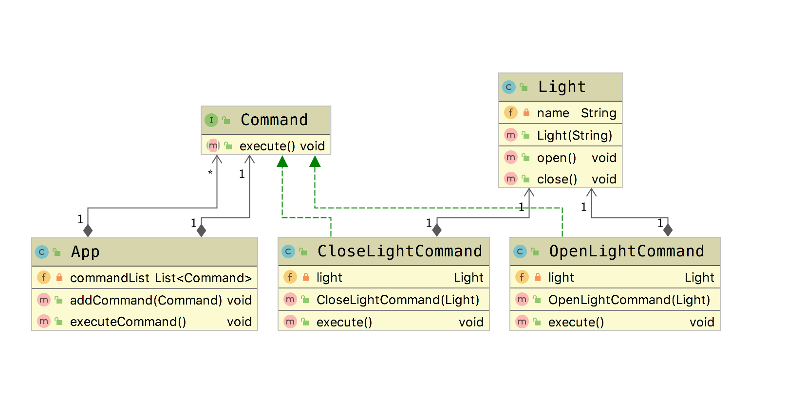

# 命令模式(Command Pattern)

**命令模式(Command Pattern)**：将一个请求封装为一个对象，以便使用不同的对象。命令模式解决了应用程序中对象的职责，以及他们之间的通信方式。  

## 适用场景

- 请求调用者和请求接收者需要解耦，使得调用者和接收者不直接交互
- 需要抽象出等待执行的行为

## 优点

- 降低解耦
- 容易扩展新命令或者一组新命令

## 缺点

- 命令的无限扩展会增加类的数量，提高系统的实现复杂度

下面我们引入一种应用场景。在万物互联智能化的今天，大部分的家居产品都可以使用app来进行控制了。就以家里的智能灯为例。我们可以通过一个app控制家里的多个灯。或者对一个灯，进行反复的开关操作。

## Golang Demo

```golang
package command

import (
    "fmt"
)

type Command interface {
    execute()
}

type Light struct {
    name string
}

func NewLight(name string) *Light {
    return &Light{name: name}
}

func (l *Light) open() {
    fmt.Println("open light " + l.name)
}
func (l *Light) close() {
    fmt.Println("close light " + l.name)
}

type OpenLightCommand struct {
    light *Light
}

func (o *OpenLightCommand) execute() {
    o.light.open()
}

func NewOpenLightCommand(light *Light) *OpenLightCommand {
    return &OpenLightCommand{light: light}
}

type CloseLightCommand struct {
    light *Light
}

func (c *CloseLightCommand) execute() {
    c.light.close()
}

func NewCloseLightCommand(light *Light) *CloseLightCommand {
    return &CloseLightCommand{light: light}
}

type App struct {
    commandList []Command
}

func NewApp() *App {
    return &App{}
}

func (a *App) addCommand(command Command) {
    a.commandList = append(a.commandList, command)
}

func (a *App) executeCommand() {
    for _, command := range a.commandList {
        command.execute()
    }
    // 清空这个切片
    a.commandList = a.commandList[0:0]
}
```

```golang
package command

func ExampleCommand() {
    light := NewLight("小智同学")
    openLightCommand := NewOpenLightCommand(light)
    closeLightCommand := NewCloseLightCommand(light)
    app := NewApp()
    app.addCommand(openLightCommand)
    app.addCommand(closeLightCommand)
    app.executeCommand()
    //Output:
    //open light 小智同学
    //close light 小智同学
}

```

## Java Demo

首先我们定义一个命令接口。

```java
package tech.selinux.design.pattern.behavioral.command;

public interface Command {
  void execute();
}

```

创建一款智能灯。

```java
package tech.selinux.design.pattern.behavioral.command;

// 智能灯
// 有个名字 小智同学
public class Light {
  private String name;

  public Light(String name) {
    this.name = name;
  }

  public void open() {
    System.out.println("open light " + this.name);
  }

  public void close() {
    System.out.println("close light" + this.name);
  }
}

```

设计相应的开灯命令，和关灯命令。

```java
package tech.selinux.design.pattern.behavioral.command;

public class OpenLightCommand implements Command {
  private Light light;

  public OpenLightCommand(Light light) {
    this.light = light;
  }

  @Override
  public void execute() {
    light.open();
  }
}

```

```java
package tech.selinux.design.pattern.behavioral.command;

public class CloseLightCommand implements Command {
  private Light light;

  public CloseLightCommand(Light light) {
    this.light = light;
  }

  @Override
  public void execute() {
    light.close();
  }
}

```

接下来，我们定义一个app类型的模拟类,这里面可以批量的接收和执行command

```java
package tech.selinux.design.pattern.behavioral.command;

import java.util.ArrayList;
import java.util.List;

public class App {
  private List<Command> commandList = new ArrayList<Command>();

  public void addCommand(Command command) {
    commandList.add(command);
  }

  public void executeCommand() {
    for (Command command : commandList) {
      command.execute();
    }
    commandList.clear();
  }
}

```

```java
package tech.selinux.design.pattern.behavioral.command;

public class Test {
  public static void main(String[] args) {
    Light light = new Light("小智同学");

    OpenLightCommand openLightCommand = new OpenLightCommand(light);
    CloseLightCommand closeLightCommand = new CloseLightCommand(light);
    App app = new App();
    app.addCommand(openLightCommand);
    app.addCommand(closeLightCommand);
    app.executeCommand();
  }
}

```

## UML



---

### 补充另一个版本的Java/Scala Demo 以及源码解析

---

## Java Demo_

## Scala Demo

## UML_

## 源码解析
