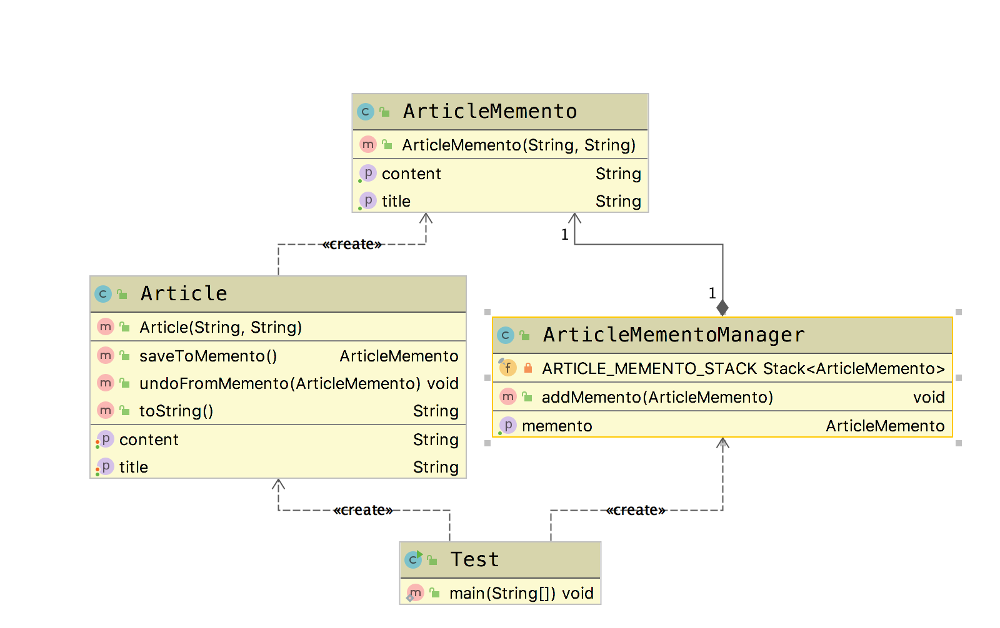

# 备忘录模式(Memento Pattern)

**备忘录模式(Memento Pattern)**：在不破坏封装的前提下，捕获一个对象的内部状态，并在该对象之外保存这个状态，这样可以在以后将对象恢复到原先保存的状态。它是一种对象行为型模式，其别名为Token.

## 适用场景

- 保存以及恢复数据相关业务场景
- 想要恢复到之前的状态

## 优点

- 为用户提供一种可恢复的机制
- 存档信息的封装

## 缺点

- 资源占用

下面我们引入一种应用场景，在网站上发表文章的时候，会有一个暂存功能。我们能够暂时保存当前的编辑状态。同时，如果后期有必要的话，我们可以返回之前的状态。

## Golang Demo

```golang

type Article struct {
  title   string
  content string
}

func NewArticle(title string, content string) *Article {
  return &Article{title: title, content: content}
}

func (a *Article) addToMemento() *ArticleMemento {
  return NewArticleMemento(a.title, a.content)
}

func (a *Article) undoFromMemento(memento *ArticleMemento) {
  a.title = memento.title
  a.content = memento.content

}

```

```golang

type ArticleMemento struct {
  title   string
  content string
}

func NewArticleMemento(title string, content string) *ArticleMemento {
  return &ArticleMemento{title: title, content: content}
}

type ArticleMementoManager struct {
  // 有很多种方式可以实现堆栈的效果 container/list slice 等等
  // 下面我们采用map来模拟一个不是很严谨的stack
  articleMementoStack map[int]*ArticleMemento
  index               int
}
```

```golang

func NewArticleMementoManager() *ArticleMementoManager {
  articleMementoStack := make(map[int]*ArticleMemento)
  return &ArticleMementoManager{articleMementoStack: articleMementoStack}
}

func (a *ArticleMementoManager) addMemento(memento *ArticleMemento) {
  a.articleMementoStack[a.index] = memento
  a.index++

}
func (a *ArticleMementoManager) getMemento() *ArticleMemento {
  if a.index > 0 {
    a.index--
    return a.articleMementoStack[a.index]
  }
  return nil

}
```

```golang
package memento

import "fmt"

func ExampleMemento() {
  article := NewArticle("hello", "the new world")
  articleMemento := article.addToMemento()
  articleMementoManager := NewArticleMementoManager()
  articleMementoManager.addMemento(articleMemento)

  fmt.Printf("%s,%s\n", article.title, article.content)

  article.content = "the new world2"
  fmt.Printf("%s,%s\n", article.title, article.content)

  article.undoFromMemento(articleMementoManager.getMemento())
  fmt.Printf("%s,%s\n", article.title, article.content)
  // Output:
  // hello,the new world
  // hello,the new world2
  // hello,the new world
}

```

## Java Demo

定义一个Article 类，用来表示在网站上编写的文章。

```java
package tech.selinux.design.pattern.behavioral.memento;

/** 网站上发表的文章 */
public class Article {
  private String title;
  private String content;

  public Article(String title, String content) {
    this.title = title;
    this.content = content;
  }

  public String getTitle() {
    return title;
  }

  public String getContent() {
    return content;
  }

  public void setTitle(String title) {
    this.title = title;
  }

  public void setContent(String content) {
    this.content = content;
  }

  public ArticleMemento saveToMemento() {
    ArticleMemento articleMemento = new ArticleMemento(this.title, this.content);
    return articleMemento;
  }

  public void undoFromMemento(ArticleMemento articleMemento) {
    this.title = articleMemento.getTitle();
    this.content = articleMemento.getContent();
  }

  @Override
  public String toString() {
    return "Article{" + "title='" + title + '\'' + ", content='" + content + '\'' + '}';
  }
}

```

编写一个备忘录类，这个类只能由article类创建，并且作为一个article的快照。这也就意味着，这个类不能被其他的类进行修改。

```java
package tech.selinux.design.pattern.behavioral.memento;

public class ArticleMemento {
  private String title;
  private String content;

  public ArticleMemento(String title, String content) {
    this.title = title;
    this.content = content;
  }

  public String getTitle() {
    return title;
  }

  public String getContent() {
    return content;
  }
}

```

定义一个备忘录管理者的类。利用栈这种数据结构来保存我们之前保存的多个状态。同时，借助栈先进后出的特性，我们能够保证最先出站的状态永远是上一次保存的状态。

```java
package tech.selinux.design.pattern.behavioral.memento;

import java.util.Stack;

public class ArticleMementoManager {
  private final Stack<ArticleMemento> ARTICLE_MEMENTO_STACK = new Stack<ArticleMemento>();

  public ArticleMemento getMemento() {
    ArticleMemento articleMemento = ARTICLE_MEMENTO_STACK.pop();
    return articleMemento;
  }

  public void addMemento(ArticleMemento articleMemento) {
    ARTICLE_MEMENTO_STACK.push(articleMemento);
  }
}

```

```java
package tech.selinux.design.pattern.behavioral.memento;

public class Test {
  public static void main(String[] args) {
    ArticleMementoManager articleMementoManager = new ArticleMementoManager();
    Article article = new Article("Hello", "the new world ");
    ArticleMemento articleMemento = article.saveToMemento();
    articleMementoManager.addMemento(articleMemento);
    System.out.println(article);
    article.setContent("world2");
    System.out.println(article);

    article.undoFromMemento(articleMemento);
    System.out.println(article);
  }
}

```

## UML

