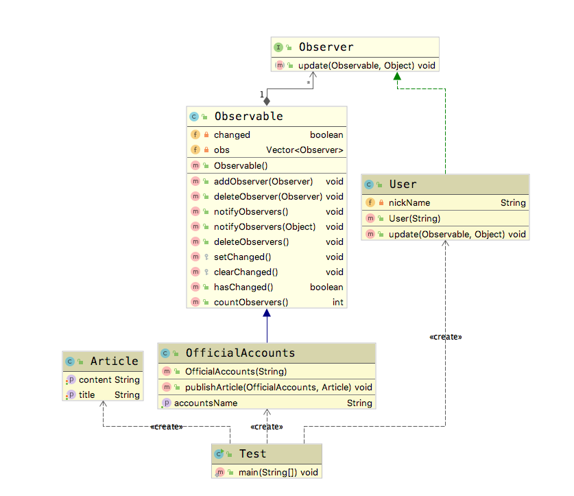

# 观察者模式(Observer Pattern)

**观察者模式(Observer Pattern)**：定义对象之间的一种一对多依赖关系，让多个观察者对象监听主题对象，当主题对象发生变化时，其相关依赖对象皆得到通知并被自动更新。观察者模式的别名包括发布-订阅（Publish/Subscribe）模式、模型-视图（Model/View）模式、源-监听器（Source/Listener）模式或从属者（Dependents）模式。观察者模式是一种对象行为型模式。

## 适用场景

- 关联行为场景，建立一套触发机制

## 优点

- 观察者和被观察者之间建立一个抽象的耦合
- 观察者模式支持广播通信

## 缺点

- 观察者之间有过多的细节依赖，提高时间消耗以及程序复杂度
- 使用要得当，要避免循环调用

在日常生活中，我们有很多这样的使用示例。例如我订阅了某个公众号，当公众号进行了更新之后，所有的订阅者都能收到消息。我对朋友圈的某条动态进行了评论，当有新评论增加时，我也会收到相应的动态更新。

## Golang Demo

首先在这里说明一下，go 中并没有像java 那样，从编程语言层面对设计模式进行支持。因此我们主要还是从代码语义的角度上来进行理解。如果想要严格的理解观察者模式，建议可以结合实际应用场景查看一下java的Demo。

```golang
package observer

type Observer interface {
  Update(observable *Observable)
}

type Observable struct {
  content string
  obs     []Observer
}

func NewObservable() *Observable {
  return &Observable{obs: make([]Observer, 0)}
}

//AddObserver 向被观察者的订阅集合中添加观察者
//需要是线程安全的
//如果被观察者已经存在，则不添加
func (o *Observable) AddObserver(observer Observer) {
  o.obs = append(o.obs, observer)
}

func (o *Observable) Notify() {
  for _, observer := range o.obs {
    observer.Update(o)
  }
}

// 更新被订阅者的内容
func (o *Observable) UpdateContent(content string) {
  o.content = content

}

```

```golang
package observer

import "fmt"

type Subscriber struct {
  name string
}

func NewSubscriber(name string) *Subscriber {
  return &Subscriber{name: name}
}

func (s *Subscriber) Update(observable *Observable) {
  fmt.Printf("%s  receive %s \n", s.name, observable.content)
}


```

```golang
package observer

func ExampleObserver() {
  observable := NewObservable()
  subscriber1 := NewSubscriber("hello1")

  subscriber2 := NewSubscriber("hello2")
  observable.AddObserver(subscriber1)
  observable.AddObserver(subscriber2)
  observable.UpdateContent("world")
  observable.Notify()
  // Output:
  // hello1  receive worl1d
  // hello2  receive world
}
```

## Java Demo

首先定义一个 公众号的类。

```java
package tech.selinux.design.pattern.behavioral.observer;

import java.util.Observable;

/** 公众号 */
public class OfficialAccounts extends Observable {
  private String accountsName;

  public OfficialAccounts(String accountsName) {
    this.accountsName = accountsName;
  }

  public String getAccountsName() {
    return accountsName;
  }

  // 代表状态发生改变
  public void publishArticle(OfficialAccounts accounts, Article article) {
    System.out.println(article.getTitle() + "  on   " + accounts.getAccountsName());
    setChanged();
    notifyObservers(article);
  }
}

```

公众号内的文章是依附于公众号存在的。

```java
package tech.selinux.design.pattern.behavioral.observer;

public class Article {
  private String title;
  private String content;

  public String getContent() {
    return content;
  }

  public void setContent(String content) {
    this.content = content;
  }

  public String getTitle() {
    return title;
  }

  public void setTitle(String title) {
    this.title = title;
  }
}


```

接下来定义用户，用户是观察者，公众号是被观察者。

```java
package tech.selinux.design.pattern.behavioral.observer;

import java.util.Observable;
import java.util.Observer;

/** 对于用户来说，观察的是公众号 观察者是 user，被观察者是 offical accounts */
public class User implements Observer {
  private String nickName;

  public User(String nickName) {
    this.nickName = nickName;
  }

  @Override
  public void update(Observable o, Object arg) {
    OfficialAccounts accounts = (OfficialAccounts) o;
    Article article = (Article) arg;
    StringBuilder sb = new StringBuilder();
    sb.append("用户名：")
        .append(nickName)
        .append(": \n")
        .append("公众号 :")
        .append(accounts.getAccountsName())
        .append("\n")
        .append("文章：")
        .append(article.getTitle())
        .append("\n");
    System.out.println(sb.toString());
  }
}

```

```java
package tech.selinux.design.pattern.behavioral.observer;

public class Test {
  public static void main(String[] args) {
    OfficialAccounts accounts = new OfficialAccounts("Linux 中国");

    User user = new User("PegasusMeteor");
    accounts.addObserver(user);

    User user1 = new User("Pegasus");
    accounts.addObserver(user1);

    Article article = new Article();
    article.setTitle("Linux 未来趋势");
    article.setContent("一片大好");
    accounts.publishArticle(accounts, article);
  }
}

```

## UML



---

### 补充另一个版本的Java/Scala Demo 以及源码解析

---

## Java Demo_

## Scala Demo

## UML_

## 源码解析
