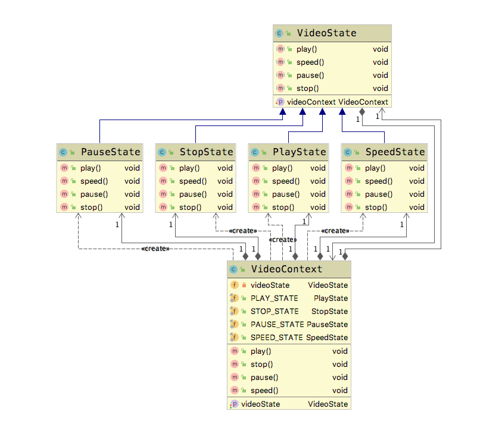

# 状态模式(State Pattern)

**状态模式(State Pattern)**：允许一个对象在其内部状态改变时改变它的行为，对象看起来似乎修改了它的类

## 适用场景

- 一个对象存个多个状态（不同状态下行为不同）,且状态之间可以可相互切换。

## 优点

- 将不同的状态隔离
- 把各种状态的转换逻辑，分布到State的子类中，减少相互间的依赖
- 增加新的状态非常简单

## 缺点

- 状态多的业务场景导致类目数量增加，导致系统非常复杂。

下面，我们引入一种应用场景。在视频网站上观看视频的时候，一个视频会有几种状态，例如播放，暂停，快进，停止等等。当我们改变了视频的状态之后，视频本身具有的行为也发生了变化，这就是状态模式。下面我们来实现一下这个设计模式。

## Golang Demo

定义四种状态的的一个接口

```golang
package state

type IVideoState interface {
    play()
    stop()
    pause()
    speed()
}

```

定义一个VideoContext,用来管理全局的状态。所有的状态变化将在这个Context 结构体下面发生变化。

```golang
package state

var PLAY_STATE = PlayState{}
var STOP_STATE = StopState{}
var PAUSE_STATE = PauseState{}
var SPEED_STATE = SpeedState{}

type VideoContext struct {
    videoState IVideoState
}

func (v *VideoContext) SetVideoState(videoState IVideoState) {
    v.videoState = videoState

}

func (v *VideoContext) play() {
    v.videoState.play()
}

func (v *VideoContext) stop() {
    v.videoState.stop()
}

func (v *VideoContext) pause() {
    v.videoState.pause()
}

func (v *VideoContext) speed() {
    v.videoState.speed()
}

```

接下来定义四种状态，这四种状态都要实现 videostate类，然后能够 与videocontext相关关联。

```golang
package state

import "fmt"

type PlayState struct {
    videoContext *VideoContext
}

func (p PlayState) play() {
    fmt.Println("正常播放Video")
}

func (p PlayState) stop() {
    p.videoContext.videoState = STOP_STATE
}

func (p PlayState) pause() {
    p.videoContext.videoState = PAUSE_STATE
}

func (p PlayState) speed() {
    p.videoContext.videoState = SPEED_STATE
}

```

```golang
package state

import "fmt"

type PauseState struct {
    videoContext *VideoContext
}

func (p PauseState) play() {
    fmt.Println("正常播放Video")
}

func (p PauseState) stop() {
    p.videoContext.videoState = STOP_STATE
}

func (p PauseState) pause() {
    fmt.Println("暂停播放Video")
}

func (p PauseState) speed() {
    p.videoContext.videoState = SPEED_STATE
}

```

```golang
package state

import "fmt"

type SpeedState struct {
    videoContext *VideoContext
}

func (s SpeedState) play() {
    s.videoContext.videoState = PLAY_STATE

}

func (s SpeedState) stop() {
    s.videoContext.videoState = STOP_STATE
}

func (s SpeedState) pause() {
    s.videoContext.videoState = PAUSE_STATE
}

func (s SpeedState) speed() {
    fmt.Println("快进播放Video")

}

```

```golang
package state

import "fmt"

type StopState struct {
    videoContext *VideoContext
}

func (s StopState) play() {
    s.videoContext.videoState = PLAY_STATE
}

func (s StopState) stop() {
    fmt.Println("停止播放Video")
}

func (s StopState) pause() {
    fmt.Println("ERROR 停止状态不能 暂停")
}

func (s StopState) speed() {
    fmt.Println("ERROR 停止状态不能 快进")
}

```

前面我们介绍过，四种状态对应的是一个context，所以在我们测试的时候，需要手动设置一下每个状态所指向的context。这与java有所不同，golang 种不允许递归引用，但是java可以。

```golang
package state

import (
    "fmt"
    "reflect"
)

func ExampleState() {
    videoContext := &VideoContext{}
    PLAY_STATE.videoContext = videoContext
    PAUSE_STATE.videoContext = videoContext
    STOP_STATE.videoContext = videoContext
    SPEED_STATE.videoContext = videoContext

    videoContext.SetVideoState(PLAY_STATE)
    fmt.Printf("current state : %v \n", reflect.TypeOf(videoContext.videoState).Name())

    videoContext.pause()
    fmt.Printf("current state : %v \n", reflect.TypeOf(videoContext.videoState).Name())

    videoContext.speed()
    fmt.Printf("current state : %v \n", reflect.TypeOf(videoContext.videoState).Name())

    videoContext.stop()
    fmt.Printf("current state : %v \n", reflect.TypeOf(videoContext.videoState).Name())

    videoContext.speed()
    fmt.Printf("current state : %v \n", reflect.TypeOf(videoContext.videoState).Name())

    //Output:
    // current state : PlayState
    // current state : PauseState
    // current state : SpeedState
    // current state : StopState
    // ERROR 停止状态不能 快进
    // current state : StopState
}

```

## Java Demo

首先我们定义一个视频状态，包含四种视频状态，并且包含了一个视频的上下文。

```java
package tech.selinux.design.pattern.behavioral.state;

public abstract class VideoState {
  protected VideoContext videoContext;

  public void setVideoContext(VideoContext videoContext) {
    this.videoContext = videoContext;
  }

  public abstract void play();

  public abstract void speed();

  public abstract void pause();

  public abstract void stop();
}

```

然后我们来定义这个视频的上下文。上下文里面包含了四种常量状态。同时有一个videostate，用来与VideoState相关联。
有一点要注意，在setVideoState的时候，顺便将自己本身赋值给了VideoState。这样二者就关联了起来。

```java
package tech.selinux.design.pattern.behavioral.state;

public class VideoContext {

  private VideoState videoState;
  public static final PlayState PLAY_STATE = new PlayState();
  public static final StopState STOP_STATE = new StopState();
  public static final PauseState PAUSE_STATE = new PauseState();
  public static final SpeedState SPEED_STATE = new SpeedState();

  public VideoState getVideoState() {
    return videoState;
  }

  public void setVideoState(VideoState videoState) {
    this.videoState = videoState;
    // 把当前的环境设置到上下文
    this.videoState.setVideoContext(this);
  }

  public void play() {
    this.videoState.play();
  }

  public void stop() {
    this.videoState.stop();
  }

  public void pause() {
    this.videoState.pause();
  }

  public void speed() {
    this.videoState.speed();
  }
}

```

实际种的四种状态，我们分别使用Video的四个子类来进行实现。  
play 状态下，可以切换到pause，speed，stop状态。

```java
package tech.selinux.design.pattern.behavioral.state;

/** play 状态下是可以切换到其他状态的 */
public class PlayState extends VideoState {
  @Override
  public void play() {
    System.out.println("正常播放Video");
  }

  @Override
  public void speed() {
    super.videoContext.setVideoState(VideoContext.SPEED_STATE);
  }

  @Override
  public void pause() {
    super.videoContext.setVideoState(VideoContext.PAUSE_STATE);
  }

  @Override
  public void stop() {
    super.videoContext.setVideoState(VideoContext.STOP_STATE);
  }
}

```

pause 状态可以切换到play，stop，speed状态。

```java
package tech.selinux.design.pattern.behavioral.state;

/** 暂停状态能够切换到其他状态 */
public class PauseState extends VideoState {
  @Override
  public void play() {
    super.videoContext.setVideoState(VideoContext.PLAY_STATE);
  }

  @Override
  public void speed() {
    super.videoContext.setVideoState(VideoContext.SPEED_STATE);
  }

  @Override
  public void pause() {
    System.out.println("暂停播放Video");
  }

  @Override
  public void stop() {
    super.videoContext.setVideoState(VideoContext.STOP_STATE);
  }
}

```

speed 状态可以切换到其他三种状态。

```java
package tech.selinux.design.pattern.behavioral.state;

/** 快进状态下是可以切换到其他状态的。 */
public class SpeedState extends VideoState {
  @Override
  public void play() {
    super.videoContext.setVideoState(VideoContext.PLAY_STATE);
  }

  @Override
  public void speed() {
    System.out.println("快进播放Video");
  }

  @Override
  public void pause() {
    super.videoContext.setVideoState(VideoContext.PAUSE_STATE);
  }

  @Override
  public void stop() {
    super.videoContext.setVideoState(VideoContext.STOP_STATE);
  }
}

```

stop 状态除了能够切换为play状态外，其他的状态切换不了，这里要注意。

```java
package tech.selinux.design.pattern.behavioral.state;

/** 停止状态不能切换到其他状态 */
public class StopState extends VideoState {
  @Override
  public void play() {
    super.videoContext.setVideoState(VideoContext.PLAY_STATE);
  }

  @Override
  public void speed() {
    System.out.println("ERROR 停止状态不能 快进");
  }

  @Override
  public void pause() {
    System.out.println("ERROR 停止状态不能 暂停");
  }

  @Override
  public void stop() {
    System.out.println("停止播放Video");
  }
}

```

```java
package tech.selinux.design.pattern.behavioral.state;

public class Test {

  public static void main(String[] args) {
    VideoContext videoContext = new VideoContext();
    // 设置初始状态
    videoContext.setVideoState(new PlayState());
    System.out.println("current state :" + videoContext.getVideoState().getClass().getSimpleName());

    videoContext.pause();
    System.out.println("current state :" + videoContext.getVideoState().getClass().getSimpleName());

    videoContext.speed();
    System.out.println("current state :" + videoContext.getVideoState().getClass().getSimpleName());

    videoContext.stop();
    System.out.println("current state :" + videoContext.getVideoState().getClass().getSimpleName());

    videoContext.speed();
    System.out.println("current state :" + videoContext.getVideoState().getClass().getSimpleName());
  }
}

```

## UML

