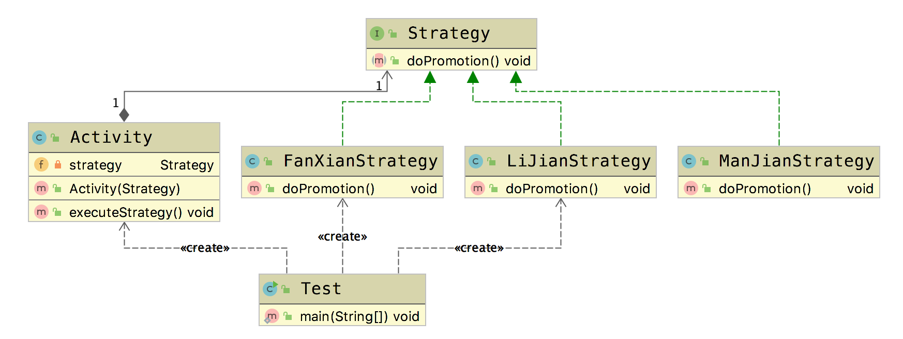

# 策略模式 (Strategy Pattern)

&emsp;&emsp; **策略模式(Strategy Pattern)**：定义一系列算法类，将每一个算法封装起来，并让它们可以相互替换，此模式让算法的变化不会影响到使用算法的用户。  
&emsp;&emsp; 如果代码中有很多的if..else.. 就可以使用策略模式来解决这些问题。

## 适用场景

- 系统有很多类，而他们的区别仅仅在于他们的行为不同
- 一个系统需要动态地在几种算法中选择一种

## 优点

- 对开闭原则完美地支持
- 避免使用多重条件转移语句
- 提高算法地保密性和安全性

## 缺点

- 客户端必须知道所有的策略类，并自行决定使用哪一个策略类
- 产生很多的策略类

下面我们引入一种业务场景，超市在店庆的时候，会进行促销，但是促销的策略有多种，满减，立减，返现等不同的方式。

## Golang Demo

```go
package strategy

import "fmt"

type Strategy interface {
    doPromotion()
}

type Activity struct {
    strategy Strategy
}

func NewActivity(strategy Strategy) *Activity {
    return &Activity{strategy: strategy}
}
func (a Activity) executeStrategy() {
    a.strategy.doPromotion()
}

type FanXianStratege struct {
}

func NewFanXianStratege() *FanXianStratege {
    return &FanXianStratege{}
}

func (FanXianStratege) doPromotion() {
    fmt.Println("返现促销")
}

type LiJianStrategy struct {
}

func NewLiJianStrategy() *LiJianStrategy {
    return &LiJianStrategy{}
}

func (LiJianStrategy) doPromotion() {
    fmt.Println("立减促销")
}

type ManJianStrategy struct {
}

func NewManJianStrategy() *ManJianStrategy {
    return &ManJianStrategy{}
}

func (ManJianStrategy) doPromotion() {
    fmt.Println("满减促销")
}

```

```go
package strategy

import "testing"

func Test(t *testing.T) {

    activity618 := NewActivity(NewFanXianStratege())
    activity1111 := NewActivity(NewLiJianStrategy())

    activity618.executeStrategy()
    activity1111.executeStrategy()

}

```

## Java Demo

```java
package tech.selinux.design.pattern.behavioral.strategy;

public interface Strategy {
  void doPromotion();
}

```

```java
package tech.selinux.design.pattern.behavioral.strategy;

public class Activity {
  private Strategy strategy;

  public Activity(Strategy strategy) {
    this.strategy = strategy;
  }

  public void executeStrategy() {
    strategy.doPromotion();
  }
}

```

```java
package tech.selinux.design.pattern.behavioral.strategy;

public class FanXianStrategy implements Strategy {
  @Override
  public void doPromotion() {
    System.out.println("返现促销");
  }
}

```

```java
package tech.selinux.design.pattern.behavioral.strategy;

public class LiJianStrategy implements Strategy {
  @Override
  public void doPromotion() {
    System.out.println("立减促销");
  }
}

```

```java
package tech.selinux.design.pattern.behavioral.strategy;

public class ManJianStrategy implements Strategy {
  @Override
  public void doPromotion() {
    System.out.println("满减促销");
  }
}

```

```java
package tech.selinux.design.pattern.behavioral.strategy;

public class Test {
  public static void main(String[] args) {
    Activity activity618 = new Activity(new LiJianStrategy());
    Activity activity1111 = new Activity(new FanXianStrategy());

    activity618.executeStrategy();
    activity1111.executeStrategy();
  }
}

```

上面的案例中就是策略模式的最简单的应用。但是这并不能满足我们复杂的开发。例如，如果我们在Test类中有这样一段代码的话。

```java
package tech.selinux.design.pattern.behavioral.strategy;

import org.apache.commons.lang3.StringUtils;

public class Test {
  public static void main(String[] args) {
    //    Activity activity618 = new Activity(new LiJianStrategy());
    //    Activity activity1111 = new Activity(new FanXianStrategy());
    //
    //    activity618.executeStrategy();
    //    activity1111.executeStrategy();

    final String strategy = "LIJIAN";

    if (StringUtils.equals(strategy, "LIJIAN")) {
      Activity activity = new Activity(new LiJianStrategy());
      activity.executeStrategy();
    } else if (StringUtils.equals(strategy, "MANJIAN")) {
      Activity activity = new Activity(new ManJianStrategy());
      activity.executeStrategy();
    }
  }
}

```

这样话，我们还是避免不了大量的if..else..的使用。此时，我们就可以结合工厂模式，或者享元模式来进行进一步的优化

## UML



---

### 补充另一个版本的Java/Scala Demo 以及源码解析

---

## Java Demo_

## Scala Demo

## UML_

## 源码解析
