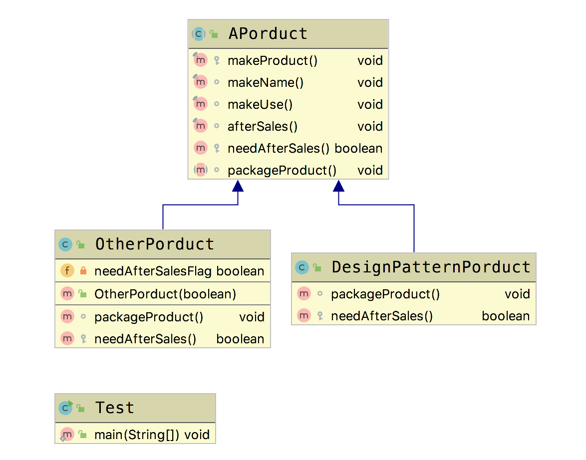

# 模板方法模式 (Template Method Pattern)

模板方法模式 (Template Method Pattern): 定义了一个算法的骨架，并允许子类为一个或多个步骤提供实现,模板方法模式使得子类可以不改变一个算法的结构即可重定义该算法的某些特定步骤。

## 适用场景

- 一次性实现算法的不变部分，并将可变的行为留给子类来实现。
- 各子类中公共的行为被提取出来并集中到一个公共的父类中，从而避免代码重复。

## 优点

- 提高复用性,将相同部分的代码放在抽象的父类中
- 提高扩展性，将不同的代码放在不同的子类中
- 符合开闭原则

## 缺点

- 类数目增加
- 增加了系统实现的复杂度
- 继承关系自身缺点，如果父类添加新的抽象方法，所有子类都要修改一遍

我们引入一种应用场景。产品线上可以使用一种产品线生产不同系列的产品，每种产品同属一种产品线，但是具体的实现细节有所差别。

## Golang Demo

```go
package templatemethod

import "fmt"

type IProduct interface {
    makeName()
    makeUse()
    afterSales()
    needAfterSales() bool

    packageProduct()
}

// golang 中不能定义抽象类，所以，我们使用一个struct 和一个 interface 组合来实现
type Product struct {
    iProduct IProduct
}

func NewProduct() *Product {
    return &Product{}
}

func (p *Product) makeProduct() {
    p.iProduct.makeName()
    p.iProduct.makeUse()
    if p.iProduct.needAfterSales() {
        p.iProduct.afterSales()
    }
    p.iProduct.packageProduct()
}

func (*Product) makeName() {
    fmt.Println("产品命名")

}
func (*Product) makeUse() {
    fmt.Println("产品使用手册")

}
func (*Product) afterSales() {
    fmt.Println("售后")

}

func (*Product) needAfterSales() bool {
    return false
}

func (*Product) packageProduct() {

}

```

```go
package templatemethod

import "fmt"

type DesignPatternProduct struct {
    Product
}

func NewDesignPatternProduct() *DesignPatternProduct {
    return &DesignPatternProduct{}
}

func (DesignPatternProduct) packageProduct() {
    fmt.Println("提供DesignPatternPorduct")

}

func (DesignPatternProduct) needAfterSales() bool {
    return true
}

type OtherPorduct struct {
    Product
    needAfterSalesFlag bool
}

func NewOtherPorduct(needAfterSalesFlag bool) *OtherPorduct {
    return &OtherPorduct{needAfterSalesFlag: needAfterSalesFlag}
}

func (o *OtherPorduct) packageProduct() {
    fmt.Println("提供OtherPorduct")
    fmt.Println("提供OtherPorduct other")
}

func (o *OtherPorduct) needAfterSales() bool {
    return o.needAfterSalesFlag
}

```

```go
package templatemethod

import (
    "fmt"
    "testing"
)

func Test(t *testing.T) {

    fmt.Println("pattern start---")

    designPatternProduct := NewProduct()
    designPatternProduct.iProduct = NewDesignPatternProduct()
    designPatternProduct.makeProduct()
    fmt.Println("pattern end---")

    fmt.Println("start---")
    otherProduct := NewProduct()
    otherProduct.iProduct = NewOtherPorduct(true)
    otherProduct.makeProduct()
    fmt.Println("end---")

}

```

## Java Demo

```java
package tech.selinux.design.pattern.behavioral.templatemethod;

public abstract class APorduct {

  protected final void makeProduct() {
    this.makeName();
    this.makeUse();
    if (needAfterSales()) {
      this.afterSales();
    }
    this.packageProduct();
  }

  final void makeName() {
    System.out.println("产品命名");
  }

  final void makeUse() {
    System.out.println("产品使用手册");
  }

  final void afterSales() {
    System.out.println("售后");
  }
  // 钩子方法
  protected boolean needAfterSales() {
    return false;
  }

  abstract void packageProduct();
}

```

```java
package tech.selinux.design.pattern.behavioral.templatemethod;

public class DesignPatternPorduct extends APorduct {
  @Override
  void packageProduct() {
    System.out.println("提供DesignPatternPorduct");
  }

  @Override
  protected boolean needAfterSales() {
    return true;
  }
}

```

```java
package tech.selinux.design.pattern.behavioral.templatemethod;

public class OtherPorduct extends APorduct {
  private boolean needAfterSalesFlag = false;

  @Override
  void packageProduct() {
    System.out.println("提供OtherPorduct");
    System.out.println("提供OtherPorduct other");
  }

  public OtherPorduct(boolean needAfterSalesFlag) {
    this.needAfterSalesFlag = needAfterSalesFlag;
  }

  @Override
  protected boolean needAfterSales() {
    return this.needAfterSalesFlag;
  }
}

```

```java
package tech.selinux.design.pattern.behavioral.templatemethod;

public class Test {
  public static void main(String[] args) {
    System.out.println("pattern start---");
    APorduct designPatternProduct = new DesignPatternPorduct();
    designPatternProduct.makeProduct();
    System.out.println("pattern end---");

    System.out.println("start---");
    APorduct product = new OtherPorduct(false);
    product.makeProduct();
    System.out.println("end---");
  }
}
```

## UML



---

### 补充另一个版本的Java/Scala Demo 以及源码解析

---

## Java Demo_

## Scala Demo

## UML_

## 源码解析
