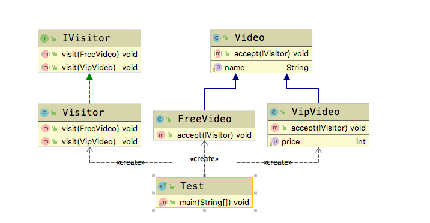

# 访问者模式(Visitor Pattern)

**访问者模式(Visitor Pattern)**:提供一个作用于某对象结构中的各元素的操作表示，它使我们可以在不改变各元素的类的前提下定义作用于这些元素的新操作。

封装用于某数据结构（List、Set、Map）中各种元素的操作,核心是**封装操作**。

## 适用场景

- 当一个数据结构如（List、Set、Map）包含很多类型对象。
- 数据结构与数据操作分离

## 优点

- 增加新的操作很容易，新增一个访问者就可以

## 缺点

- 增加新的数据结构困难
- 具体元素变更比较麻烦

下面我们引入一个应用场景。在很多视频网站上，会有很多的免费视频，以及付费视频。用户去视频网站浏览的时候，就是一个个访问者。接下来我们通过代码来模拟一下这个业务逻辑。  

**注意：** 在实际工作中，并不一定常用访问者模式。一单要使用访问者模式，就说明，这个应用场景必须要使用访问者模式来解决问题，或者说使用访问者模式能让问题解决地更优雅。

## Golang Demo

```golang
package visitor

import "fmt"

type IVisitor interface {
    visit(interface{})
}

// 定义一个visitor 实现IVisitor 接口
type Visitor struct {
}

// golang 中不支持重载，所以这里的visit 方法，我们需要费劲一点
func (Visitor) visit(i interface{}) {
    switch i.(type) {
    case FreeVideo:
        video := i.(FreeVideo)
        fmt.Println("Free Video " + video.name)
    case VipVideo:
        video := i.(VipVideo)
        fmt.Printf("Vip Video  %v : Price  %d \n", video.name, video.price)
    }
}

// IVideo 和 Video的组合 模拟一个抽象类
type IVideo interface {
    accept(visitor IVisitor)
}
type Video struct {
    name string
}

type FreeVideo struct {
    Video
}

func (f FreeVideo) accept(visitor IVisitor) {
    visitor.visit(f)
}

type VipVideo struct {
    Video
    price int
}

func (v VipVideo) accept(visitor IVisitor) {
    visitor.visit(v)
}

```

```golang
package visitor

func ExampleVisitor() {

    videoList := []IVideo{}
    freeVideo := FreeVideo{}
    freeVideo.name = "一条狗的使命"

    vipVideo := VipVideo{}
    vipVideo.name = "流浪地球"
    vipVideo.price = 6

    videoList = append(videoList, freeVideo)
    videoList = append(videoList, vipVideo)

    for _, video := range videoList {
        video.accept(Visitor{})
    }

    // Output:
    // Free Video 一条狗的使命
    // Vip Video  流浪地球 : Price  6
}

```

## Java Demo

定义一个访问者的接口

```java
package tech.selinux.design.pattern.behavioral.visitor;

/** 定义了一个访问者的接口 */
public interface IVisitor {
  void visit(FreeVideo freeVideo);

  void visit(VipVideo vipVideo);
}

```

定义视频的抽象类

```java
package tech.selinux.design.pattern.behavioral.visitor;

public abstract class Video {
  private String name;

  public String getName() {
    return name;
  }

  public void setName(String name) {
    this.name = name;
  }

  // 是否接受访问者的访问
  public abstract void accept(IVisitor visitor);
}

```

```java
package tech.selinux.design.pattern.behavioral.visitor;

/** 定义了一个免费视频 继承了视频类 */
public class FreeVideo extends Video {
  @Override
  public void accept(IVisitor visitor) {
    visitor.visit(this);
  }
}

```

```java
package tech.selinux.design.pattern.behavioral.visitor;

public class VipVideo extends Video {
  private int price;

  public int getPrice() {
    return price;
  }

  public void setPrice(int price) {
    this.price = price;
  }

  /** 这里会根据传入的类型调用相应的方法 */
  @Override
  public void accept(IVisitor visitor) {
    visitor.visit(this);
  }
}

```

定义了visitor，visitor会根据传入的视频类别来进行访问。

```java
package tech.selinux.design.pattern.behavioral.visitor;

public class Visitor implements IVisitor {
  @Override
  public void visit(FreeVideo freeVideo) {
    System.out.println("Free Video " + freeVideo.getName());
  }

  @Override
  public void visit(VipVideo vipVideo) {
    System.out.println("Vip Video " + vipVideo.getName() + ": Price " + vipVideo.getPrice());
  }
}

```

```java
package tech.selinux.design.pattern.behavioral.visitor;

import java.util.ArrayList;
import java.util.List;

public class Test {
  public static void main(String[] args) {
    List<Video> videoList = new ArrayList<Video>();

    FreeVideo freeVideo = new FreeVideo();
    freeVideo.setName("一条狗的使命");

    VipVideo vipVideo = new VipVideo();
    vipVideo.setName("流浪地球");
    vipVideo.setPrice(6);

    videoList.add(freeVideo);
    videoList.add(vipVideo);

    for (Video video : videoList) {
      video.accept(new Visitor());
    }
  }
}

```

## UML



---

### 补充另一个版本的Java/Scala Demo 以及源码解析

---

## Java Demo_

## Scala Demo

## UML_

## 源码解析
