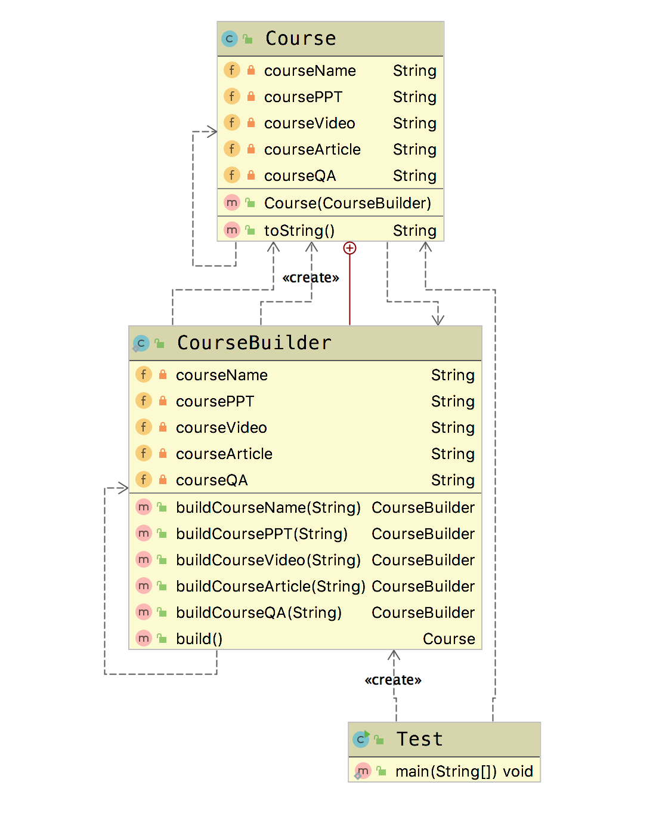

# 建造者模式(Builder Pattern)

&emsp;&emsp; **建造者模式(Builder Pattern)**：将一个复杂对象的构建与它的表示分离，使得同样的构建过程可以创建不同的表示。建造者模式是一种对象创建型模式。  
&emsp;&emsp; 用户只需指定需要建造的类型就可以得到他们，建造过程以及细节不需要知道。

## 适用场景

- 一个对象有非常复杂的内部结构（很多属性）
- 想把复杂对象的创建和使用分离

## 优点

- 封装性好，创建和使用分离
- 扩展性好，建造类之间独立，一定程度可以解偶

## 缺点

- 产生多余的Builder对象
- 产品内部发生变化，建造者都要修改，成本较大

## 建造者模式与工厂模式的比较

- 建造者模式更注重于方法的调用顺序，工厂模式注重于创建产品
- 创建对象的力度有所不同，建造者模式可以创建一些复杂的产品，由各种复杂的部件组成，而工厂模式创建出来的产品都是一个样子
- 关注点有区别，工厂模式注重的是只要把对象创建出来就ok了，而建造者模式不仅要创建产品，还要知道产品都是由哪些部件组成的
- 建造着模式关心顺序，而工厂不关心顺序

## Golang Demo

```go
package builder

type Builder interface {
    buildCourseName(courseName string) Builder
    buildCoursePPT(coursePPT string) Builder
    buildCourseVideo(courseVideo string) Builder
    buildCourseArticle(courseArticle string) Builder
    buildCourseQA(courseQA string) Builder
    build() Course
}

```

```go
package builder

type Course struct {
    courseName    string
    coursePPT     string
    courseVideo   string
    courseArticle string
    courseQA      string
}

type CourseBuilder struct {
    course Course
}

func NewCourseBuilder() *CourseBuilder {
    return &CourseBuilder{}
}

func (c *CourseBuilder) buildCourseName(courseName string) Builder {
    c.course.courseName = courseName
    return c
}

func (c *CourseBuilder) buildCoursePPT(coursePPT string) Builder {
    c.course.coursePPT = coursePPT
    return c
}

func (c *CourseBuilder) buildCourseVideo(courseVideo string) Builder {
    c.course.courseVideo = courseVideo
    return c
}

func (c *CourseBuilder) buildCourseArticle(courseArticle string) Builder {
    c.course.courseArticle = courseArticle
    return c
}

func (c *CourseBuilder) buildCourseQA(courseQA string) Builder {
    c.course.courseQA = courseQA
    return c
}

func (c *CourseBuilder) build() Course {
    return c.course
}

```

```go
package builder

import (
    "fmt"
    "testing"
)

func TestBuilder(t *testing.T) {

    course := NewCourseBuilder().
        buildCourseName("golang").
        buildCourseArticle("golang note").
        buildCoursePPT("golang ppt").build()
    fmt.Println(course)
}

```

## Java Demo

```java
package tech.selinux.design.pattern.creational.builder;

public class Course {

    private String courseName;
    private String coursePPT;
    private String courseVideo;
    private String courseArticle;

    //question & answer
    private String courseQA;

    public Course(CourseBuilder courseBuilder) {
        this.courseName = courseBuilder.courseName;
        this.coursePPT = courseBuilder.coursePPT;
        this.courseVideo = courseBuilder.courseVideo;
        this.courseArticle = courseBuilder.courseArticle;
        this.courseQA = courseBuilder.courseQA;
    }


    @Override
    public String toString() {
        return "Course{" +
                "courseName='" + courseName + '\'' +
                ", coursePPT='" + coursePPT + '\'' +
                ", courseVideo='" + courseVideo + '\'' +
                ", courseArticle='" + courseArticle + '\'' +
                ", courseQA='" + courseQA + '\'' +
                '}';
    }

    public static class CourseBuilder{
        private String courseName;
        private String coursePPT;
        private String courseVideo;
        private String courseArticle;

        //question & answer
        private String courseQA;

        public CourseBuilder buildCourseName(String courseName){
            this.courseName = courseName;
            return this;
        }


        public CourseBuilder buildCoursePPT(String coursePPT) {
            this.coursePPT = coursePPT;
            return this;
        }

        public CourseBuilder buildCourseVideo(String courseVideo) {
            this.courseVideo = courseVideo;
            return this;
        }

        public CourseBuilder buildCourseArticle(String courseArticle) {
            this.courseArticle = courseArticle;
            return this;
        }

        public CourseBuilder buildCourseQA(String courseQA) {
            this.courseQA = courseQA;
            return this;
        }

        public Course build(){
            return new Course(this);
        }
    }
}

```

```java
package tech.selinux.design.pattern.creational.builder;

public class Test {
  public static void main(String[] args) {
    // 链式调用
    Course course =
        new Course.CourseBuilder()
            .buildCourseName("Java pattern")
            .buildCoursePPT("Java pattern PPT")
            .buildCourseVideo("Java pattern video")
            .build();
    System.out.println(course);
  }
}
```

## UML

