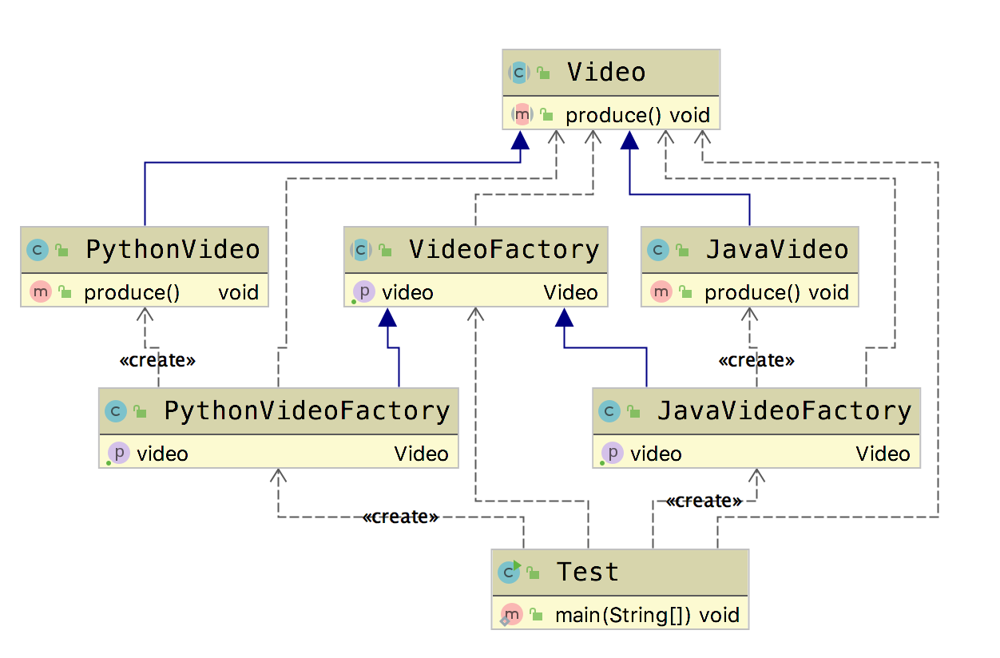

# 工厂方法模式(Factory Method Pattern)

&emsp;&emsp;  前面我们介绍过，简单工厂模式最大的缺点是当有新产品要加入到系统中时，必须修改工厂类，需要在其中加入必要的业务逻辑，这违背了“开闭原则”。

&emsp;&emsp;  在工厂方法模式中，我们不再提供一个统一的工厂类来创建所有的产品对象，而是针对不同的产品提供不同的工厂，系统提供一个与产品等级结构对应的工厂等级结构。

&emsp;&emsp;  **工厂方法模式(Factory Method Pattern)**：定义一个用于创建对象的接口，让子类决定将哪一个类实例化。工厂方法模式让一个类的实例化延迟到其子类。工厂方法模式又简称为工厂模式(Factory Pattern)，又可称作虚拟构造器模式(Virtual Constructor Pattern)或多态工厂模式(Polymorphic Factory Pattern)。工厂方法模式是一种类创建型模式。

## 适用场景

- 创建对象需要大量重复的代码
- 客户端(应用层)不依赖于产品实例，如何被创建、实现等细节
- 一个类通过其子类来指定创建哪个对象

## 优点

- 用户只需要关心所需产品对应的工厂，无须关心创建细节
- 加入新产品符合开闭原则，提高可扩展性

## 缺点

- 类的个数容易过多，增加复杂度
- 增加了系统的抽象性和理解难度

## Golang Demo

```go
package factorymethod

type Video interface {
    produce()
}
```

```go
package factorymethod

type VideoFactory interface {
    getVideo() Video
}
```

```go
package factorymethod

import "fmt"

type JavaVideo struct {
}

func (j JavaVideo) produce() {
    fmt.Println("produce java")
}
```

```go
package factorymethod

type JavaFactory struct {
}

func NewJavaFactory() *JavaFactory {
    return &JavaFactory{}
}

func (j JavaFactory) getVideo() Video {
    return JavaVideo{}
}
```

```go
package factorymethod

import "fmt"

type PythonVideo struct {
}

func (PythonVideo) produce() {
    fmt.Println("produce python")
}
```

```go
package factorymethod

type PythonFactory struct {
}

func NewPythonFactory() *PythonFactory {
    return &PythonFactory{}
}

func (PythonFactory) getVideo() Video {
    return PythonVideo{}
}
```

```go
package factorymethod

import "testing"

func TestGetVideo(t *testing.T) {
    videoFactory := NewJavaFactory()
    videoFactory.getVideo().produce()
    videoFactory2 := NewPythonFactory()
    videoFactory2.getVideo().produce()
}

```

## Java Demo

```java
package tech.selinux.design.pattern.creational.factorymethod;

public abstract class Video {
    public abstract void produce();
}
```

```java
package tech.selinux.design.pattern.creational.factorymethod;

public abstract class VideoFactory {
    public abstract Video getVideo();
}
```

```java
package tech.selinux.design.pattern.creational.factorymethod;

public class JavaVideo extends Video {
    @Override
    public void produce() {
        System.out.println("Java Produce");
    }
}
```

```java
package tech.selinux.design.pattern.creational.factorymethod;

public class JavaVideoFactory extends VideoFactory {
    @Override
    public Video getVideo() {
        return new JavaVideo();
    }
}
```

```java
package tech.selinux.design.pattern.creational.factorymethod;

public class PythonVideo extends Video {
    @Override
    public void produce() {
        System.out.println("Python produce");
    }
}

```

```java
package tech.selinux.design.pattern.creational.factorymethod;

public class PythonVideoFactory extends VideoFactory {
    @Override
    public Video getVideo() {
        return new PythonVideo();
    }
}
```

```java
package tech.selinux.design.pattern.creational.factorymethod;

public class Test {
    public static void main(String[] args) {
        VideoFactory videoFactory = new PythonVideoFactory();
        VideoFactory videoFactory2 = new JavaVideoFactory();
        Video video = videoFactory.getVideo();
        video.produce();
    }
}
```

## Scala Demo

## UML

