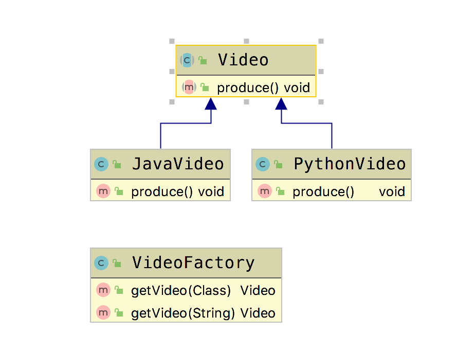

# 简单工厂模式(Simple Factory Pattern)

&emsp;&emsp; **简单工厂模式(Simple Factory Pattern)**：由一个工厂对象决定创建哪一种产品类的实例。  
简单工厂模式是工厂模式的“小弟”，它不属于GoF23种设计模式之一。但是平常应用也比较频繁，所以我们先介绍它。  

- **优点**：只要传入一个正确的参数，就可以获得你所需要的对象，无须知道其创建细节。
- **缺点**：工厂类的职责相对过重，增加新的产品，需要修改工厂类的判断逻辑，违背了开闭原则。

## Golang Demo

```go
package simplefactory

import "fmt"

type JavaVideo struct {
}

func (JavaVideo) produce() {
    fmt.Println("produce java video")
}
```

```go
package simplefactory

import "fmt"

type PythonVideo struct {
}

func (PythonVideo) produce() {
    fmt.Println("produce python video")
}
```

```go
package simplefactory

type Video interface {
    produce()
}

func GetVideoByType(v Video) (video Video) {
    switch v.(type) {
    case JavaVideo:
        video = JavaVideo{}
    case PythonVideo:
        video = PythonVideo{}
    }
    return
}
func GetVideoByStr(class string) (video Video) {
    switch class {
    case "java":
        video = JavaVideo{}
    case "python":
        video = PythonVideo{}
    }
    return
}
```

```go
package simplefactory

import (
    "testing"
)

func TestGetVideoByStr(t *testing.T) {
    video := GetVideoByStr("java")
    video.produce()

}

func TestGetVideoByType(t *testing.T) {
    video := GetVideoByType(PythonVideo{})
    video.produce()
}
```

## Java Demo

```java
package tech.selinux.design.pattern.creational.simplefactory;

public abstract class Video {
    public abstract void produce();
}
```

```java
package tech.selinux.design.pattern.creational.simplefactory;

public class JavaVideo extends Video {
    @Override
    public void produce() {
        System.out.println("produce java");
    }
}
```

```java
package tech.selinux.design.pattern.creational.simplefactory;

public class PythonVideo extends Video {
    @Override
    public void produce() {
        System.out.println("produce python");
    }
}
```

```java
package tech.selinux.design.pattern.creational.simplefactory;

public class VideoFactory {
    public Video getVideo(Class c){
        Video video = null;
        try {
            video = (Video) Class.forName(c.getName()).newInstance();
        } catch (InstantiationException e) {
            e.printStackTrace();
        } catch (IllegalAccessException e) {
            e.printStackTrace();
        } catch (ClassNotFoundException e) {
            e.printStackTrace();
        }
        return video;
    }


    public Video getVideo(String type){
        if("java".equalsIgnoreCase(type)){
            return new JavaVideo();
        }else if("python".equalsIgnoreCase(type)){
            return new PythonVideo();
        }
        return null;
    }

}
```

```java
package tech.selinux.design.pattern.creational.simplefactory;

public class Test {
    public static void main(String[] args) {

        VideoFactory videoFactory = new VideoFactory();
        Video video = videoFactory.getVideo(JavaVideo.class);
        if(video == null){
            return;
        }
        video.produce();
    }
}
```

## UML

