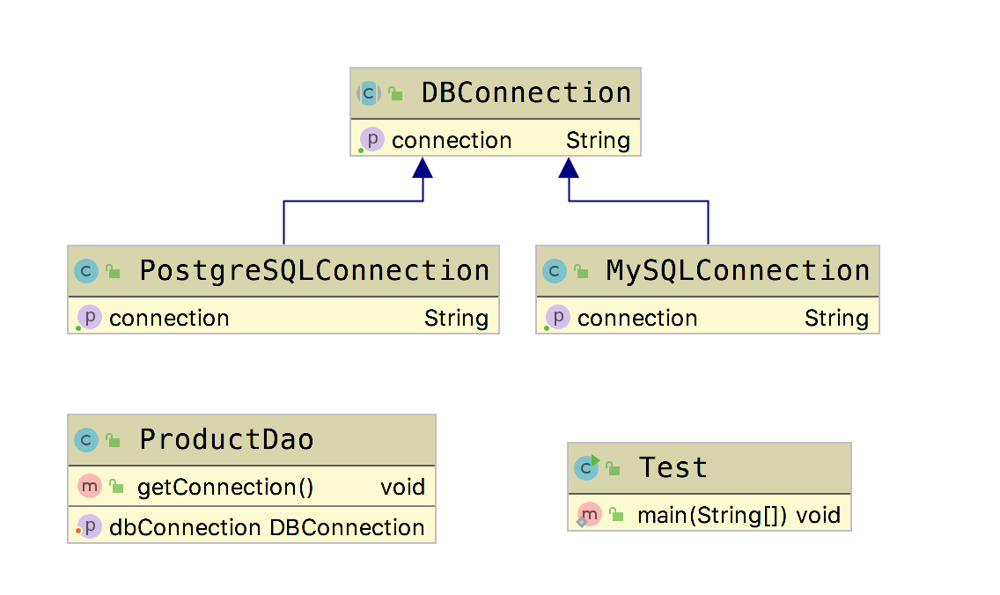

# 合成复用原则(Composite Reuse Principle, CRP)

&emsp;&emsp; **合成复用原则(Composite Reuse Principle, CRP)**：尽量使用对象组合/聚合，而不是继承来达到复用的目的。  
&emsp;&emsp; **优点**： 使系统更加灵活，降低类于类之间的耦合度，一个类的变化对其他类造成的影响相对较小。  
&emsp;&emsp; **缺点**： 破坏了包装，同时包含的类的实现细节被隐藏。

## 聚合/组合

&emsp;&emsp; 组合和聚合到底有什么区别呢？下面我们拿出一点时间来对这两个概念进行一下简单的区分。下面我们引入一个代码场景。
A类中包含了B类的一个引用，当A的一个对象消失时，B对象所指向的这个引用也就随之消失了，因为没有任何一个引用指向它，就被GC了。这种情况就叫做组合。反过来想，B类创建的对象，所指向的引用，如果还有另外一个引用指向它，这种情况就叫做聚合。因为A类消失后，B类所创建的对象没有消失。 也就是说，组合关系的类，具有同样的生命周期。  

下面我们从代码上区分一下聚合和组合的关系。

```java
public  class BirdGroup
{
    public Bird bird;

    public BirdGroup(Bird bird)
    {
        this.bird = bird;
    }
}
```

聚合关系的类里有另外一个类作为参数。BirdGroup类被gc之后，bird类的引用依然建在。这就是聚合。

```java
public class Bird
{
    public Wings wings;

    public Bird()
    {
        wings=new Wings();
    }
}
```

组合关系的类里有另外一个类的实例化，如果Bird这个类被GC了，内部的类的引用，随之消失了，这就是组合。

## Golang Demo

```go
package compositionaggregation

type DBConnection interface {
    GetConnection() string
}
```

```go
package compositionaggregation

type MySQLConnection struct {
}

func NewMySQLConnection() *MySQLConnection {
    return &MySQLConnection{}
}

func (MySQLConnection) GetConnection() string {
    return "mysql conn"
}
```

```go
package compositionaggregation

type PostgreSQLConnection struct {
}

func NewPostgreSQLConnection() *PostgreSQLConnection {
    return &PostgreSQLConnection{}
}

func (PostgreSQLConnection) GetConnection() string {
    return "postgresql conn"
}
```

```go
package compositionaggregation

import "fmt"

type ProductDao struct {
    dbConn DBConnection
}

func NewProductDao(dbConn DBConnection) *ProductDao {
    return &ProductDao{dbConn: dbConn}
}

func (p ProductDao) addProdcut() {
    conn := p.dbConn.GetConnection()

    fmt.Println("add " + conn)
}
```

```go
package compositionaggregation

import "testing"

func Test(t *testing.T) {
    product := NewProductDao(NewMySQLConnection())
    product.addProdcut()
}
```

## Java Demo

```java
package tech.selinux.design.principle.compositionaggregation;

public abstract class DBConnection {
    public abstract String getConnection();
}
```

```java
package tech.selinux.design.principle.compositionaggregation;

public class MySQLConnection extends DBConnection {
    @Override
    public String getConnection() {
        return "MySQL conn";
    }
}
```

```java
package tech.selinux.design.principle.compositionaggregation;

public class PostgreSQLConnection extends DBConnection {
    @Override
    public String getConnection() {
        return "PostgreSQL conn";
    }
}
```

```java
package tech.selinux.design.principle.compositionaggregation;

public class ProductDao{
    private DBConnection dbConnection;

    public void setDbConnection(DBConnection dbConnection) {
        this.dbConnection = dbConnection;
    }

    public void addProduct() {
        String conn = dbConnection.getConnection();
        System.out.println("add" + conn);
    }
}
```

```java
package tech.selinux.design.principle.compositionaggregation;

public class Test {
    public static void main(String[] args) {
        ProductDao productDao = new ProductDao();
        productDao.setDbConnection(new PostgreSQLConnection());
        productDao.addProduct();
    }
}
```

## UML



---

### 补充另一个版本的Java/Scala Demo 以及源码解析

---

## Java Demo_

## Scala Demo

## UML_

## 源码解析

