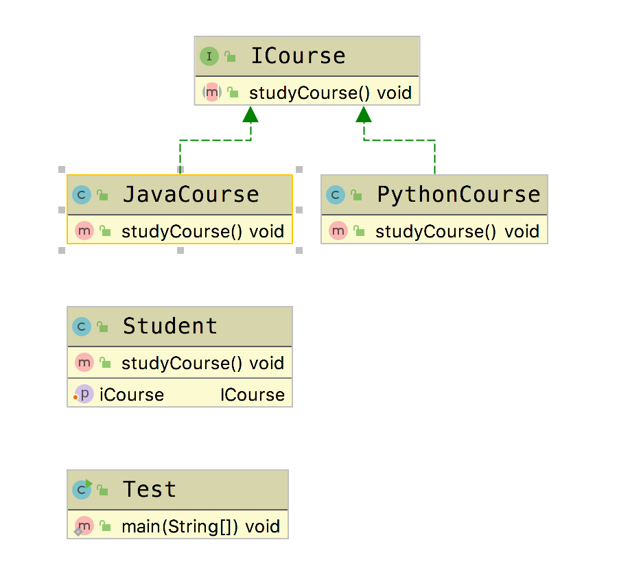

# 依赖倒置原则(Dependence  Inversion Principle, DIP)

&emsp;&emsp; **依赖倒置原则(Dependency Inversion  Principle, DIP)**：高层模块不应该依赖于低层模块，二者应该依赖于其抽象。抽象不应该依赖于细节，细节应当依赖于抽象。换言之，要针对接口编程，而不是针对实现编程。

## Golang Demo

```go
package dependenceinversion

type CourseInterface interface {
    studyCourse()
}
```

```go
package dependenceinversion

import "fmt"

type JavaCourse struct {
}

func NewJavaCourse() *JavaCourse {
    return &JavaCourse{}
}

func (JavaCourse) studyCourse() {
    fmt.Println("study java")
}

```

```go
package dependenceinversion

import "fmt"

type PythonCourse struct {
}

func NewPythonCourse() *PythonCourse {
    return &PythonCourse{}
}

func (PythonCourse) studyCourse() {
    fmt.Println("study pyhon")
}

```

```go
package dependenceinversion

type Student struct {
    course CourseInterface
}

func NewStudent(course CourseInterface) *Student {
    return &Student{course: course}
}

func (s Student) studyCourse() {
    s.course.studyCourse()
}

```

```go
package dependenceinversion

import "testing"

func TestDependenceInversion(t *testing.T) {
    student := NewStudent(NewJavaCourse())
    student.studyCourse()
}

```

## Java Demo

```java
package tech.selinux.design.principle.dependenceinversion;

public interface ICourse {
  void studyCourse();
}
```

```java
package tech.selinux.design.principle.dependenceinversion;

public class JavaCourse implements ICourse {

  @Override
  public void studyCourse() {
    System.out.println("Study Java");
  }
}
```

```java
package tech.selinux.design.principle.dependenceinversion;

public class PythonCourse implements ICourse {
  @Override
  public void studyCourse() {
    System.out.println("Study Python");
  }
}
```

```java
package tech.selinux.design.principle.dependenceinversion;

public class Student {

  private ICourse iCourse;

  public void setiCourse(ICourse iCourse) {
    this.iCourse = iCourse;
  }

  public void studyCourse() {
    iCourse.studyCourse();
  }
}
```

```java
package tech.selinux.design.principle.dependenceinversion;

public class Test {
  public static void main(String[] args) {
    Student geely = new Student();
    geely.setiCourse(new JavaCourse());
    geely.studyCourse();
  }
}
```

## Scala Demo

## UML

