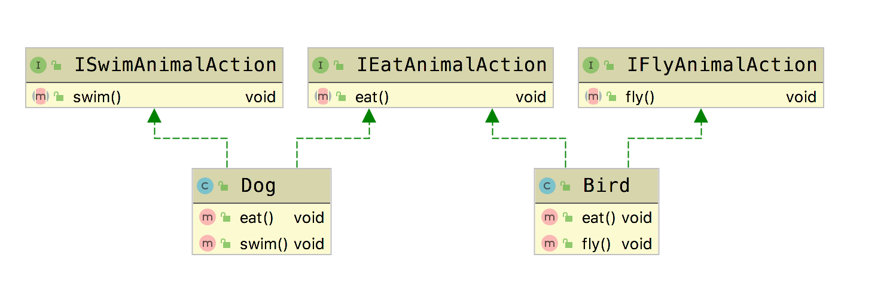

# 接口隔离原则(Interface Segregation Principle, ISP)

**接口隔离原则(Interface  Segregation Principle, ISP)**：使用多个专门的接口，而不使用单一的总接口，即客户端不应该依赖那些它不需要的接口。

- 一个类对一个类的依赖应该建立在最小的接口上
- 建立单一接口不要建立庞大臃肿的接口
- 尽量细化接口，接口中的方法应该尽量少

**在使用接口隔离原则时，我们需要注意控制接口的粒度，接口不能太小，如果太小会导致系统中接口泛滥，不利于维护；接口也不能太大，太大的接口将违背接口隔离原则，灵活性较差，使用起来很不方便。**一般而言，接口中仅包含为某一类用户定制的方法即可，不应该强迫客户依赖于那些它们不用的方法。这符合我们经常说的，高内聚，低耦合的思想。从而使程序具有很好的可读性，可维护性，可扩展性。

## Golang Demo

```go
package interfacesegregation

// 生产中根据实际情况，将接口拆分到不同的文件中
type EatAnimalAction interface {
    eat()
}
type FlyAnimalAction interface {
    fly()
}
type SwimAnimalAction interface {
    swim()
}
```

```go
package interfacesegregation

import "fmt"

type Bird struct {
}

func (Bird) fly() {
    fmt.Println("bird fly")
}

func (Bird) eat() {
    fmt.Println("bird eat")
}

```

```go
package interfacesegregation

import "fmt"

type Dog struct {
}

func (Dog) swim() {
    fmt.Println("dog swim")
}

func (Dog) eat() {
    fmt.Println("dog eat")
}

```

## Java Demo

假设我们有这样一个接口，定义了动物的行为。

```java
package tech.selinux.design.principle.interfacesegregation;

public interface IAnimalAction {
  void eat();

  void fly();

  void swim();
}
```

但是，如果我们有一个实现类，例如Dog,并不需要实现fly的方法，因此这个接口中定义的方法就显得冗余复杂。这时接口隔离原则的作用就体现出来了。

```java
package tech.selinux.design.principle.interfacesegregation;

public interface IEatAnimalAction {
  void eat();
}
```

```java
package tech.selinux.design.principle.interfacesegregation;

public interface IFlyAnimalAction {
  void fly();
}
```

```java
package tech.selinux.design.principle.interfacesegregation;

public interface ISwimAnimalAction {
  void swim();
}
```

```java
package tech.selinux.design.principle.interfacesegregation;

public class Dog implements ISwimAnimalAction, IEatAnimalAction {

  @Override
  public void eat() {}

  @Override
  public void swim() {}
}
```

```java
package tech.selinux.design.principle.interfacesegregation;

public class Bird implements IEatAnimalAction,IFlyAnimalAction {
  @Override
  public void eat() {}

  @Override
  public void fly() {}

}
```

## UML



---

### 补充另一个版本的Java/Scala Demo 以及源码解析

---

## Java Demo_

## Scala Demo

## UML_

## 源码解析
