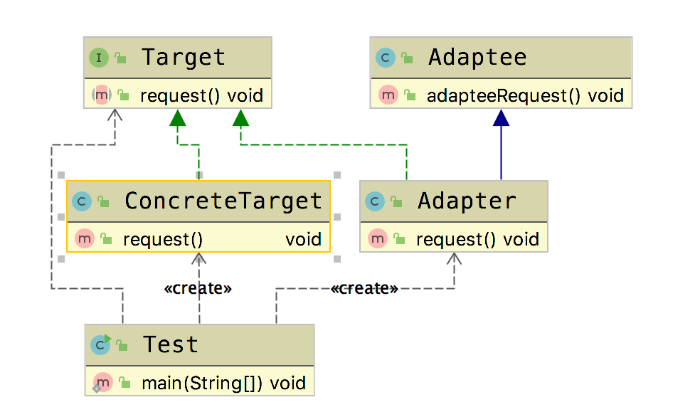
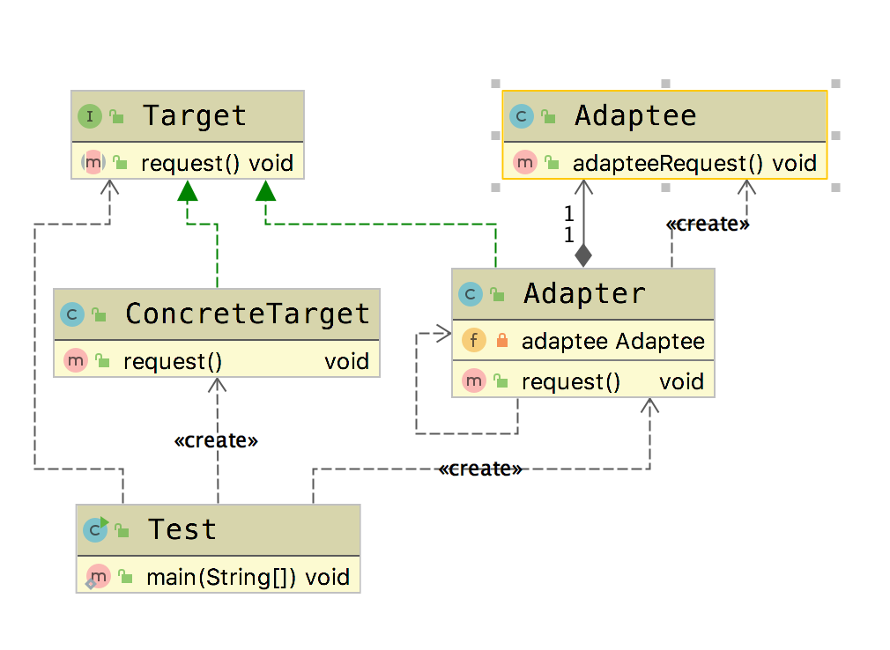

# 适配器模式(Adapter Pattern)

&emsp;&emsp; **适配器模式(Adapter Pattern)**：将一个接口(被适配者)转换成客户希望的另一个接口(目标)，使接口不兼容的那些类可以一起工作，其别名为包装器(Wrapper)。适配器模式既可以作为类结构型模式，也可以作为对象结构型模式。

**【注：在适配器模式定义中所提及的接口是指广义的接口，它可以表示一个方法或者方法的集合。】**

## 适用场景

- 已经存在的类,它的方法和需求不匹配时(方法结果相同或相似)
- 不是软件设计阶段考虑的设计模式，是随着软件维护，由于不同产品，不同厂家造成功能类似而接口不相同情况下的解决方案。

## 优点

- 提高类的透明性和复用，现有的类复用但不需要改变
- 目标类和和适配器类解耦,提高程序扩展性
- 符合开闭原则

## 缺点

- 适配器在编写过程中需要全面考虑，可能会增加系统的复杂性
- 增加系统代码可读的难度

## Golang Demo

### 类适配器模式(go)

```go
package classadapter

import "fmt"

type Adaptee struct {
}

func (Adaptee) adapteeRequest() {
    fmt.Println("被适配者的方法")
}
```

```go
package classadapter

import "fmt"

type Target interface {
    request()
}

type ConcreteTarget struct {
}

func (ConcreteTarget) request() {
    fmt.Println("concreteTarget目标方法")
}

```

```go
package classadapter

type Adapter struct {
    Adaptee
}

func (a Adapter) request() {
    a.adapteeRequest()
}

```

```go
package classadapter

import "testing"

func Test(t *testing.T) {
    var target Target = ConcreteTarget{}
    target.request()

    var adapterTarget Target = Adapter{}
    adapterTarget.request()
}
```

### 对象适配器模式(go)

```go
package objectadapter

import "fmt"

type Adaptee struct {
}

func (Adaptee) adapteeRequest() {
    fmt.Println("被适配者的方法")
}

```

```go
package objectadapter

import "fmt"

type Target interface {
    request()
}

type ConcreteTarget struct {
}

func (ConcreteTarget) request() {
    fmt.Println("concreteTarget目标方法")
}

```

```go
package objectadapter

type Adapter struct {
    adaptee Adaptee
}

func (a Adapter) request() {
    a.adaptee.adapteeRequest()
}

```

```go
package objectadapter

import "testing"

func Test(t *testing.T) {
    var target Target = ConcreteTarget{}
    target.request()

    var adapterTarget Target = Adapter{}
    adapterTarget.request()
}

```

## Java Demo

### 类适配器模式

类适配器强调的是继承，通过继承实现目标target的方法。

```java
package tech.selinux.design.pattern.structural.adapter.classadapter;

public class Adaptee {
  public void adapteeRequest() {
    System.out.println("被适配者的方法");
  }
}
```

```java
package tech.selinux.design.pattern.structural.adapter.classadapter;

public interface Target {
  void request();
}

```

```java
package tech.selinux.design.pattern.structural.adapter.classadapter;

public class ConcreteTarget implements Target {
  @Override
  public void request() {
    System.out.println("concreteTarget目标方法");
  }
}
```

```java
package tech.selinux.design.pattern.structural.adapter.classadapter;

public class Adapter extends Adaptee implements Target {
  @Override
  public void request() {
    // ...
    super.adapteeRequest();
    // ...
  }
}
```

```java
package tech.selinux.design.pattern.structural.adapter.classadapter;

public class Test {
  public static void main(String[] args) {
    Target target = new ConcreteTarget();
    target.request();

    Target adapterTarget = new Adapter();
    adapterTarget.request();
  }
}
```

#### 类适配器UML



### 对象适配器模式

对象适配器模式，是通过组合的形式来完成适配，在实际开发中，如果能够适用组合的形式，就尽量不用要继承。

```java
package tech.selinux.design.pattern.structural.adapter.objectadapter;

public class Adaptee {
  public void adapteeRequest() {
    System.out.println("被适配者的方法");
  }
}

```

```java
package tech.selinux.design.pattern.structural.adapter.objectadapter;

public interface Target {
  void request();
}

```

```java
package tech.selinux.design.pattern.structural.adapter.objectadapter;

public class ConcreteTarget implements Target {
  @Override
  public void request() {
    System.out.println("concreteTarget目标方法");
  }
}

```

```java
package tech.selinux.design.pattern.structural.adapter.objectadapter;

public class Adapter implements Target {
  private Adaptee adaptee = new Adaptee();

  @Override
  public void request() {
    // ...
    adaptee.adapteeRequest();
    // ...
  }
}
```

```java
package tech.selinux.design.pattern.structural.adapter.objectadapter;

public class Test {
  public static void main(String[] args) {
    Target target = new ConcreteTarget();
    target.request();

    Target adapterTarget = new Adapter();
    adapterTarget.request();
  }
}
```

## UML



---

### 补充另一个版本的Java/Scala Demo 以及源码解析

---

## Java Demo_

## Scala Demo

## UML_

## 源码解析
