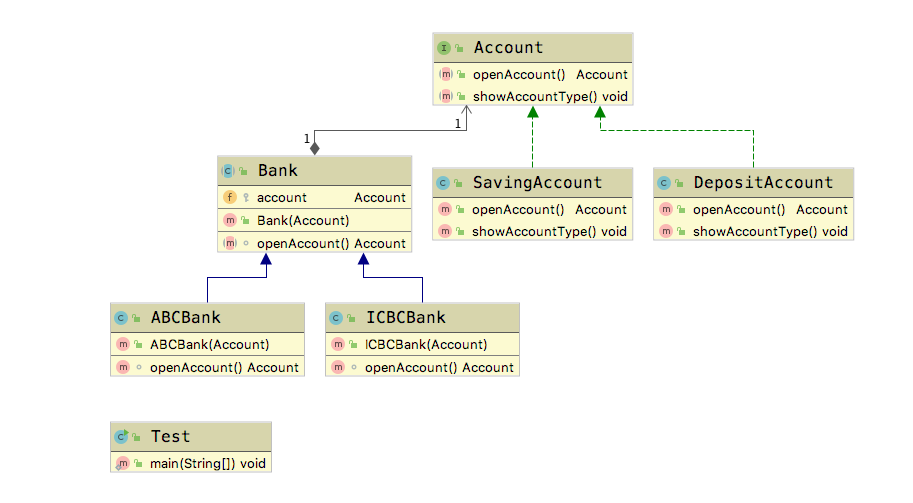

# 桥接模式(Bridge Pattern)

&emsp;&emsp;  **桥接模式(Bridge Pattern)：** 将抽象部分与它的具体实现部分分离，使它们都可以独立地变化。它是一种对象结构型模式，又称为柄体(Handle and Body)模式或接口(Interface)模式。通过组合的方式实现两个类之间联系，而不是继承。

## 适用场景

- 抽象和具体实现之间增加更多的灵活性
- 一个类存在两个（或者多个）独立变化的维度，并且这两个（或者多个）维度都需要独立进行扩展
- 不希望使用继承，或者因为多层继承导致系统类的个数剧增

## 优点

- 分离抽象部分及其具体实现部分
- 提高了系统的可扩展性
- 符合开闭原则
- 符合合成复用原则

## 缺点

- 增加了系统的理解与设计难度
- 需要正确地识别出系统中两个独立变化的维度

下面我们引入一种应用场景，银行有很多种，每种银行又可以又多种储蓄账户，例如活期和定期。

## Golang Demo

```go
package bridge

// 账户
type Account interface {
    openAccount() Account
    showAccountType()
}

```

```go
package bridge

type Bank interface {
    openAccount() Account
}

```

```go
package bridge

import "fmt"

type DepositAccount struct {
}

func NewDepositAccount() *DepositAccount {
    return &DepositAccount{}
}

func (DepositAccount) openAccount() Account {
    fmt.Println("打开定期账号")
    return *NewDepositAccount()
}

func (DepositAccount) showAccountType() {
    fmt.Println("这是一个定期账号")
}

```

```go
package bridge

import "fmt"

type SavingAccount struct {
}

func NewSavingAccount() *SavingAccount {
    return &SavingAccount{}
}

func (SavingAccount) openAccount() Account {
    fmt.Println("打开活期账号")
    return *NewSavingAccount()
}

func (SavingAccount) showAccountType() {
    fmt.Println("这是一个活期账号")
}

```

```go
package bridge

import "fmt"

type ABCBank struct {
    account Account
}

func NewABCBank(account Account) *ABCBank {

    return &ABCBank{account: account}
}

func (abc ABCBank) openAccount() Account {
    fmt.Println("打开中国农业银行账号")
    abc.account.openAccount()
    return abc.account
}

```

```go
package bridge

import "fmt"

type ICBCBank struct {
    account Account
}

func NewICBCBank(account Account) *ICBCBank {

    return &ICBCBank{account: account}
}

func (icbc ICBCBank) openAccount() Account {

    fmt.Println("打开中国工商银行账号")
    icbc.account.openAccount()
    return icbc.account
}

```

```go
package bridge

import "testing"

func Test(t *testing.T) {
    var icbcBank Bank = NewICBCBank(NewDepositAccount())
    icbcAccount := icbcBank.openAccount()
    icbcAccount.showAccountType()

    var abcBank Bank = NewABCBank(NewSavingAccount())
    abcAccount := abcBank.openAccount()
    abcAccount.showAccountType()
}

```

## Java Demo

定义一个接口，里面定义了两种账户。

```java
package tech.selinux.design.pattern.structural.bridge;

public interface Account {
  Account openAccount();

  void showAccountType();
}
```

定义一个抽象类的银行，里面有一个账户，同时有一个与账户同名的方法。

```java
package tech.selinux.design.pattern.structural.bridge;

public abstract class Bank {
  protected Account account;

  public Bank(Account account) {
    this.account = account;
  }

  abstract Account openAccount();
}

```

分别定义两种账户的实现类。

```java
package tech.selinux.design.pattern.structural.bridge;

public class DepositAccount implements Account {
  @Override
  public Account openAccount() {
    System.out.println("打开定期账号");
    return new DepositAccount();
  }

  @Override
  public void showAccountType() {
    System.out.println("这是一个定期账号");
  }
}
```

```java
package tech.selinux.design.pattern.structural.bridge;

public class SavingAccount implements Account {
  @Override
  public Account openAccount() {
    System.out.println("打开活期账号");
    // ...
    return new SavingAccount();
  }

  @Override
  public void showAccountType() {
    System.out.println("这是一个活期账号");
  }
}

```

接下来定义两种银行的实现类。

```java
package tech.selinux.design.pattern.structural.bridge;

public class ABCBank extends Bank {
  public ABCBank(Account account) {
    super(account);
  }

  @Override
  Account openAccount() {
    System.out.println("打开中国农业银行账号");
    account.openAccount();
    return account;
  }
}

```

```java
package tech.selinux.design.pattern.structural.bridge;

public class ICBCBank extends Bank {
  public ICBCBank(Account account) {
    super(account);
  }

  @Override
  Account openAccount() {
    System.out.println("打开中国工商银行账号");
    account.openAccount();
    return account;
  }
}
```

然后我们来进行一下测试。

```java
package tech.selinux.design.pattern.structural.bridge;

public class Test {
  public static void main(String[] args) {
    Bank icbcBank = new ICBCBank(new DepositAccount());
    Account icbcAccount = icbcBank.openAccount();
    icbcAccount.showAccountType();

    Bank icbcBank2 = new ICBCBank(new SavingAccount());
    Account icbcAccount2 = icbcBank2.openAccount();
    icbcAccount2.showAccountType();

    Bank abcBank = new ABCBank(new SavingAccount());
    Account abcAccount = abcBank.openAccount();
    abcAccount.showAccountType();
  }
}

```

## UML



---

### 补充另一个版本的Java/Scala Demo 以及源码解析

---

## Java Demo_

## Scala Demo

## UML_

## 源码解析
