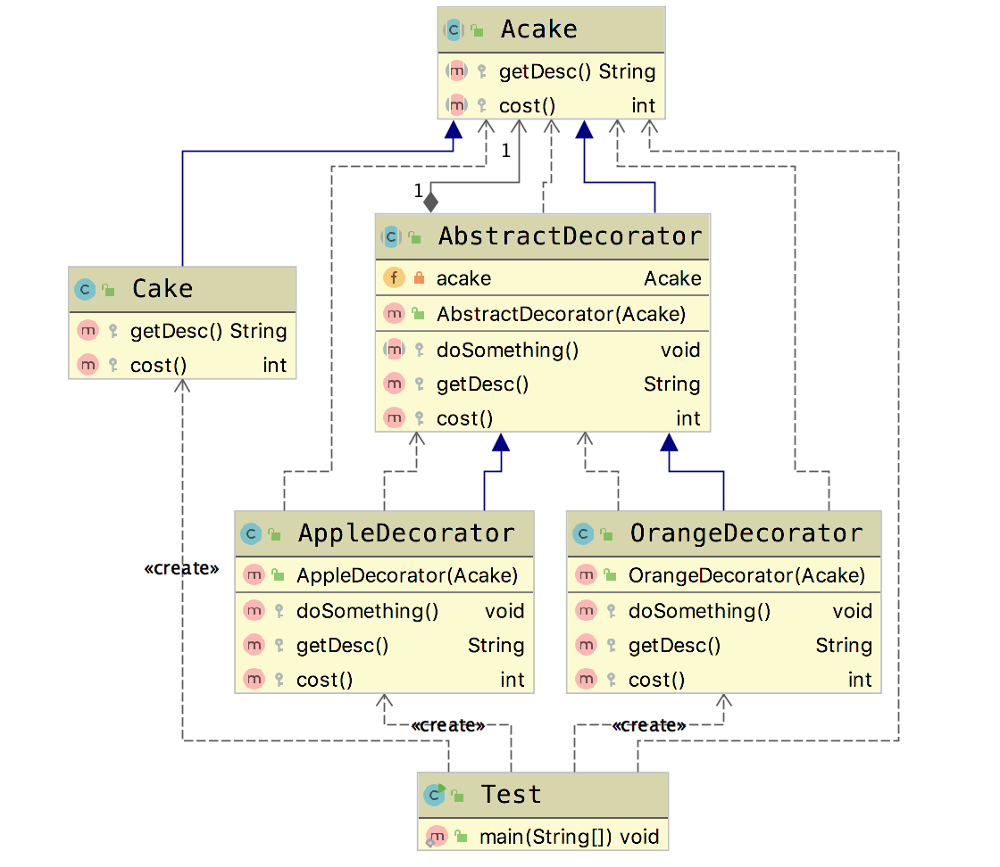

# 装饰模式(Decorator Pattern)

&emsp;&emsp; **装饰模式(Decorator Pattern)**：动态地给一个对象增加一些额外的职责，就增加对象功能来说，装饰模式比生成子类实现更为灵活。装饰模式是一种对象结构型模式。提供了比继承更有弹性的替代方案(扩展原有对象的功能)

## 适用场景

- 扩展一个类的功能或给一个类添加职责
- 动态的给一个对象添加功能,这些功能可以再动态地撤销

## 优点

- 继承的有力补充,比继承灵活,不改变原有对象的情况下给一个对象扩展功能。
- 通过使用不同的装饰类,以及这些装饰类的排列组合,可以实现不同的效果。
- 符合开闭原则

## 缺点

- 会出现更多的代码，更多类，增加程序复杂性
- 动态装饰时,多层装饰时会更复杂

## 装饰者相关模式

- 装饰者模式和代理模式
- 装饰者模式和适配器模式

## Golang Demo

```go
package decorator

type ICake interface {
    desc() string
    cost() int
}

type Cake struct {
}

func (Cake) desc() string {
    return "蛋糕"
}

func (Cake) cost() int {
    return 8
}

type AppleDecorator struct {
    icake ICake
}

func AddAppelDecorator(cake ICake) ICake {
    return &AppleDecorator{
        icake: cake,
    }
}

func (a AppleDecorator) desc() string {
    return a.icake.desc() + "add apple "
}

func (a AppleDecorator) cost() int {
    return a.icake.cost() + 2
}

type OrangeDecorator struct {
    icake ICake
}

func AddOrangeDecorator(cake ICake) ICake {
    return &OrangeDecorator{
        icake: cake,
    }

}

func (o OrangeDecorator) desc() string {
    return o.icake.desc() + "add orange "
}

func (o OrangeDecorator) cost() int {
    return o.icake.cost() + 1
}

```

```go
package decorator

import (
    "fmt"
    "testing"
)

func Test(t *testing.T) {
    var cake ICake = &Cake{}

    cake = AddOrangeDecorator(cake)
    cake = AddAppelDecorator(cake)

    fmt.Println(cake.desc())
    fmt.Println(cake.cost())
}

```

## Java Demo

```java
package tech.selinux.design.pattern.structural.decorator.v2;

public abstract class Acake {
  protected abstract String getDesc();

  protected abstract int cost();
}
```

```java
package tech.selinux.design.pattern.structural.decorator.v2;

public abstract class AbstractDecorator extends Acake {
  private Acake acake;

  public AbstractDecorator(Acake acake) {
    this.acake = acake;
  }

  protected abstract void doSomething();

  @Override
  protected String getDesc() {
    return this.acake.getDesc();
  }

  @Override
  protected int cost() {
    return this.acake.cost();
  }
}

```

```java
package tech.selinux.design.pattern.structural.decorator.v2;

public class Cake extends Acake {
  @Override
  protected String getDesc() {
    return "蛋糕";
  }

  @Override
  protected int cost() {
    return 8;
  }
}

```

```java
package tech.selinux.design.pattern.structural.decorator.v2;

public class AppleDecorator extends AbstractDecorator {
  public AppleDecorator(Acake acake) {
    super(acake);
  }

  @Override
  protected void doSomething() {}

  @Override
  protected String getDesc() {
    return super.getDesc() + " add apple";
  }

  @Override
  protected int cost() {
    return super.cost() + 1;
  }
}

```

```java
package tech.selinux.design.pattern.structural.decorator.v2;

public class OrangeDecorator extends AbstractDecorator {
  public OrangeDecorator(Acake acake) {
    super(acake);
  }

  @Override
  protected void doSomething() {}

  @Override
  protected String getDesc() {
    return super.getDesc() + " add orange";
  }

  @Override
  protected int cost() {
    return super.cost() + 2;
  }
}
```

```java
package tech.selinux.design.pattern.structural.decorator.v2;

public class Test {
  public static void main(String[] args) {
    Acake acake;
    acake = new Cake();
    acake = new AppleDecorator(acake);
    acake = new AppleDecorator(acake);
    acake = new OrangeDecorator(acake);

    System.out.println(acake.getDesc() + " 销售价格:" + acake.cost());
  }
}

```

## UML

