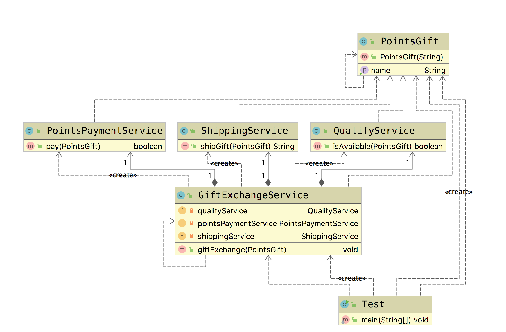

# 外观模式(Facade Pattern)

&emsp;&emsp; **外观模式(Facade Pattern)**：为子系统中的一组接口提供一个统一的入口。外观模式定义了一个高层接口，这个接口使得这一子系统更加容易使用。

## 适用场景

- 子系统越来越复杂，增加外观模式提供简单的接口调用。
- 构建多层系统,利用外观对象作为每层的入口，简化层间调用。

## 优点

- 简化调用过程，无需深入了解子系统，防止带来风险。
- 减少系统依赖，松散耦合。
- 更好的划分访问层次
- 符合迪米特法则，即最少知道原则

## 缺点

- 增加子系统、扩展子系统容易引入风险。
- 不符合开闭原则。

接下来，我们引入一个应用场景，然后结合代码来学习外观模式。
在我们实际生活中，例如使用信用卡，会获得相应的积分，每一定量的积分，
就可以在积分商城里面进行兑换。那这样一种应用场景里面，会进行如下的子系统区分。

- 积分资格校验子系统
- 支付子系统
- 物流子系统

## Golang Demo

```go
package facade

import "fmt"

type PonitsGift struct {
    name string
}

func NewPonitsGift(name string) *PonitsGift {
    return &PonitsGift{name: name}
}

type QualifyService struct {
}

func (QualifyService) isAvailable(gift PonitsGift) bool {
    fmt.Println("校验 " + gift.name + " 积分资格通过，库存通过")
    return true

}

type PointsPaymentService struct {
}

func (PointsPaymentService) pay(gift PonitsGift) bool {
    fmt.Println("积分支付 " + gift.name + " 成功")
    return true
}

type ShippingService struct {
}

func (ShippingService) shipGift(gift PonitsGift) (orderNo string) {
    fmt.Println(gift.name + " 派单成功，进入物流")
    return "666"
}

```

```go
package facade

import "fmt"

type GiftExchangeService struct {
    qualifyService       QualifyService
    pointsPaymentService PointsPaymentService
    shippingService      ShippingService
}

func (g GiftExchangeService) giftExchange(gift PonitsGift) {
    if g.qualifyService.isAvailable(gift) {
        // 资格校验通过
        if g.pointsPaymentService.pay(gift) {
            // 如果支付积分成功
            shippingOrderNo := g.shippingService.shipGift(gift)
            fmt.Println("物流系统下单成功,订单号是:" + shippingOrderNo)
        }
    }
}

```

```go
package facade

import "testing"

func Test(t *testing.T) {

    giftExchangeService := GiftExchangeService{}

    pointsGift := NewPonitsGift("耳机")

    giftExchangeService.giftExchange(*pointsGift)
}
```

## Java Demo

定义积分礼物

```java
package tech.selinux.design.pattern.structural.facade;

public class PointsGift {
  private String name;

  public PointsGift(String name) {
    this.name = name;
  }

  public String getName() {
    return name;
  }
}
```

积分资格校验

```java
package tech.selinux.design.pattern.structural.facade;

public class QualifyService {
  public boolean isAvailable(PointsGift pointsGift) {
    System.out.println("校验" + pointsGift.getName() + " 积分资格通过,库存通过");
    return true;
  }
}
```

积分扣减系统，支付系统

```java
package tech.selinux.design.pattern.structural.facade;

public class PointsPaymentService {
  public boolean pay(PointsGift pointsGift) {
    // 扣减积分
    System.out.println("支付" + pointsGift.getName() + " 积分成功");
    return true;
  }
}
```

物流服务子系统

```java
package tech.selinux.design.pattern.structural.facade;

public class ShippingService {
  public String shipGift(PointsGift pointsGift) {
    // 物流系统的对接逻辑
    System.out.println(pointsGift.getName() + "进入物流系统");
    String shippingOrderNo = "666";
    return shippingOrderNo;
  }
}

```

应用层不关心，子系统，应用层只和外观类进行通信。这里要注意。

```java
package tech.selinux.design.pattern.structural.facade;

public class GiftExchangeService {
  // 外观类在创建时，其中所依赖的子系统 service 就已经被创建好了
  // 因为外部调用时，不需要关心子系统
  private QualifyService qualifyService = new QualifyService();
  private PointsPaymentService pointsPaymentService = new PointsPaymentService();
  private ShippingService shippingService = new ShippingService();

  public void giftExchange(PointsGift pointsGift) {
    if (qualifyService.isAvailable(pointsGift)) {
      // 资格校验通过
      if (pointsPaymentService.pay(pointsGift)) {
        // 如果支付积分成功
        String shippingOrderNo = shippingService.shipGift(pointsGift);
        System.out.println("物流系统下单成功,订单号是:" + shippingOrderNo);
      }
    }
  }
}
```

```java
package tech.selinux.design.pattern.structural.facade;

public class Test {
  public static void main(String[] args) {
    PointsGift pointsGift = new PointsGift("T恤");
    GiftExchangeService giftExchangeService = new GiftExchangeService();
    giftExchangeService.giftExchange(pointsGift);
  }
}

```

## UML

