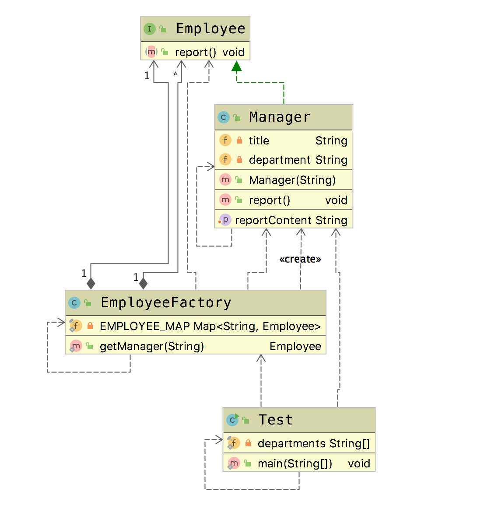

# 享元模式(Flyweight Pattern)

&emsp;&emsp; **享元模式(Flyweight Pattern)**:运用共享技术有效地支持大量细粒度对象的复用。系统只使用少量的对象，而这些对象都很相似，状态变化很小，可以实现对象的多次复用。由于享元模式要求能够共享的对象必须是细粒度对象，因此它又称为轻量级模式，它是一种对象结构型模式。**提供了减少对象数量从而改善应用所需的对象结构的的方式**

## 适用场景

- 尝尝应用于系统的底层开发，以便解决系统的性能问题。例如数据库的连接池。
- 系统有大量的相似对象，需要缓冲池的场景。

## 优点

- 减少对象的创建，降低内存中对象的数量，降低系统的内存，提高效率
- 减少内存之外的其他资源

## 缺点

- 关注内/外部状态、关注线程安全问题
- 使系统、程序逻辑复杂化

## 扩展

- 内部状态，不随着环境的改变而改变，位于享元对象的内部。
- 外部状态，因为环境的改变而改变，一般位于享元模式的外部。

通常可以理解，内部状态就是享元对象的属性。

## Golang Demo

```go
package flyweight

import (
    "fmt"
)

type Employee interface {
    report()
}

type Manager struct {
    title         string
    department    string
    reportContent string
}

func (m Manager) report() {
    fmt.Println(m.reportContent)
}

func NewManager(department string) Manager {
    return Manager{
        title:      "部门经理",
        department: department,
    }
}

func (m *Manager) SetReportContent(reportContent string) {
    m.reportContent = reportContent
}

type EmployeeFactory struct {
    employeeMap map[string]Employee
}

func NewEmployeeFactory() *EmployeeFactory {
    return &EmployeeFactory{
        employeeMap: make(map[string]Employee),
    }
}

func (e *EmployeeFactory) getManager(department string) Employee {

    var manager Manager
    if v, ok := e.employeeMap[department]; !ok {
        manager = NewManager(department)
        fmt.Println("创建部门经理:" + department)
    } else {
        manager = v.(Manager)
    }
    reportContent := department + "部门汇报:此次报告的主要内容是......"
    manager.SetReportContent(reportContent)
    fmt.Println(" 创建报告:" + reportContent)
    e.employeeMap[department] = manager
    return manager
}

```

```go
package flyweight

import (
    "math/rand"
    "testing"
    "time"
)

func Test(t *testing.T) {
    departments := []string{"RD", "QA", "PM", "BD"}
    rand.Seed(time.Now().UnixNano())
    employeeFactory := NewEmployeeFactory()
    for i := 0; i < 10; i++ {
        department := departments[int(rand.Float32()*4)]
        manager := employeeFactory.getManager(department).(Manager)
        manager.report()
    }
}

```

## Java Demo

```java
package tech.selinux.design.pattern.structural.flyweight;

public interface Employee {
  void report();
}
```

```java
package tech.selinux.design.pattern.structural.flyweight;

public class Manager implements Employee {
  @Override
  public void report() {
    System.out.println(reportContent);
  }

  private String title = "部门经理";
  private String department;
  private String reportContent;

  public void setReportContent(String reportContent) {
    this.reportContent = reportContent;
  }

  public Manager(String department) {
    this.department = department;
  }
}

```

```java
package tech.selinux.design.pattern.structural.flyweight;

import java.util.HashMap;
import java.util.Map;

public class EmployeeFactory {
  private static final Map<String, Employee> EMPLOYEE_MAP = new HashMap<String, Employee>();

  public static Employee getManager(String department) {
    Manager manager = (Manager) EMPLOYEE_MAP.get(department);

    if (manager == null) {
      manager = new Manager(department);
      System.out.print("创建部门经理:" + department);
      String reportContent = department + "部门汇报:此次报告的主要内容是......";
      manager.setReportContent(reportContent);
      System.out.println(" 创建报告:" + reportContent);
      EMPLOYEE_MAP.put(department, manager);
    }
    return manager;
  }
}
```

```java
package tech.selinux.design.pattern.structural.flyweight;

public class Test {
  private static final String departments[] = {"RD", "QA", "PM", "BD"};

  public static void main(String[] args) {
    for (int i = 0; i < 10; i++) {
      String department = departments[(int) (Math.random() * departments.length)];
      Manager manager = (Manager) EmployeeFactory.getManager(department);
      manager.report();
    }
  }
}

```

这里面，title 一直不会发生变化，就是内部状态，而department需要通过setter方法来使用。就可以理解为title是内部状态，而department使外部状态。

## Scala Demo

## UML

