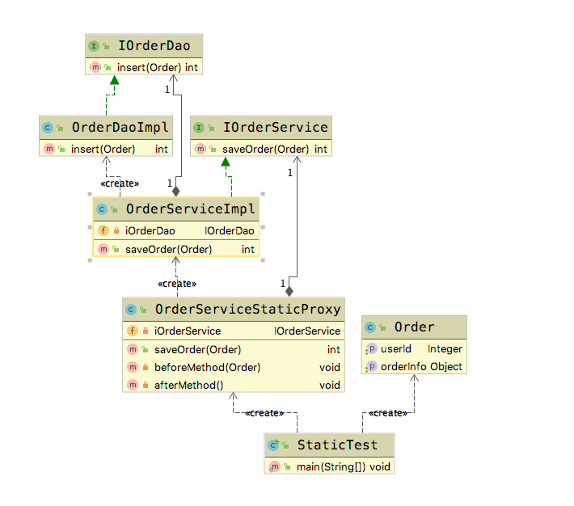
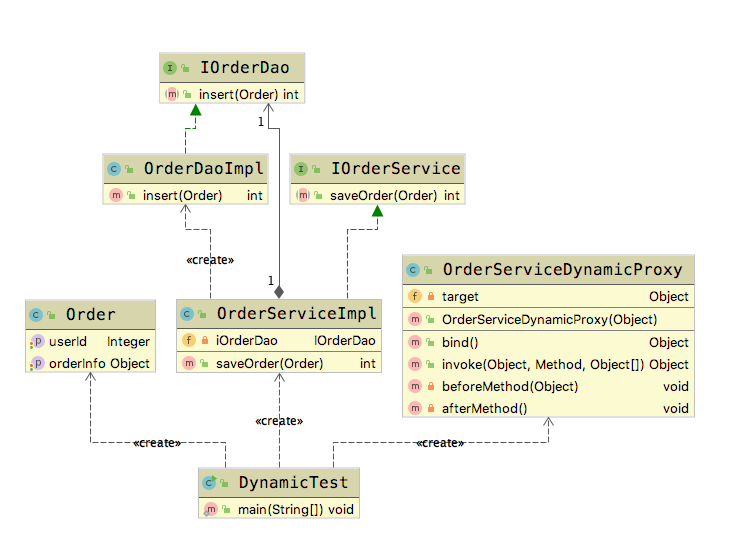

# 代理模式(Proxy Pattern)

&emsp;&emsp;  **代理模式(Proxy Pattern)**： 给某一个对象提供一个代理或占位符，并由代理对象来控制对原对象的访问。 代理对象在客户端和目标对象之间起到中介的作用。

## 适用场景

- 保护目标对象
- 增强目标对象

## 优点

- 代理模式能将代理对象与真实被调用的目标对象分离.
- 一定程度上降低了系统的耦合度，扩展性好。
- 保护目标对象
- 增强目标对象

## 缺点

- 代理模式会造成系统设计种类的数据增加
- 在客户端和目标对象增加一个代理对象，会造成请求处理速度变慢
- 增加系统的复杂度

## 扩展

- 静态代理
- 动态代理
- CGLib代理

下面我们来看一种业务场景，在买房的时候，我们经常会通过中介来进行沟通。中介

## Golang Demo

```go
package proxy

import "fmt"

type House interface {
    Sail()
}

type SmailHouse struct {
}

func (SmailHouse) Sail() {
    fmt.Println("100 万")
}

type Proxy struct {
    house SmailHouse
}

func NewProxy() *Proxy {
    return &Proxy{}
}

func (p Proxy) Sail() {

    var result string = "签订成功"
    p.Before()

    p.house.Sail()

    p.After()

    fmt.Println(result)
}

func (Proxy) Before() {

    fmt.Println("代理之前的一些检查")

}

func (Proxy) After() {

    fmt.Println("代理之后的一些检查")

}

```

```go
package proxy

import "testing"

func Test(t *testing.T) {

    var house House = NewProxy()
    house.Sail()

}

```

## Java Demo

接下来，我们引入一个业务场景。 进行商城下订单的设计，同时通过代理来进行分库。也就是我们会根据orderid的取模值来进行模式分库  

首先我们模拟一下的spring编程模式。  

定义一个订单类。  

```java
package tech.selinux.design.pattern.structural.proxy;

public class Order {
  private Object orderInfo;
  private Integer userId;

  public Object getOrderInfo() {
    return orderInfo;
  }

  public void setOrderInfo(Object orderInfo) {
    this.orderInfo = orderInfo;
  }

  public Integer getUserId() {
    return userId;
  }

  public void setUserId(Integer userId) {
    this.userId = userId;
  }
}

```

接下来分别定义Dao层和Service层。

```java
package tech.selinux.design.pattern.structural.proxy;

public interface IOrderDao {
  int insert(Order order);
}

```

```java
package tech.selinux.design.pattern.structural.proxy;

public interface IOrderService {
  int saveOrder(Order order);
}

```

```java
package tech.selinux.design.pattern.structural.proxy;

public class OrderDaoImpl implements IOrderDao {
  @Override
  public int insert(Order order) {
    System.out.println("Dao层添加Order成功");
    return 1;
  }
}

```

```java
package tech.selinux.design.pattern.structural.proxy;

public class OrderServiceImpl implements IOrderService {
  private IOrderDao iOrderDao;

  @Override
  public int saveOrder(Order order) {
    iOrderDao = new OrderDaoImpl();
    System.out.println("Service层调用Dao层添加Order");
    return iOrderDao.insert(order);
  }
}

```

### 静态代理

```java
package tech.selinux.design.pattern.structural.proxy.staticproxy;

import tech.selinux.design.pattern.structural.proxy.IOrderService;
import tech.selinux.design.pattern.structural.proxy.Order;
import tech.selinux.design.pattern.structural.proxy.OrderServiceImpl;

public class OrderServiceStaticProxy {
  private IOrderService iOrderService;

  public int saveOrder(Order order) {
    beforeMethod(order);
    iOrderService = new OrderServiceImpl();
    int result = iOrderService.saveOrder(order);
    afterMethod();
    return result;
  }

  private void beforeMethod(Order order) {
    int userId = order.getUserId();
    int dbRouter = userId % 2;
    System.out.println("静态代理分配到【db" + dbRouter + "】处理数据");

    // todo 设置dataSource;
    System.out.println("db" + String.valueOf(dbRouter));
    System.out.println("静态代理 before code");
  }

  private void afterMethod() {
    System.out.println("静态代理 after code");
  }
}
```

```java
package tech.selinux.design.pattern.structural.proxy;

public class StaticTest {
  public static void main(String[] args) {
    Order order = new Order();
    order.setUserId(2);

    OrderServiceStaticProxy orderServiceStaticProxy = new OrderServiceStaticProxy();
    orderServiceStaticProxy.saveOrder(order);
  }
}


```

### 静态代理 UML



### 动态代理

```java
package tech.selinux.design.pattern.structural.proxy.dynamicproxy;

import tech.selinux.design.pattern.structural.proxy.Order;

import java.lang.reflect.InvocationHandler;
import java.lang.reflect.Method;
import java.lang.reflect.Proxy;

public class OrderServiceDynamicProxy implements InvocationHandler {

  private Object target;

  public OrderServiceDynamicProxy(Object target) {
    this.target = target;
  }

  public Object bind() {
    Class cls = target.getClass();
    return Proxy.newProxyInstance(cls.getClassLoader(), cls.getInterfaces(), this);
  }

  @Override
  public Object invoke(Object proxy, Method method, Object[] args) throws Throwable {
    Object argObject = args[0];
    beforeMethod(argObject);
    Object object = method.invoke(target, args);
    afterMethod();
    return object;
  }

  private void beforeMethod(Object obj) {
    int userId = 0;
    System.out.println("动态代理 before code");
    if (obj instanceof Order) {
      Order order = (Order) obj;
      userId = order.getUserId();
    }
    int dbRouter = userId % 2;
    System.out.println("动态代理分配到【db" + dbRouter + "】处理数据");

    // todo 设置dataSource;
    System.out.println("db" + String.valueOf(dbRouter));
  }

  private void afterMethod() {
    System.out.println("动态代理 after code");
  }
}

```

```java
package tech.selinux.design.pattern.structural.proxy;

public class DynamicTest {
  public static void main(String[] args) {
    Order order = new Order();
    order.setUserId(1);
    IOrderService orderServiceDynamicProxy =
        (IOrderService) new OrderServiceDynamicProxy(new OrderServiceImpl()).bind();

    orderServiceDynamicProxy.saveOrder(order);
  }
}

```

### 动态代理 UML



---

### 补充另一个版本的Java/Scala Demo 以及源码解析

---

## Java Demo_

## Scala Demo

## UML_

## 源码解析
