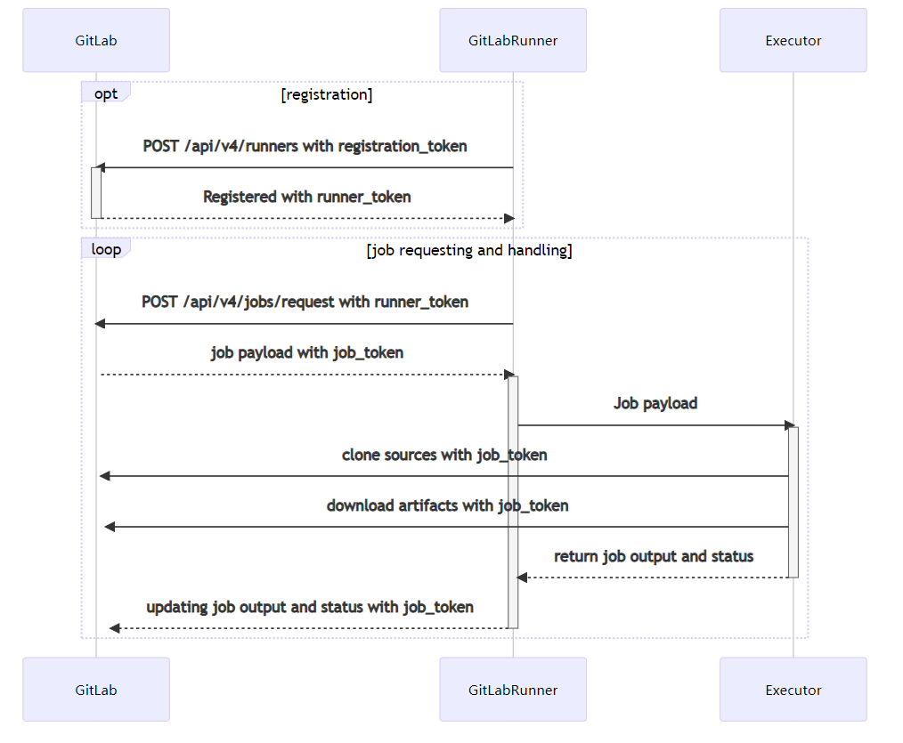
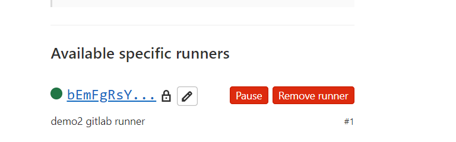

# Gitlab Runner

参考资料：
- https://scarletsky.github.io/2016/07/29/use-gitlab-ci-for-continuous-integration/

- https://gitlab.com/gitlab-org/gitlab-runner

## Install Gitlab Runner

### 添加官方 REPO

```
# For Debian/Ubuntu/Mint
curl -L "https://packages.gitlab.com/install/repositories/runner/gitlab-runner/script.deb.sh" | sudo bash

# For RHEL/CentOS/Fedora
curl -L "https://packages.gitlab.com/install/repositories/runner/gitlab-runner/script.rpm.sh" | sudo bash
```

### 安装最新版本的Gitlab-Runner

```
# For Debian/Ubuntu/Mint
sudo -E apt-get install gitlab-runner

# For RHEL/CentOS/Fedora
sudo -E yum install gitlab-runner
```

### 二进制安装

如果由于网络原因，不能采用在线安装的方式的话，可以将二进制包下载，手动安装。参考 [https://docs.gitlab.com/runner/install/linux-manually.html](https://docs.gitlab.com/runner/install/linux-manually.html)


## 注册 gitlab runner

安装完成应用程序后，需要注册各个 runners。Runners是 运行 Gitlab CI/CD job 的代理商。

当我们注册了Runner，就相当于在Gitlab 实例，与Gitlab Runner所在的主机建立了 建立了联系。

Runners 通常在安装 GitLab Runner 的同一台机器上处理作业。 同样的，也可以在容器、Kubernetes 集群中使用运行器进程作业。

### Executors

当注册Runner时，必须选择一个 Executor。

这个 Executor 决定了每一个job 的执行环境。

例如： 
- 如果希望 CI/CD job 运行 PowerShell 命令，就可以在 Windows 服务器上安装 GitLab Runner，然后注册一个runner 来使用 Shell executor。
- 如果希望 CI/CD job 运行在一个自定义的Docker 容器中，就可以将Gitlab Runner 安装在Linux主机上，然后注册一个runner 来使用Docker executer。


# TODO: 如何区分不同类型的 Excuters
https://docs.gitlab.com/runner/executors/README.html
#### 这个todo 应该时H4

## Runner execution flow




## 注册 Runner

切换到 gitlab -admin area- setting 页面，能够看到有 runner 的配置。点击展开就可以找到 注册runner 的提示。

下面我们将使用 下面的命令，在 运行了Gitlab Runner的主机上，将 runner 注册到 gitlab。

```

]# sudo gitlab-runner register --url http://10.0.41.214/ --registration-token 92SPWaSKYmxBG9m2amM7
Runtime platform                                    arch=amd64 os=linux pid=17038 revision=7a6612da version=13.12.0
Running in system-mode.

Enter the GitLab instance URL (for example, https://gitlab.com/):
[http://10.0.41.214/]:
Enter the registration token:
[92SPWaSKYmxBG9m2amM7]:
Enter a description for the runner:
[demo2.sugon.com]: demo2 gitlab runner
Enter tags for the runner (comma-separated):

Registering runner... succeeded                     runner=92SPWaSK
Enter an executor: custom, docker-ssh, docker+machine, kubernetes, docker-ssh+machine, docker, parallels, shell, ssh, virtualbox:
docker
Enter the default Docker image (for example, ruby:2.6):
maven:3.3.9-jdk-8
Runner registered successfully. Feel free to start it, but if it's running already the config should be automatically reloaded!
```

注册成功之后，就会在 gitlab runner 配置界面，出现下面的信息。

