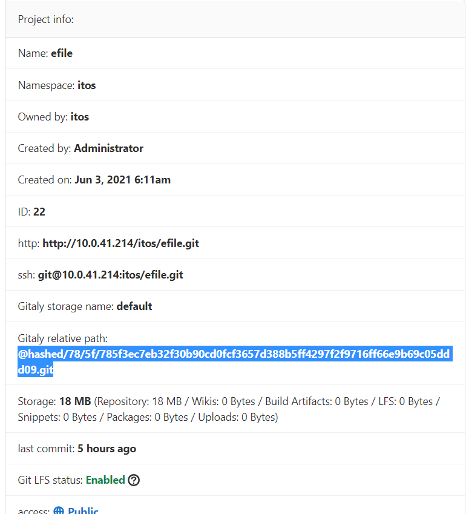

# Servier Hooks

Git 支持在不同操作上执行的Hook。这些Hook在服务器上运行，可用于根据存储库的状态强制执行特定的提交策略或执行其他任务。

Git 支持下面的Hook:  
- pre-receive 
- post-receive 
- update 

Server-side Git hooks 可以被配置到 某一个Repo或者全部的Repo上。

三种类型的hook 有什么区别 ，可以通过[https://git-scm.com/book/en/v2/Customizing-Git-Git-Hooks](https://git-scm.com/book/en/v2/Customizing-Git-Git-Hooks) ，进行参考。

## 为单个Git Repo 创建server hook 

对于不同的安装类型，Repo 位置可能不一样。

- 从源码安装,路径可能是 `/home/git/repositories/<group>/<project>.git.`
- 通过官方库安装，路径一般是`/var/opt/gitlab/git-data/repositories/<group>/<project>.git`。

按照下面的步骤为某一个Repo添加Server-Side Hook。

1. Admin area > Projects  选择对应的project
2. 找到 如下图所示的位置。
    
    参考 [Translate hashed storage paths](https://docs.gitlab.com/ce/administration/repository_storage_types.html#translate-hashed-storage-paths) ,根据projec id 找到服务器上的存储地址。
    
    实际上，efile 的存储地址就是 `/var/opt/gitlab/git-data/repositories/@hashed/78/5f/785f3ec7eb32f30b90cd0fcf3657d388b5ff4297f2f9716ff66e9b69c05ddd09.git`

3.  在 存储目录下，创建一个新的目录 `custom_hooks`.
4.  在`custom_hooks` 目录下，创建一个与 hook 类型一致的文件。例如一个 pre-receive 类型的文件就是 `pre-receive`,并且没有后缀。

5. 对`pre-receive`文件，添加可执行权限，并且确保被 Git User 拥有。

6. 在 `pre-receive` 编写对应的脚本就可以了。

## 为所有的 Git Repo 创建server hook 

默认的全局 server hook 目录是 GitLab Shell directory (`gitlab-shell/hooks`). 被添加到这里的任何一个Server Hook 适用于 所有的repositories, 包括:

- **Project and group wiki** repositories, 这类存储库的名字格式一般 是 `<id>.wiki.git`.
- 某个项目下的 **Design management** repositories，这类存储库的名字格式一般是 `<id>.design.git` .

默认的路径，在不同的安装策略下可能不同：

- 源码 安装一般是 `/home/git/gitlab-shell/hooks`。
- 通过官方库安装，`/opt/gitlab/embedded/service/gitlab-shell/hooks`.

按照下面的步骤，就可以设置全局的 Server Hook。

1. 切换到对应的 Gitlab Shell 目录下。
2. 在这个路径下，根据Hook 的类型创建新的目录，例如 `pre-receive.d`, `post-receive.d`, or `update.d`。
3. 在每个路径下，添加对应的脚本，并赋予相应的执行权限，就可以了。

## Gitlab基于git-hooks做checkstyle代码检测

转载自 [https://my.oschina.net/leelance/blog/1922709](https://my.oschina.net/leelance/blog/1922709)

