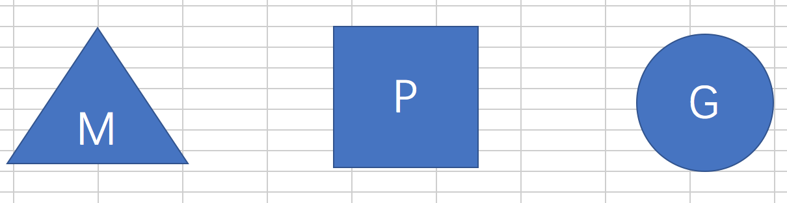
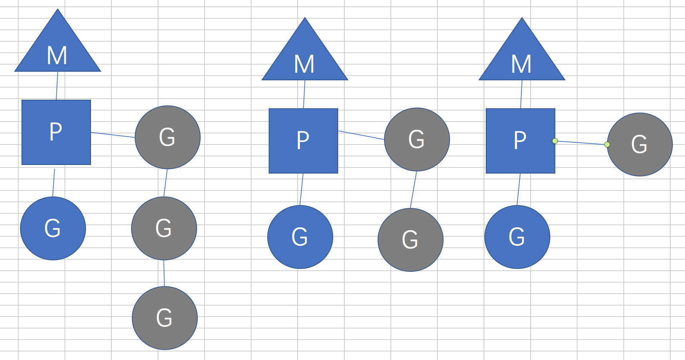
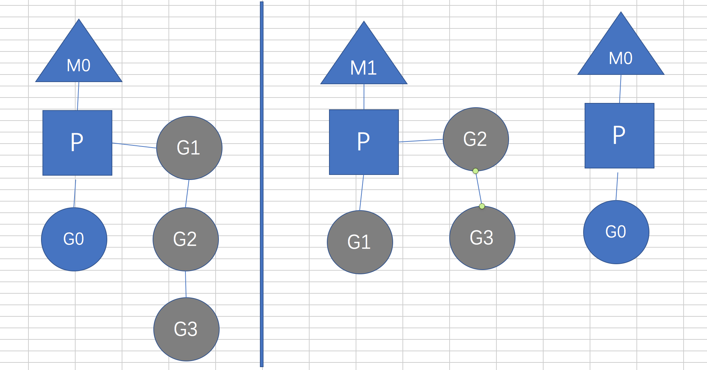

# Goroutine

推荐一本书 [《Concurrency in go 》](https://www.kancloud.cn/mutouzhang/go/596804)

<!-- TOC -->

- [Goroutine](#goroutine)
  - [提出问题](#%E6%8F%90%E5%87%BA%E9%97%AE%E9%A2%98)
  - [进程与线程](#%E8%BF%9B%E7%A8%8B%E4%B8%8E%E7%BA%BF%E7%A8%8B)
    - [产生的背景](#%E4%BA%A7%E7%94%9F%E7%9A%84%E8%83%8C%E6%99%AF)
    - [相关概念](#%E7%9B%B8%E5%85%B3%E6%A6%82%E5%BF%B5)
      - [Process](#process)
      - [thread](#thread)
      - [other](#other)
  - [并发（concurrency）和并行（parallelism）](#%E5%B9%B6%E5%8F%91concurrency%E5%92%8C%E5%B9%B6%E8%A1%8Cparallelism)
  - [进程间通信（IPC，Inter-Process Communication）](#%E8%BF%9B%E7%A8%8B%E9%97%B4%E9%80%9A%E4%BF%A1ipcinter-process-communication)
  - [线程同步](#%E7%BA%BF%E7%A8%8B%E5%90%8C%E6%AD%A5)
    - [同步的方法(以java为例)](#%E5%90%8C%E6%AD%A5%E7%9A%84%E6%96%B9%E6%B3%95%E4%BB%A5java%E4%B8%BA%E4%BE%8B)
  - [Go的并发哲学](#go%E7%9A%84%E5%B9%B6%E5%8F%91%E5%93%B2%E5%AD%A6)
  - [协程](#%E5%8D%8F%E7%A8%8B)
    - [什么是协程](#%E4%BB%80%E4%B9%88%E6%98%AF%E5%8D%8F%E7%A8%8B)
    - [协程的调度(MPG)](#%E5%8D%8F%E7%A8%8B%E7%9A%84%E8%B0%83%E5%BA%A6mpg)
    - [协程(Goroutine scheduler)的源码实现](#%E5%8D%8F%E7%A8%8Bgoroutine-scheduler%E7%9A%84%E6%BA%90%E7%A0%81%E5%AE%9E%E7%8E%B0)
  - [一些参考](#%E4%B8%80%E4%BA%9B%E5%8F%82%E8%80%83)

<!-- /TOC -->

## 提出问题

- go 是如何天然支持高并发的？
- goroutine的调度机制？
- goroutine的底层实现？
- channel的底层实现？
- channel如何做到了goroutine-safe?

## 进程与线程

在最开始，我们先来老生长谈一下什么是进程、线程。 或许每个人都知道进程和线程，但是有几个人能够快速准确的说出进程是什么呢？  

维基百科中关于 [进程的定义](https://zh.wikipedia.org/wiki/%E8%A1%8C%E7%A8%8B)

### 产生的背景

- 由用户输入指令的低效 -->
- 批处理操作系统的串行 -->
- CPU时间片轮转实现操作系统的并发 -->
- 线程实现了进程内部的并发

可以参考 [深入浅出java多线程](https://redspider.gitbook.io/concurrent/di-yi-pian-ji-chu-pian/1)

### 相关概念

#### Process

- 面向进程的操作系统（早期的UNIX，Linux 2.4）是程序执行的基本单位
- 面向线程的操作系统（Linux 2.6之后）进程不是基本单位而是线程的容器
- 进程五种状态（new、running、waiting、ready、terminated）

#### thread

- 操作系统运算调度的最小单位,在进程之中，是进程的实际运行单位.
- 进程中可以有多个执行不同任务的并发线程
- 在Unix System V及SunOS中也被称为轻量进程（lightweight processes），但轻量进程更多指内核线程（kernel thread），而把用户线程（user thread）称为线程。

#### other

- 进程优先级
- 线程优先级

## 并发（concurrency）和并行（parallelism）

“并发”指的是程序的结构，“并行”指的是程序运行时的状态.
并行指物理上同时执行，并发指能够让多个任务在逻辑上交织执行的程序设计.

Concurrency is about dealing with lots of things at once.

Parallelism is about doing lots of things at once.

Not the same, but related.

Concurrency is about structure, parallelism is about execution.

Concurrency provides a way to structure a solution to solve a problem that may (but not necessarily) be parallelizable.

go 官方有一篇bolg [Concurrency is not parallelism](https://blog.golang.org/concurrency-is-not-parallelism)，接下来我们就以官方的slide来认识一下并发和并行。[点击这里](https://talks.golang.org/2012/waza.slide#1)

## 进程间通信（IPC，Inter-Process Communication）

进程是计算机系统分配资源的最小单位（严格说来是线程）。每个进程都有自己的一部分独立的系统资源，彼此是隔离的。为了能使不同的进程互相访问资源并进行协调工作，就有了进程间通信.

主要的IPC方法

- 文件(文件锁 log-->file-->filebeat)
- [信号](https://zh.wikipedia.org/wiki/Unix%E4%BF%A1%E5%8F%B7) (SIGILL、SIGKILL、ctrl+c==SIGINT ...)
- [socket](https://en.wikipedia.org/wiki/Berkeley_sockets) (tcp 三次握手)
- [message queue](https://en.wikipedia.org/wiki/Message_queue)
- 管道pipe (ps -aux | grep nginx)
- [命名管道FIFO](https://en.wikipedia.org/wiki/Named_pipe) (mkfifo my_pipe ; gzip -9 -c < my_pipe > out.gz &  ;cat file > my_pipe)  
- [信号量](https://zh.wikipedia.org/wiki/%E4%BF%A1%E5%8F%B7%E9%87%8F) (信号量与信号不是一个问题，P(wait) 申请,V(signal)释放)
- [共享内存](https://en.wikipedia.org/wiki/Shared_memory)
- [消息传递](https://en.wikipedia.org/wiki/Message_passing)（filebeat --> logstash -->es）
- [内存映射文件](https://en.wikipedia.org/wiki/Memory-mapped_file)

## 线程同步

线程同步被定义为一种机制，可确保两个或多个并发进程或线程不会同时执行称为临界区的某个特定程序段.

- [死锁](https://en.wikipedia.org/wiki/Deadlock)，当许多进程正在等待某个其他进程持有的共享资源（临界区）时发生。在这种情况下，进程只是等待并且不再执行;
- [饥饿](https://en.wikipedia.org/wiki/Starvation_(computer_science))，当进程等待进入临界区时发生，但其他进程独占关键部分，第一个进程被迫无限期等待;
- [优先级倒置](https://en.wikipedia.org/wiki/Priority_inversion)，在高优先级进程处于临界区时发生，并由中优先级进程中断。这种违反优先权规则的行为可能会在某些情况下发生，并可能导致实时系统的严重后果;
- [忙等待](https://en.wikipedia.org/wiki/Busy_waiting)，当进程经常轮询以确定它是否可以访问关键部分时发生。这种频繁的轮询会拖延其他进程的处理时间。

### 同步的方法(以java为例)

- 同步方法

```java
public synchronized void save(){}
```

- 同步代码块

```java
synchronized(object){}
```

- 使用特殊域变量(volatile)实现线程同步

```java
可以参考前面线程安全的单例模式
```

- 使用重入锁实现线程同步

ReenreantLock类的常用方法有：
ReentrantLock() : 创建一个ReentrantLock实例
lock() : 获得锁
unlock() : 释放锁

这种方式类似于golang中的lock。

```java
class Test {

            private int count = 100;
            //需要声明这个锁
            private Lock lock = new ReentrantLock();
            public int getAccount() {
                return account;
            }
            //这里不再需要synchronized
            public void save(int num) {
                lock.lock();
                try{
                    count += num;
                }finally{
                    lock.unlock();
                }
            }
        ｝
```

- ...等等其他的方式

## Go的并发哲学

Go鼓励使用channel在goroutine之间传递数据，而不是显式地使用锁来调解对共享数据的访问.[Share Memory By Communicating](https://blog.golang.org/share-memory-by-communicating)

[《Cuncurrency in Go》Go的并发哲学](https://www.kancloud.cn/mutouzhang/go/596822)

## 协程

下面来到了今天的主角，Goroutine。  

### 什么是协程

Goroutine是Go中最基本的组织单位之一，最直观来说，gotoutine就是一个并发的函数（记住：不一定是并行）和其他代码一起运行.

```go
func main() {
    go sayHello()
    // continue doing other things
}

func sayHello() {
    fmt.Println("hello")
}
```

或者使用匿名函数来启动go协程

```go
go func(str string) {
fmt.Println(str)
}("hello")
```

Goroutines对Go来说是独一无二的。它们不是操作系统线程，它们不完全是绿色的线程(例如JVM管理的线程)，它们是更高级别的抽象，被称为协程(coroutines)。协程是非抢占的并发子程序，也就是说，它们不能被中断。

下面是从[goroutine背后的知识](http://www.sizeofvoid.net/goroutine-under-the-hood/)摘录的几点内容。

- goroutine是Go语言运行库的功能，不是操作系统提供的功能，goroutine不是用线程实现的。

- goroutine就是一段代码，一个函数入口，以及在堆上为其分配的一个堆栈。所以它非常廉价，我们可以很轻松的创建上万个goroutine，但它们并不是被操作系统所调度执行,go runtime 有自己的scheduler。

- 除了被系统调用阻塞的线程外，Go运行库最多会启动$GOMAXPROCS个线程来运行goroutine，现在go应用程序已经默认使用$GOMAXPROCS

- goroutine是协作式调度的，如果goroutine会执行很长时间，而且不是通过等待读取或写入channel的数据来同步的话，就需要主动调用Gosched()来让出CPU

- 和所有其他并发框架里的协程一样，goroutine里所谓“无锁”的优点只在单线程下有效，如果$GOMAXPROCS > 1并且协程间需要通信，Go运行库会负责加锁保护数据

- **Web等服务端程序要处理的请求从本质上来讲是并行处理的问题，每个请求基本独立，互不依赖，几乎没有数据交互，这不是一个并发编程的模型**，而并发编程框架只是解决了其语义表述的复杂性，并不是从根本上提高处理的效率，也许是并发连接和并发编程的英文都是concurrent吧，很容易产生“并发编程框架和coroutine可以高效处理大量并发连接”的误解。

### 协程的调度(MPG)

如果要理解协程的调度，或者看懂 Goroutine scheduler 代码的话，就不得不了解一下MPG。

我们引申出三个定义

```go
G - goroutine.
M - worker thread, or machine.
P - processor, a resource that is required to execute Go code.
    M must have an associated P to execute Go code, however it can be
    blocked or in a syscall w/o an associated P.
```

**用下面三个图形来表示。**  


**MPG的运行状态I**  


- 当前程序有三个M，如果三个M在同一个CPU上运行就是并发，不同CPU就是并行。
- M1.M2,M3都在执行G，同时队列中分别有不同的G在等待获取P，来运行。
- 从这个图的感觉上来看，这一点与线程有点类似，但是Goroutine是逻辑态的，因此go很容易就开启上万Goroutine。
- 其他编程语言实现的线程往往是内核态或者用户态，有时还需要互相转化，比较重量级，很容易耗光物理资源。

**MPG的运行状态Ⅱ**  


- 我们分成两个部分来看，首先看左边的部分。M0正在执行G0，另外有三个协程在等待。
- 如果G0阻塞，比如读取文件或者数据库读写等
- 这时就会创建M1 Worker thread(也有可能从现有的线程池中取出新的线程),并且将等待的三个G放到M1下开始执行,M0下的G0依然执行自己的耗时操作。
- 这样的MPG调度模式,可以既让G0执行，同时也不会让队列的其他协程一直阻塞，仍然可以并发/并行执行。
- 等到G0不阻塞了，M0会被放到空闲的主线程(从已有的线程池中取)继续执行。

MPG的源代码在 [src/runtime/rumtime2.go](https://github.com/golang/go/blob/master/src/runtime/runtime2.go)

**MPG的状态定义**
下面我们贴一下MPG的状态定义，这将有利于我们在后面分析goroutine源码。  

首先是G的状态定义，状态都是常量。

```go
// defined constants
const (
    // G status
    //
    // Beyond indicating the general state of a G, the G status
    // acts like a lock on the goroutine's stack (and hence its
    // ability to execute user code).
    //
    // If you add to this list, add to the list
    // of "okay during garbage collection" status
    // in mgcmark.go too.
    //
    // TODO(austin): The _Gscan bit could be much lighter-weight.
    // For example, we could choose not to run _Gscanrunnable
    // goroutines found in the run queue, rather than CAS-looping
    // until they become _Grunnable. And transitions like
    // _Gscanwaiting -> _Gscanrunnable are actually okay because
    // they don't affect stack ownership.

    // _Gidle means this goroutine was just allocated and has not
    // yet been initialized.
    _Gidle = iota // 0

    // _Grunnable means this goroutine is on a run queue. It is
    // not currently executing user code. The stack is not owned.
    _Grunnable // 1

    // _Grunning means this goroutine may execute user code. The
    // stack is owned by this goroutine. It is not on a run queue.
    // It is assigned an M and a P.
    _Grunning // 2

    // _Gsyscall means this goroutine is executing a system call.
    // It is not executing user code. The stack is owned by this
    // goroutine. It is not on a run queue. It is assigned an M.
    _Gsyscall // 3

    // _Gwaiting means this goroutine is blocked in the runtime.
    // It is not executing user code. It is not on a run queue,
    // but should be recorded somewhere (e.g., a channel wait
    // queue) so it can be ready()d when necessary. The stack is
    // not owned *except* that a channel operation may read or
    // write parts of the stack under the appropriate channel
    // lock. Otherwise, it is not safe to access the stack after a
    // goroutine enters _Gwaiting (e.g., it may get moved).
    _Gwaiting // 4

    // _Gmoribund_unused is currently unused, but hardcoded in gdb
    // scripts.
    _Gmoribund_unused // 5

    // _Gdead means this goroutine is currently unused. It may be
    // just exited, on a free list, or just being initialized. It
    // is not executing user code. It may or may not have a stack
    // allocated. The G and its stack (if any) are owned by the M
    // that is exiting the G or that obtained the G from the free
    // list.
    _Gdead // 6

    // _Genqueue_unused is currently unused.
    _Genqueue_unused // 7

    // _Gcopystack means this goroutine's stack is being moved. It
    // is not executing user code and is not on a run queue. The
    // stack is owned by the goroutine that put it in _Gcopystack.
    _Gcopystack // 8

    // _Gscan combined with one of the above states other than
    // _Grunning indicates that GC is scanning the stack. The
    // goroutine is not executing user code and the stack is owned
    // by the goroutine that set the _Gscan bit.
    //
    // _Gscanrunning is different: it is used to briefly block
    // state transitions while GC signals the G to scan its own
    // stack. This is otherwise like _Grunning.
    //
    // atomicstatus&~Gscan gives the state the goroutine will
    // return to when the scan completes.
    _Gscan         = 0x1000
    _Gscanrunnable = _Gscan + _Grunnable // 0x1001
    _Gscanrunning  = _Gscan + _Grunning  // 0x1002
    _Gscansyscall  = _Gscan + _Gsyscall  // 0x1003
    _Gscanwaiting  = _Gscan + _Gwaiting  // 0x1004
)
```

接下来是P的状态。P的状态相比G来说，简单许多。

```go
const (
    // P status
    _Pidle    = iota
    _Prunning // Only this P is allowed to change from _Prunning.
    _Psyscall
    _Pgcstop
    _Pdead
)
```

M本身没有像P、G一样的状态定义，但是感兴趣的话，可以查看一下M的结构体定义来进行了解。

### 协程(Goroutine scheduler)的源码实现

接下来，我们就来看下go rutime的启动过程，源码位置 [src/runtime/proc.go](https://github.com/golang/go/blob/master/src/runtime/proc.go)

go 的运行时包含了一些汇编的内容，在源码中有汇编代码，我们可以自编译。也可以使用GDB调试来实验go的运行时，这里我们暂时不深入。所以，如果要看goroutine创建的话，一定要结合GDB调试。补充一点：go在build的时候，是把自己的运行时也一起build到bin中了，所以go的可执行文件一般比较大。  

首先是main goroutine

```go
// The main goroutine.
func main() {
    // 获取一个G,一般就是main
    g := getg()

    // Racectx of m0->g0 is used only as the parent of the main goroutine.
    // It must not be used for anything else.
    g.m.g0.racectx = 0

    //
    // Max stack size is 1 GB on 64-bit, 250 MB on 32-bit.
    // Using decimal instead of binary GB and MB because
    // they look nicer in the stack overflow failure message.
    if sys.PtrSize == 8 {
        maxstacksize = 1000000000
    } else {
        maxstacksize = 250000000
    }

    // Allow newproc to start new Ms.
    mainStarted = true

    if GOARCH != "wasm" { // no threads on wasm yet, so no sysmon
        systemstack(func() {
            newm(sysmon, nil)
        })
    }

    // Lock the main goroutine onto this, the main OS thread,
    // during initialization. Most programs won't care, but a few
    // do require certain calls to be made by the main thread.
    // Those can arrange for main.main to run in the main thread
    // by calling runtime.LockOSThread during initialization
    // to preserve the lock.
    lockOSThread()

    if g.m != &m0 {
        throw("runtime.main not on m0")
    }

    doInit(&runtime_inittask) // must be before defer
    if nanotime() == 0 {
        throw("nanotime returning zero")
    }

    // Defer unlock so that runtime.Goexit during init does the unlock too.
    needUnlock := true
    defer func() {
        if needUnlock {
            unlockOSThread()
        }
    }()

    // Record when the world started.
    runtimeInitTime = nanotime()

    // 开启GC
    gcenable()

    main_init_done = make(chan bool)
    // 进行一些检查
    if iscgo {
        if _cgo_thread_start == nil {
            throw("_cgo_thread_start missing")
        }
        if GOOS != "windows" {
            if _cgo_setenv == nil {
                throw("_cgo_setenv missing")
            }
            if _cgo_unsetenv == nil {
                throw("_cgo_unsetenv missing")
            }
        }
        if _cgo_notify_runtime_init_done == nil {
            throw("_cgo_notify_runtime_init_done missing")
        }
        // Start the template thread in case we enter Go from
        // a C-created thread and need to create a new thread.
        startTemplateThread()
        cgocall(_cgo_notify_runtime_init_done, nil)
    }

    doInit(&main_inittask)

    close(main_init_done)

    needUnlock = false
    unlockOSThread()

    if isarchive || islibrary {
        // A program compiled with -buildmode=c-archive or c-shared
        // has a main, but it is not executed.
        return
    }
    fn := main_main // make an indirect call, as the linker doesn't know the address of the main package when laying down the runtime
    fn()
    // 调试的
    if raceenabled {
        racefini()
    }

    // Make racy client program work: if panicking on
    // another goroutine at the same time as main returns,
    // let the other goroutine finish printing the panic trace.
    // Once it does, it will exit. See issues 3934 and 20018.
    if atomic.Load(&runningPanicDefers) != 0 {
        // Running deferred functions should not take long.
        for c := 0; c < 1000; c++ {
            if atomic.Load(&runningPanicDefers) == 0 {
                break
            }
            Gosched()
        }
    }
    if atomic.Load(&panicking) != 0 {
        gopark(nil, nil, waitReasonPanicWait, traceEvGoStop, 1)
    }

    exit(0)
    for {
        var x *int32
        *x = 0
    }
}

```

如何创建一个goroutine呢？

```go
// Create a new g running fn with siz bytes of arguments.
// Put it on the queue of g's waiting to run.
// The compiler turns a go statement into a call to this.
// Cannot split the stack because it assumes that the arguments
// are available sequentially after &fn; they would not be
// copied if a stack split occurred.
//go:nosplit
func newproc(siz int32, fn *funcval) {
    argp := add(unsafe.Pointer(&fn), sys.PtrSize)
    gp := getg()
    pc := getcallerpc()
    systemstack(func() {
        newproc1(fn, (*uint8)(argp), siz, gp, pc)
    })
}

// Create a new g running fn with narg bytes of arguments starting
// at argp. callerpc is the address of the go statement that created
// this. The new g is put on the queue of g's waiting to run.
func newproc1(fn *funcval, argp *uint8, narg int32, callergp *g, callerpc uintptr) {
    _g_ := getg()

    if fn == nil {
        _g_.m.throwing = -1 // do not dump full stacks
        throw("go of nil func value")
    }
    acquirem() // disable preemption because it can be holding p in a local var
    siz := narg
    siz = (siz + 7) &^ 7

    // We could allocate a larger initial stack if necessary.
    // Not worth it: this is almost always an error.
    // 4*sizeof(uintreg): extra space added below
    // sizeof(uintreg): caller's LR (arm) or return address (x86, in gostartcall).
    if siz >= _StackMin-4*sys.RegSize-sys.RegSize {
        throw("newproc: function arguments too large for new goroutine")
    }

    _p_ := _g_.m.p.ptr()
    newg := gfget(_p_)
    if newg == nil {
        newg = malg(_StackMin)
        casgstatus(newg, _Gidle, _Gdead)
        allgadd(newg) // publishes with a g->status of Gdead so GC scanner doesn't look at uninitialized stack.
    }
    if newg.stack.hi == 0 {
        throw("newproc1: newg missing stack")
    }

    if readgstatus(newg) != _Gdead {
        throw("newproc1: new g is not Gdead")
    }

    totalSize := 4*sys.RegSize + uintptr(siz) + sys.MinFrameSize // extra space in case of reads slightly beyond frame
    totalSize += -totalSize & (sys.SpAlign - 1)                  // align to spAlign
    sp := newg.stack.hi - totalSize
    spArg := sp
    if usesLR {
        // caller's LR
        *(*uintptr)(unsafe.Pointer(sp)) = 0
        prepGoExitFrame(sp)
        spArg += sys.MinFrameSize
    }
    if narg > 0 {
        memmove(unsafe.Pointer(spArg), unsafe.Pointer(argp), uintptr(narg))
        // This is a stack-to-stack copy. If write barriers
        // are enabled and the source stack is grey (the
        // destination is always black), then perform a
        // barrier copy. We do this *after* the memmove
        // because the destination stack may have garbage on
        // it.
        if writeBarrier.needed && !_g_.m.curg.gcscandone {
            f := findfunc(fn.fn)
            stkmap := (*stackmap)(funcdata(f, _FUNCDATA_ArgsPointerMaps))
            if stkmap.nbit > 0 {
                // We're in the prologue, so it's always stack map index 0.
                bv := stackmapdata(stkmap, 0)
                bulkBarrierBitmap(spArg, spArg, uintptr(bv.n)*sys.PtrSize, 0, bv.bytedata)
            }
        }
    }

    memclrNoHeapPointers(unsafe.Pointer(&newg.sched), unsafe.Sizeof(newg.sched))
    newg.sched.sp = sp
    newg.stktopsp = sp
    newg.sched.pc = funcPC(goexit) + sys.PCQuantum // +PCQuantum so that previous instruction is in same function
    newg.sched.g = guintptr(unsafe.Pointer(newg))
    gostartcallfn(&newg.sched, fn)
    newg.gopc = callerpc
    newg.ancestors = saveAncestors(callergp)
    newg.startpc = fn.fn
    if _g_.m.curg != nil {
        newg.labels = _g_.m.curg.labels
    }
    if isSystemGoroutine(newg, false) {
        atomic.Xadd(&sched.ngsys, +1)
    }
    newg.gcscanvalid = false
    casgstatus(newg, _Gdead, _Grunnable)

    if _p_.goidcache == _p_.goidcacheend {
        // Sched.goidgen is the last allocated id,
        // this batch must be [sched.goidgen+1, sched.goidgen+GoidCacheBatch].
        // At startup sched.goidgen=0, so main goroutine receives goid=1.
        _p_.goidcache = atomic.Xadd64(&sched.goidgen, _GoidCacheBatch)
        _p_.goidcache -= _GoidCacheBatch - 1
        _p_.goidcacheend = _p_.goidcache + _GoidCacheBatch
    }
    newg.goid = int64(_p_.goidcache)
    _p_.goidcache++
    if raceenabled {
        newg.racectx = racegostart(callerpc)
    }
    if trace.enabled {
        traceGoCreate(newg, newg.startpc)
    }
    runqput(_p_, newg, true)

    if atomic.Load(&sched.npidle) != 0 && atomic.Load(&sched.nmspinning) == 0 && mainStarted {
        wakep()
    }
    releasem(_g_.m)
}
```

## 一些参考

- [goroutine背后的知识](http://www.sizeofvoid.net/goroutine-under-the-hood/)
- [Go的并发哲学](https://www.kancloud.cn/mutouzhang/go/596822)
- [深入浅出java多线程](https://redspider.gitbook.io/concurrent/di-yi-pian-ji-chu-pian/1)
- [协程的实现原理](https://www.cnblogs.com/zkweb/p/7815600.html)
