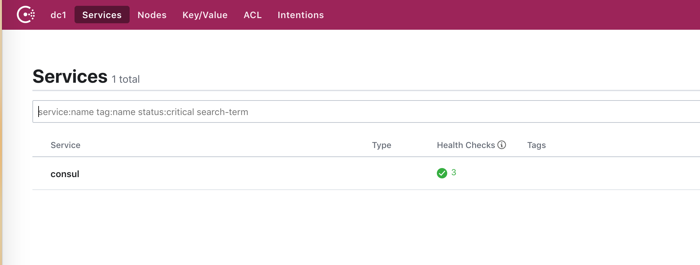
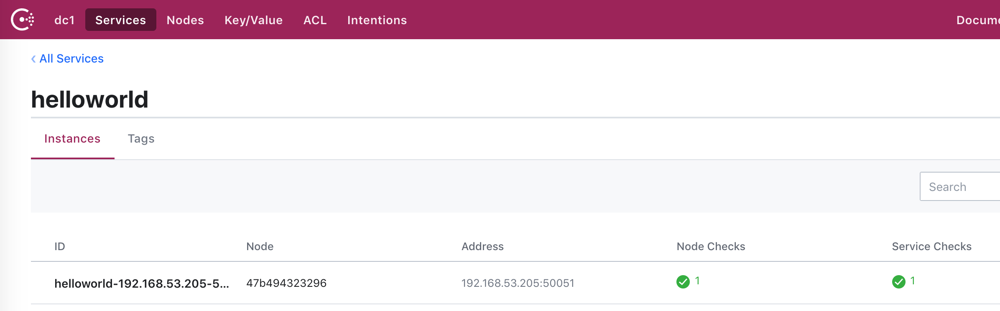

# Consul

微服务的注册和发现是整个微服务架构中至关重要的一个环节，网上也有很多的关于注册发现的文章，因此我们在这里并不会过多的介绍。

同样，提起微服务的注册发现，很多人第一时间就会想到ZooKeeper，ETCD,eureka,Consul等众多组件。由于目前团队使用的Consul，同时最新版本的Consul也添加了对ServiceMesh的支持,这为我们接下来的ServiceMesh研究有参考价值，所以我们gRPC系列的服务注册和发现就以consul为主来进行介绍。

关于consul的原理和实际使用操作等内容，不是我们这次介绍的重点。后面有时间会详细学习一下consul的原理，然后另开一篇文章  [Architechture Consul](../../architecture/consul.md) 来进行详细的原理介绍。

## Consul安装

为了便于测试，我们这里采用 consul on docker 的形式安装。可以参考 consul 在dockerhub上的文章 [Consul and Docker](https://hub.docker.com/_/consul)

### 1、将image pull 下来,采用最新版本就可以。

```shell
docker pull consul
```

### 2、 启动一个consul server

```shell
docker run -d --name=dev-consul -p 8500:8500 -e CONSUL_BIND_INTERFACE=eth0 consul
```

这将运行一个完全基于内存的Consul服务器代理，其默认采用桥接网络，并且不在主机上显示任何服务。目前我的测试采用这种方式，但是不建议在生产中使用，因为一旦容器重启，所有的数据都会丢失。

查看一下容器启动的端口,并且对外暴露了8500 端口

```shell
$ docker container ls
CONTAINER ID        IMAGE               COMMAND                  CREATED             STATUS              PORTS                                                        NAMES
47b494323296        consul              "docker-entrypoint.s…"   11 seconds ago      Up 9 seconds        8300-8302/tcp, 8500/tcp, 8301-8302/udp, 8600/tcp, 8600/udp, 0.0.0.0:8500->8500/tcp   dev-consul
```

然后使用 http://host-ip:8500 就可以打开consul的UI界面了.

使用exec 命令可以进入到容器内部。

```shell
docker exec -it dev-consul bin/sh
```

使用下面的命令查看,consul在容器内绑定的地址。

```shell
$ docker exec -t dev-consul ifconfig
eth0      Link encap:Ethernet  HWaddr 02:42:AC:11:00:02
          inet addr:172.17.0.2  Bcast:172.17.255.255  Mask:255.255.0.0
          UP BROADCAST RUNNING MULTICAST  MTU:1500  Metric:1
          RX packets:22 errors:0 dropped:0 overruns:0 frame:0
          TX packets:0 errors:0 dropped:0 overruns:0 carrier:0
          collisions:0 txqueuelen:0
          RX bytes:1716 (1.6 KiB)  TX bytes:0 (0.0 B)

lo        Link encap:Local Loopback
          inet addr:127.0.0.1  Mask:255.0.0.0
          UP LOOPBACK RUNNING  MTU:65536  Metric:1
          RX packets:535 errors:0 dropped:0 overruns:0 frame:0
          TX packets:535 errors:0 dropped:0 overruns:0 carrier:0
          collisions:0 txqueuelen:1
          RX bytes:38800 (37.8 KiB)  TX bytes:38800 (37.8 KiB)
```

 例如，如果该服务器在内部地址172.17.0.2上运行，则可以通过启动另外两个实例并告诉它们加入第一个节点来运行三节点集群以进行开发。

### 3、加入另外两个节点

```shell

$ docker run -d --name=dev-consul1 -e CONSUL_BIND_INTERFACE=eth0 consul agent -dev -join=172.17.0.2

$ docker run -d --name=dev-consul2 -e CONSUL_BIND_INTERFACE=eth0 consul agent -dev -join=172.17.0.2

```

查看集群中的所有成员

```shell

$ docker exec -t dev-consul consul members
Node          Address          Status  Type    Build  Protocol  DC   Segment
3a993c913dfa  172.17.0.3:8301  alive   server  1.5.1  2         dc1  <all>
47b494323296  172.17.0.2:8301  alive   server  1.5.1  2         dc1  <all>
7bc5b37a4e1a  172.17.0.4:8301  alive   server  1.5.1  2         dc1  <all>
```

### 4、客户端模式下运行Consul Agent

```shell
docker run -d  --name=dev-consul-agent   -e CONSUL_CLIENT_INTERFACE=eth0 consul agent  -retry-join=172.17.0.2
```

通过查看一下 `docker logs` 可以知道，这个agent已经能够进行注册发现的代理了。

```shell
$ docker logs 7509e2b8a31a

==> Found address '172.17.0.5' for interface 'eth0', setting client option...
==> Starting Consul agent...
==> Consul agent running!
           Version: 'v1.5.1'
           Node ID: 'a10e290d-9d1f-69a0-dc19-58c08fe7eaf3'
         Node name: '7509e2b8a31a'
        Datacenter: 'dc1' (Segment: '')
            Server: false (Bootstrap: false)
       Client Addr: [172.17.0.5] (HTTP: 8500, HTTPS: -1, gRPC: -1, DNS: 8600)
      Cluster Addr: 172.17.0.5 (LAN: 8301, WAN: 8302)
           Encrypt: Gossip: false, TLS-Outgoing: false, TLS-Incoming: false

==> Log data will now stream in as it occurs:

    2019/06/18 07:58:00 [INFO] serf: EventMemberJoin: 7509e2b8a31a 172.17.0.5
    2019/06/18 07:58:00 [INFO] agent: Started DNS server 172.17.0.5:8600 (udp)
    2019/06/18 07:58:00 [INFO] agent: Started DNS server 172.17.0.5:8600 (tcp)
    2019/06/18 07:58:00 [INFO] agent: Started HTTP server on 172.17.0.5:8500 (tcp)
    2019/06/18 07:58:00 [INFO] agent: started state syncer
    2019/06/18 07:58:00 [INFO] serf: EventMemberJoin: 47b494323296 172.17.0.2
    2019/06/18 07:58:00 [INFO] agent: Retry join LAN is supported for: aliyun aws azure digitalocean gce k8s mdns os packet scaleway softlayer triton vsphere
    2019/06/18 07:58:00 [INFO] consul: adding server 47b494323296 (Addr: tcp/172.17.0.2:8300) (DC: dc1)
    2019/06/18 07:58:00 [INFO] agent: Joining LAN cluster...
    2019/06/18 07:58:00 [INFO] agent: (LAN) joining: [172.17.0.2]
    2019/06/18 07:58:00 [WARN] manager: No servers available
    2019/06/18 07:58:00 [ERR] agent: failed to sync remote state: No known Consul servers
    2019/06/18 07:58:00 [INFO] serf: EventMemberJoin: 3a993c913dfa 172.17.0.3
    2019/06/18 07:58:00 [INFO] serf: EventMemberJoin: 7bc5b37a4e1a 172.17.0.4
    2019/06/18 07:58:00 [INFO] consul: adding server 3a993c913dfa (Addr: tcp/172.17.0.3:8300) (DC: dc1)
    2019/06/18 07:58:00 [INFO] consul: adding server 7bc5b37a4e1a (Addr: tcp/172.17.0.4:8300) (DC: dc1)
    2019/06/18 07:58:00 [INFO] agent: (LAN) joined: 1 Err: <nil>
    2019/06/18 07:58:00 [INFO] agent: Join LAN completed. Synced with 1 initial agents
    2019/06/18 07:58:00 [INFO] agent: Synced node info
```

此时此刻，我们再去查看一下 consul member 的话，可以看到有3个server一个client.

```shell
$ docker exec -t dev-consul consul members
Node          Address          Status  Type    Build  Protocol  DC   Segment
3a993c913dfa  172.17.0.3:8301  alive   server  1.5.1  2         dc1  <all>
47b494323296  172.17.0.2:8301  alive   server  1.5.1  2         dc1  <all>
7bc5b37a4e1a  172.17.0.4:8301  alive   server  1.5.1  2         dc1  <all>
7509e2b8a31a  172.17.0.5:8301  alive   client  1.5.1  2         dc1  <default>
```

consul 正常启动后，浏览器访问 ip:8500 就可以看到consul的UI界面了。



## 服务注册

接下来，我们正式进入gRPC 服务注册的过程了。

官方给出的例子中，已经进行了详细了案例介绍，我们可以根据官方的示例，写出我们的服务注册和发现 [grpc-examples](https://github.com/grpc/grpc-go/tree/master/examples)

我们以官方的helloword示例为例，进行注册与发现的改造。

首先在server端实现向consul中注册服务，并添加上health check

```go

// ConsulService 根据自己的需求进行的服务定制
type ConsulService struct {
    IP   string
    Port int
    Tag  []string
    Name string
}

//RegisterService 向consul中注册服务
func RegisterService(consulAddress string, service *ConsulService) {
    consulConfig := api.DefaultConfig()
    consulConfig.Address = consulAddress
    client, err := api.NewClient(consulConfig)
    if err != nil {
        log.Errorf("New consul client err \n: %v", err)
        return
    }

    agent := client.Agent()
    interval := time.Duration(10) * time.Second
    deregister := time.Duration(1) * time.Minute

    reg := &api.AgentServiceRegistration{
        ID:      fmt.Sprintf("%v-%v-%v", service.Name, service.IP, service.Port), // 服务节点的名称
        Name:    service.Name,                                                    // 服务名称
        Tags:    service.Tag,                                                     // tag，可以为空
        Port:    service.Port,                                                    // 服务端口
        Address: service.IP,                                                      // 服务 IP
        // In Consul 0.7 and later, checks that are associated with a service
        // may also contain this optional DeregisterCriticalServiceAfter field,
        // which is a timeout in the same Go time format as Interval and TTL. If
        // a check is in the critical state for more than this configured value,
        // then its associated service (and all of its associated checks) will
        // automatically be deregistered.
        Check: &api.AgentServiceCheck{ // 健康检查
            Interval:                       interval.String(),                                               // 健康检查间隔
            GRPC:                           fmt.Sprintf("%v:%v/%v", service.IP, service.Port, service.Name), // grpc 支持，执行健康检查的地址，service 会传到 Health.Check 函数中
            DeregisterCriticalServiceAfter: deregister.String(),                                             // 注销时间，相当于过期时间
        },
    }

    log.Printf("registing to %v\n", consulAddress)
    if err := agent.ServiceRegister(reg); err != nil {
        log.Printf("Service Register error\n%v", err)
        return
    }

}

```

## 服务发现

服务发现，在client端启动时，不再是直接去找server端进行通信，而是根据我们配置的consul的地址，进行服务发现，然后根据获取的服务地址进行与Server端的通信。

```go
package consul

import (
    "errors"
    "fmt"
    "regexp"
    "sync"

    "google.golang.org/grpc/serviceconfig"

    "github.com/hashicorp/consul/api"
    log "github.com/sirupsen/logrus"
    "google.golang.org/grpc/resolver"
)

const (
    defaultPort = "8500"
)

var (
    errMissingAddr = errors.New("consul resolver: missing address")

    errAddrMisMatch = errors.New("consul resolver: invalied uri")

    errEndsWithColon = errors.New("consul resolver: missing port after port-separator colon")

    regexConsul, _ = regexp.Compile("^([A-z0-9.]+)(:[0-9]{1,5})?/([A-z_]+)$")
)

// Init consul resolver
func Init() {
    log.Printf("calling consul init\n")
    resolver.Register(NewBuilder())
}

type consulBuilder struct {
}

type consulResolver struct {
    address              string
    wg                   sync.WaitGroup
    clientConn           resolver.ClientConn
    name                 string
    disableServiceConfig bool
    lastIndex            uint64
}

// NewBuilder new consulBuilder
func NewBuilder() resolver.Builder {
    return &consulBuilder{}
}

func (cb *consulBuilder) Build(target resolver.Target, cc resolver.ClientConn, opts resolver.BuildOption) (resolver.Resolver, error) {

    log.Printf("calling consul build\n")
    log.Printf("target: %v\n", target)
    host, port, name, err := parseTarget(fmt.Sprintf("%s/%s", target.Authority, target.Endpoint))
    if err != nil {
        return nil, err
    }

    cr := &consulResolver{
        address:              fmt.Sprintf("%s%s", host, port),
        name:                 name,
        clientConn:           cc,
        disableServiceConfig: opts.DisableServiceConfig,
        lastIndex:            0,
    }

    cr.wg.Add(1)
    go cr.watcher()
    return cr, nil

}

func (cr *consulResolver) watcher() {
    log.Printf("calling consul watcher\n")
    config := api.DefaultConfig()
    config.Address = cr.address
    client, err := api.NewClient(config)
    if err != nil {
        log.Printf("error create consul client: %v\n", err)
        return
    }

    for {
        services, metainfo, err := client.Health().Service(cr.name, cr.name, true, &api.QueryOptions{WaitIndex: cr.lastIndex})
        if err != nil {
            log.Printf("error retrieving instances from Consul: %v", err)
        }

        cr.lastIndex = metainfo.LastIndex
        var newAddrs []resolver.Address
        for _, service := range services {
            addr := fmt.Sprintf("%v:%v", service.Service.Address, service.Service.Port)
            newAddrs = append(newAddrs, resolver.Address{Addr: addr})
        }
        log.Printf("adding service addrs\n")
        log.Printf("newAddrs: %v\n", newAddrs)

        serviceConfig, err := serviceconfig.Parse(cr.name)
        if err != nil {
            state := resolver.State{
                Addresses:     newAddrs,
                ServiceConfig: serviceConfig,
            }
            cr.clientConn.UpdateState(state)
        } else {
            log.Error(err.Error())
        }

    }

}

func (cb *consulBuilder) Scheme() string {
    return "consul"
}

func (cr *consulResolver) ResolveNow(opt resolver.ResolveNowOption) {
}

func (cr *consulResolver) Close() {
}

func parseTarget(target string) (host, port, name string, err error) {

    log.Printf("target uri: %v\n", target)
    if target == "" {
        return "", "", "", errMissingAddr
    }

    if !regexConsul.MatchString(target) {
        return "", "", "", errAddrMisMatch
    }

    groups := regexConsul.FindStringSubmatch(target)
    host = groups[1]
    port = groups[2]
    name = groups[3]
    if port == "" {
        port = defaultPort
    }
    return host, port, name, nil
}

```

## Try it

1. 启动我们的server端服务,然后查看Consul中是否有成功注册

```shell

$ go run server/cmd/main.go

INFO[0000] registing to 192.168.53.205:8500
INFO[0006] health checking
INFO[0016] health checking
INFO[0026] health checking
INFO[0036] health checking

```

  

1. 启动我们的客户端就能够输出下面的信息，这就成功发现了服务并发送了消息了,同时server端也能够收到相应的消息。

```shell
$ go run client/cmd/main.go
INFO[0000] calling consul init
INFO[0000] calling consul build
INFO[0000] target: {consul 192.168.53.205:8500 helloworld}
INFO[0000] target uri: 192.168.53.205:8500/helloworld
INFO[0000] calling consul watcher
INFO[0000] adding service addrs
INFO[0000] newAddrs: [{192.168.53.205:50051 0  <nil>}]
2019/06/19 14:26:49 Greeting: Hello world

```

[本示例完整的代码地址](https://github.com/PegasusMeteor/grpc-examples/tree/master/grpc-consul)

## 参考

- [用consul做grpc的服务发现](https://segmentfault.com/a/1190000018424798)
- [consul api](https://godoc.org/github.com/hashicorp/consul/api#Agent.ServiceRegister)
