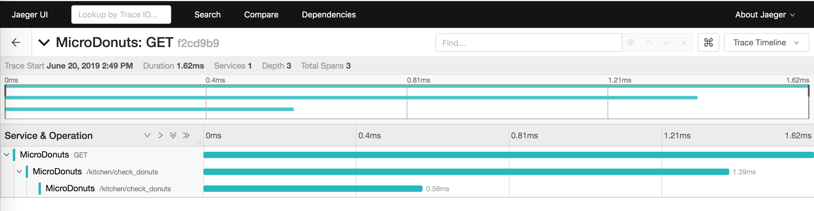

# 分布式链路追踪

<!-- TOC -->

- [分布式链路追踪](#分布式链路追踪)
  - [尝鲜一下](#尝鲜一下)
    - [Setup MicroDonuts](#setup-microdonuts)
    - [选择一个分布式追踪工具](#选择一个分布式追踪工具)

<!-- /TOC -->

传送门 [Opentracing](../../architecture/opentracing.md)

传送门 [Jayger && ZipKin](../../architecture/Jaeger-zipkin.md)

## [尝鲜一下](https://github.com/opentracing-contrib/java-opentracing-walkthrough)

在前面的两篇文章中，我们已经普及了什么是OpenTracing，以及Jaeger和ZipKin的简单比较。接下来，就来按照官方的例子进行一个简单的尝试，然后再抽丝剥茧，看看如何在我们的工程代码中进行实现。

[官方DEMO](https://github.com/opentracing-contrib/java-opentracing-walkthrough)

### Setup MicroDonuts

首先，测试环境需要安装JDK，以及Maven,可以搜索如何安装。

```shell
git clone git@github.com:opentracing-contrib/java-opentracing-walkthrough.git
cd java-opentracing-walkthrough/microdonuts
mvn package exec:exec
```

在浏览器中访问 [http://127.0.0.1:10001](http://127.0.0.1:10001) 就可以看到一个简单的页面了。


### 选择一个分布式追踪工具

我们这里选择的是Jaeger.

修改 `microdonuts/tracer_config.properties` 文件：

```properties
tracer=jaeger
jaeger.reporter_host=localhost
jaeger.reporter_port=5775
```

在docker中运行：

```shell

docker run -d -p 5775:5775/udp -p 16686:16686 jaegertracing/all-in-one:latest

```

打开浏览器，访问 `http://localhost:16686` 就可以看到 Jaeger UI 了。



## gRPC 集成 Jaeger

在前面的对比中，我们已经大体上介绍过Jaeger的区别，同时我们也介绍了二者在现有云原生生态中的发展。所以，我们这里选择了Jaeger来进行学习。

下面我们就介绍一下，如何在gRPC中集成Jaeger。

