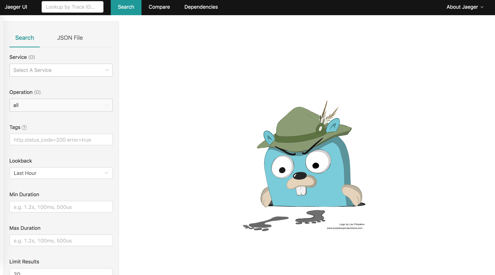
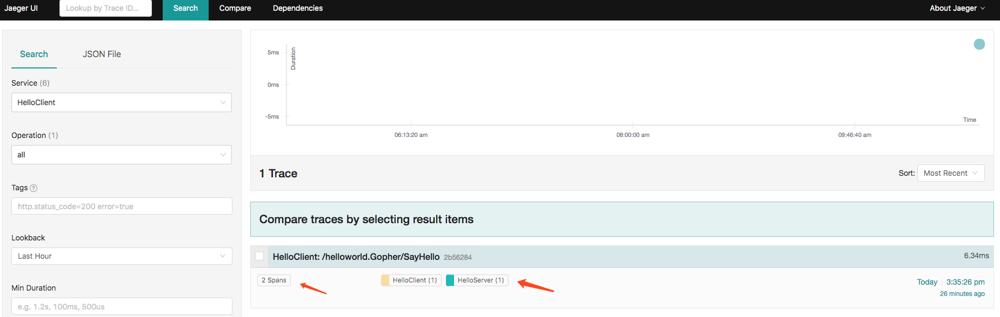
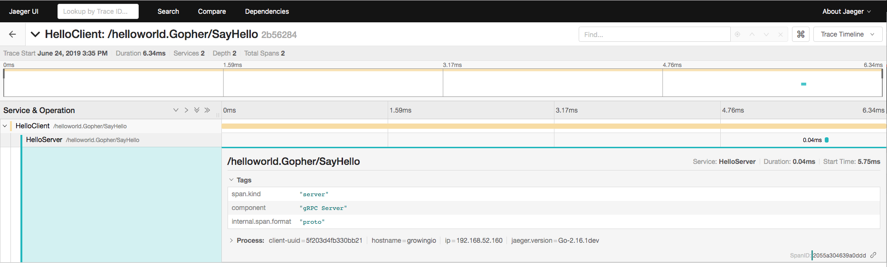
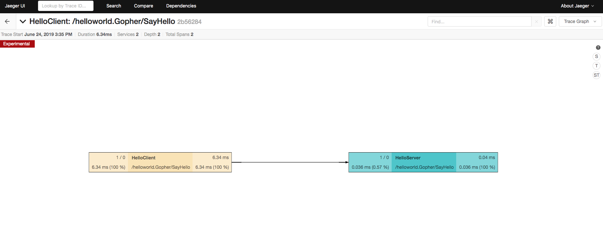

# 分布式链路追踪

<!-- TOC -->

- [分布式链路追踪](#分布式链路追踪)
  - [[尝鲜一下](https://github.com/opentracing-contrib/java-opentracing-walkthrough)](#尝鲜一下httpsgithubcomopentracing-contribjava-opentracing-walkthrough)
    - [Setup MicroDonuts](#setup-microdonuts)
    - [选择一个分布式追踪工具](#选择一个分布式追踪工具)
  - [官方示例 Tracing Demo](#官方示例-tracing-demo)
  - [gRPC 集成 Jaeger](#grpc-集成-jaeger)
    - [查看一下容器内的构成](#查看一下容器内的构成)
    - [tracing carrier](#tracing-carrier)
    - [创建 GlobalTracer](#创建-globaltracer)
    - [gRPC Interceptor](#grpc-interceptor)
    - [gRPC Client 和 gRPC Server 中集成 Interceptor 和Tracer](#grpc-client-和-grpc-server-中集成-interceptor-和tracer)
    - [运行一下](#运行一下)
  - [参考](#参考)

<!-- /TOC -->

传送门 [Opentracing](../../architecture/opentracing.md)

传送门 [Jayger && ZipKin](../../architecture/Jaeger-zipkin.md)

## [尝鲜一下](https://github.com/opentracing-contrib/java-opentracing-walkthrough)

在前面的两篇文章中，我们已经普及了什么是OpenTracing，以及Jaeger和ZipKin的简单比较。接下来，就来按照官方的例子进行一个简单的尝试，然后再抽丝剥茧，看看如何在我们的工程代码中进行实现。

[官方DEMO](https://github.com/opentracing-contrib/java-opentracing-walkthrough)

### Setup MicroDonuts

首先，测试环境需要安装JDK，以及Maven,可以搜索如何安装。

```shell
git clone git@github.com:opentracing-contrib/java-opentracing-walkthrough.git
cd java-opentracing-walkthrough/microdonuts
mvn package exec:exec
```

在浏览器中访问 [http://127.0.0.1:10001](http://127.0.0.1:10001) 就可以看到一个简单的页面了。


### 选择一个分布式追踪工具

我们这里选择的是Jaeger.

修改 `microdonuts/tracer_config.properties` 文件：

```properties
tracer=jaeger
jaeger.reporter_host=localhost
jaeger.reporter_port=5775
```

在docker中运行：

```shell

docker run -d -p 5775:5775/udp -p 16686:16686 jaegertracing/all-in-one:latest

```

打开浏览器，访问 `http://localhost:16686` 就可以看到 Jaeger UI 了。


## 官方示例 Tracing Demo

[Take OpenTracing for a HotROD ride](https://medium.com/opentracing/take-opentracing-for-a-hotrod-ride-f6e3141f7941)

## gRPC 集成 Jaeger

在前面的对比中，我们已经大体上介绍过Jaeger 和 ZipKin 的区别，同时我们也介绍了二者在现有云原生生态中的发展。所以，我们这里选择了Jaeger来进行学习。

下面我们就介绍一下，如何在gRPC中集成Jaeger。

从我们之前介绍的Jaeger文章中，我们看到如果想要对每个服务进行tracing，除了需要在代码里面嵌入Jaeger Client 之外，还需要有Agent，collector，store,UI 等众多组件。我们这里只演示如何在代码中集成JaegerClient,至于其他组件，我们都在docker中运行。

```shell
docker run -d -p6831:6831/udp -p16686:16686 jaegertracing/all-in-one:latest
```

这时在浏览器中访问 `http://127.0.0.1:16686/search`就可以看到jaeger的页面了。不过现在代码还没有跑起来，看不到什么效果。



### 查看一下容器内的构成

可以点击 [jaeger-docker-compose](https://github.com/jaegertracing/jaeger/tree/master/docker-compose) 去查看一下这个容器内的构成。 下面把代码贴一下。

```yaml
version: '2'

services:
    jaeger-collector:
      image: jaegertracing/jaeger-collector
      command: ["--cassandra.keyspace=jaeger_v1_dc1", "--cassandra.servers=cassandra", "--collector.zipkin.http-port=9411"]
      ports:
        - "14269"
        - "14268:14268"
        - "14267"
        - "14250"
        - "9411:9411"
      restart: on-failure
      depends_on:
        - cassandra-schema

    jaeger-query:
      image: jaegertracing/jaeger-query
      command: ["--cassandra.keyspace=jaeger_v1_dc1", "--cassandra.servers=cassandra"]
      ports:
        - "16686:16686"
        - "16687"
      restart: on-failure
      depends_on:
        - cassandra-schema

    jaeger-agent:
      image: jaegertracing/jaeger-agent
      command: ["--reporter.grpc.host-port=jaeger-collector:14250"]
      ports:
        - "5775:5775/udp"
        - "6831:6831/udp"
        - "6832:6832/udp"
        - "5778:5778"
      restart: on-failure
      depends_on:
        - jaeger-collector

    cassandra:
      image: cassandra:3.9

    cassandra-schema:
      image: jaegertracing/jaeger-cassandra-schema
      depends_on:
        - cassandra
```

即便对容器不是很熟悉的话，也能够看出，容器内运行的程序 包含了四个部分，分别是 `agent`,`query`,`collector`,还有存储`cassandra`。很明显，接下来，我们在 gRPC-example中，再集成 `jaeger-client`,然后就可以进行微服务的链路追踪了。

### tracing carrier

根据 Opentracing 的官方定义在进行，跨进程追踪调用的时候，需要进行 [Inject  and Extract](https://opentracing.io/docs/overview/inject-extract/)。并且需要指定carrier。

而官方指定的carrier 只有两种。 [TextMapCarrier  和 HTTPHeadersCarrier](https://github.com/opentracing/opentracing-go/blob/master/propagation.go)

```go
// TextMapCarrier allows the use of regular map[string]string
// as both TextMapWriter and TextMapReader.
type TextMapCarrier map[string]string

// HTTPHeadersCarrier satisfies both TextMapWriter and TextMapReader.
//
// Example usage for server side:
//
//     carrier := opentracing.HTTPHeadersCarrier(httpReq.Header)
//     clientContext, err := tracer.Extract(opentracing.HTTPHeaders, carrier)
//
// Example usage for client side:
//
//     carrier := opentracing.HTTPHeadersCarrier(httpReq.Header)
//     err := tracer.Inject(
//         span.Context(),
//         opentracing.HTTPHeaders,
//         carrier)
//
type HTTPHeadersCarrier http.Header

```

当然，我们也可以进行 自定义的carrier，但是如果要实现自定义的carrier，就必须要实现 [TextMapWriter & TextMapReader](https://github.com/opentracing/opentracing-go/blob/master/propagation.go) 接口

```go
// TextMapWriter is the Inject() carrier for the TextMap builtin format. With
// it, the caller can encode a SpanContext for propagation as entries in a map
// of unicode strings.
type TextMapWriter interface {
    // Set a key:value pair to the carrier. Multiple calls to Set() for the
    // same key leads to undefined behavior.
    //
    // NOTE: The backing store for the TextMapWriter may contain data unrelated
    // to SpanContext. As such, Inject() and Extract() implementations that
    // call the TextMapWriter and TextMapReader interfaces must agree on a
    // prefix or other convention to distinguish their own key:value pairs.
    Set(key, val string)
}

// TextMapReader is the Extract() carrier for the TextMap builtin format. With it,
// the caller can decode a propagated SpanContext as entries in a map of
// unicode strings.
type TextMapReader interface {
    // ForeachKey returns TextMap contents via repeated calls to the `handler`
    // function. If any call to `handler` returns a non-nil error, ForeachKey
    // terminates and returns that error.
    //
    // NOTE: The backing store for the TextMapReader may contain data unrelated
    // to SpanContext. As such, Inject() and Extract() implementations that
    // call the TextMapWriter and TextMapReader interfaces must agree on a
    // prefix or other convention to distinguish their own key:value pairs.
    //
    // The "foreach" callback pattern reduces unnecessary copying in some cases
    // and also allows implementations to hold locks while the map is read.
    ForeachKey(handler func(key, val string) error) error
}

```

我们接下来来实现一下两个接口，采用一个自定义的carrier。

```go
// MDCarrier custome carrier
type MDCarrier struct {
    metadata.MD
}

// ForeachKey conforms to the TextMapReader interface.
// 这里必须要实现这个 TextMapReader 这个接口
// TextMapReader is the Extract() carrier for the TextMap builtin format. With it,
// the caller can decode a propagated SpanContext as entries in a map of
// unicode strings.
//type TextMapReader interface {
//    // ForeachKey returns TextMap contents via repeated calls to the `handler`
//    // function. If any call to `handler` returns a non-nil error, ForeachKey
//    // terminates and returns that error.
//    //
//    // NOTE: The backing store for the TextMapReader may contain data unrelated
//    // to SpanContext. As such, Inject() and Extract() implementations that
//    // call the TextMapWriter and TextMapReader interfaces must agree on a
//    // prefix or other convention to distinguish their own key:value pairs.
//    //
//    // The "foreach" callback pattern reduces unnecessary copying in some cases
//    // and also allows implementations to hold locks while the map is read.
//    ForeachKey(handler func(key, val string) error) error
//}
func (m MDCarrier) ForeachKey(handler func(key, val string) error) error {
    for k, strs := range m.MD {
        for _, v := range strs {
            if err := handler(k, v); err != nil {
                return err
            }
        }
    }
    return nil
}

// Set implements Set() of opentracing.TextMapWriter
// 这里也必须要实现
// TextMapWriter is the Inject() carrier for the TextMap builtin format. With
// it, the caller can encode a SpanContext for propagation as entries in a map
// of unicode strings.
//type TextMapWriter interface {
//    // Set a key:value pair to the carrier. Multiple calls to Set() for the
//    // same key leads to undefined behavior.
//    //
//    // NOTE: The backing store for the TextMapWriter may contain data unrelated
//    // to SpanContext. As such, Inject() and Extract() implementations that
//    // call the TextMapWriter and TextMapReader interfaces must agree on a
//    // prefix or other convention to distinguish their own key:value pairs.
//    Set(key, val string)
//}
func (m MDCarrier) Set(key, val string) {
    m.MD[key] = append(m.MD[key], val)
}

```

### 创建 GlobalTracer

创建 tracer 的过程可以参考 官方的demo示例 [jaeger-client-go](https://github.com/jaegertracing/jaeger-client-go/blob/master/config/example_test.go)

```go
// NewJaegerTracer NewJaegerTracer for current service
func NewJaegerTracer(serviceName string, jagentHost string) (tracer opentracing.Tracer, closer io.Closer, err error) {
    cfg := jaegercfg.Configuration{
        ServiceName: serviceName,
        Sampler: &jaegercfg.SamplerConfig{
            Type:  jaeger.SamplerTypeConst,
            Param: 1,
        },
        Reporter: &jaegercfg.ReporterConfig{
            LogSpans:            true,
            BufferFlushInterval: 1 * time.Second,
            LocalAgentHostPort:  jagentHost,
        },
    }
    // Example logger and metrics factory. Use github.com/uber/jaeger-client-go/log
    // and github.com/uber/jaeger-lib/metrics respectively to bind to real logging and metrics
    // frameworks.
    jLogger := jaegerlog.StdLogger
    jMetricsFactory := metrics.NullFactory

    // Initialize tracer with a logger and a metrics factory
    tracer, closer, err = cfg.NewTracer(
        jaegercfg.Logger(jLogger),
        jaegercfg.Metrics(jMetricsFactory))

    opentracing.SetGlobalTracer(tracer)
    if err != nil {
        grpclog.Errorf("Could not initialize jaeger tracer: %s", err.Error())
        return
    }
    return
}
```

### gRPC Interceptor

gRPC 提供了 拦截器，让我们可以在Clent端和server端对方法进行拦截处理，这样可以节省我们很大的麻烦。因为我们如果在server端和client端分别有很多的方法需要监控，难道我们每个方法都要去实现一遍 tracer定义？interceptor帮助我们解决了这个问题。

可以参考gRPC 官方 [Example Interceptor](https://github.com/grpc/grpc-go/tree/master/examples/features/interceptor)

下面我们看下如何定义的Client和Server Interceptor.

```go
// ClientInterceptor 客户端拦截器
// https://godoc.org/google.golang.org/grpc#UnaryClientInterceptor
func ClientInterceptor(tracer opentracing.Tracer) grpc.UnaryClientInterceptor {
    return func(ctx context.Context, method string, request, reply interface{}, cc *grpc.ClientConn, invoker grpc.UnaryInvoker, opts ...grpc.CallOption) error {

        //一个RPC调用的服务端的span，和RPC服务客户端的span构成ChildOf关系
        var parentCtx opentracing.SpanContext
        parentSpan := opentracing.SpanFromContext(ctx)
        if parentSpan != nil {
            parentCtx = parentSpan.Context()
        }
        span := tracer.StartSpan(
            method,
            opentracing.ChildOf(parentCtx),
            opentracing.Tag{Key: string(ext.Component), Value: "gRPC Client"},
            ext.SpanKindRPCClient,
        )

        defer span.Finish()
        md, ok := metadata.FromOutgoingContext(ctx)
        if !ok {
            md = metadata.New(nil)
        } else {
            md = md.Copy()
        }

        err := tracer.Inject(
            span.Context(),
            opentracing.TextMap,
            MDCarrier{md}, // 自定义 carrier
        )

        if err != nil {
            log.Errorf("inject span error :%v", err.Error())
        }

        newCtx := metadata.NewOutgoingContext(ctx, md)
        err = invoker(newCtx, method, request, reply, cc, opts...)

        if err != nil {
            log.Errorf("call error : %v", err.Error())
        }
        return err
    }
}


// ServerInterceptor Server 端的拦截器
func ServerInterceptor(tracer opentracing.Tracer) grpc.UnaryServerInterceptor {
    return func(ctx context.Context, req interface{}, info *grpc.UnaryServerInfo, handler grpc.UnaryHandler) (resp interface{}, err error) {
        md, ok := metadata.FromIncomingContext(ctx)
        if !ok {
            md = metadata.New(nil)
        }
        spanContext, err := tracer.Extract(
            opentracing.TextMap,
            MDCarrier{md},
        )

        if err != nil && err != opentracing.ErrSpanContextNotFound {
            grpclog.Errorf("extract from metadata err: %v", err)
        } else {
            span := tracer.StartSpan(
                info.FullMethod,
                ext.RPCServerOption(spanContext),
                opentracing.Tag{Key: string(ext.Component), Value: "gRPC Server"},
                ext.SpanKindRPCServer,
            )
            defer span.Finish()

            ctx = opentracing.ContextWithSpan(ctx, span)
        }

        return handler(ctx, req)

    }

}

```

### gRPC Client 和 gRPC Server 中集成 Interceptor 和Tracer

接下来，就可以在gRPC的代码中进行tracer 和 interceptor的集成了。

我们还是使用 前面 gRPC 注册consul 的例子，在这个例子的基础上，添加 tracer。

首先我们来看下 Clinet端

```go

func main() {
    consul.Init()

    tracer, closer, err := intercepter.NewJaegerTracer(serviceName, jaegerAgent)
    defer closer.Close()
    if err != nil {
        log.Printf("NewJaegerTracer err:", err.Error())
    }
    // Set up a connection to the server.
    ctx, _ := context.WithTimeout(context.Background(), 5*time.Second)
    conn, err := grpc.DialContext(ctx, consulService, grpc.WithInsecure(), grpc.WithBalancerName("round_robin"), grpc.WithUnaryInterceptor(intercepter.ClientInterceptor(tracer)))
    if err != nil {
        log.Fatalf("did not connect: %v", err)
    }
    defer conn.Close()
    c := pb.NewGopherClient(conn)

    ........
}
```

然后我们看下 Server 端

```go
func main() {

    tracer, closer, err := intercepter.NewJaegerTracer(serviceName, jaegerAgent)
    defer closer.Close()
    if err != nil {
        log.Printf("NewJaegerTracer err: %v", err.Error())
    }
    lis, err := net.Listen("tcp", port)
    if err != nil {
        log.Fatalf("failed to listen: %v", err)
    }
    s := grpc.NewServer(grpc.UnaryInterceptor(intercepter.ServerInterceptor(tracer)))
    pb.RegisterGopherServer(s, &server{})
    grpc_health_v1.RegisterHealthServer(s, &HealthImpl{})
    RegisterToConsul()
    if err := s.Serve(lis); err != nil {
        log.Fatalf("failed to serve: %v", err)
    }
}

```

从上面的代码来看，我们的实现，非常简单。只要在client和server端启动时将我们的interceptor传入，同时传入创建好的trace就可以了。

但是有一点需要注意，因为我们使用的是interceptor，所以，在进行健康性检查的时候，也会被trace到。也就是说，我们在 jaeger UI 上查看时也能够看到 health check 的trace 信息。

### 运行一下

先运行 Server端，再启动Client端，就可以进行通信以及链路追踪了。



点开之后可以很详细的看到层级关系以及每个方法的信息，需要tracing的信息，还可以进行更详细的定义。



还可以按照 调用链 的形式来进行查看。这有利于我们梳理清复杂的服务架构。



本文的示例 代码地址 [rpc-examples](https://github.com/PegasusMeteor/grpc-examples)

## 参考

- [grpc-jaeger](https://github.com/moxiaomomo/grpc-jaeger)
- [jaeger client libraries](https://www.jaegertracing.io/docs/1.12/client-libraries/)
- [opentracing-tutorial](https://github.com/yurishkuro/opentracing-tutorial)
- [Tracing HTTP request latency in Go with OpenTracing](https://medium.com/opentracing/tracing-http-request-latency-in-go-with-opentracing-7cc1282a100a)
- [cross process tracing](https://wu-sheng.gitbooks.io/opentracing-io/content/pages/api/cross-process-tracing.html)
- [Lesson 3 - Tracing RPC Requests](https://github.com/yurishkuro/opentracing-tutorial/tree/master/go/lesson03)
- [Opentracing Inject Extract](https://opentracing.io/docs/overview/inject-extract/)
