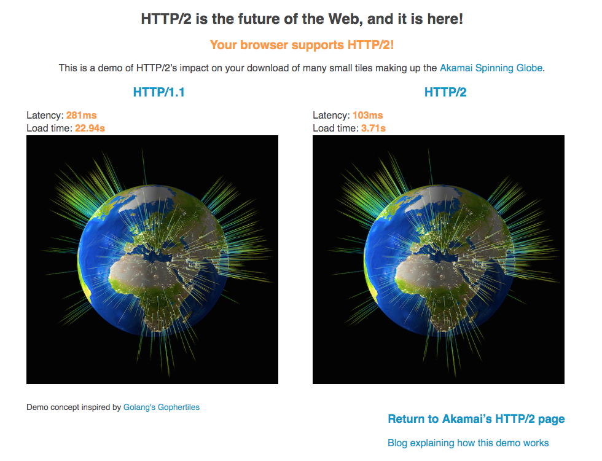

# HTTP 2.0
<!-- TOC -->

- [HTTP 2.0](#HTTP-20)
  - [尝鲜一下](#%E5%B0%9D%E9%B2%9C%E4%B8%80%E4%B8%8B)
  - [HTTP 1.1 VS HTTP 2.0](#HTTP-11-VS-HTTP-20)
  - [gRPC基于HTTP/2的优缺点](#gRPC%E5%9F%BA%E4%BA%8EHTTP2%E7%9A%84%E4%BC%98%E7%BC%BA%E7%82%B9)

<!-- /TOC -->

关于 HTTP 2.0 具体有哪些新的内容，标准发生了什么变化，或许不是一篇文章就能够说明白的。或许，我们自己瞎解释一通，不如将一些有用的资料列举出来更有意义。

## 尝鲜一下

首先，我们来直观的体验一下HTTP2.0 。 [HTTP/2 is the future of the Web, and it is here!](https://http2.akamai.com/demo)  Akamai 公司 建立了一个在线的演示，可以直观的感受HTTP1.1与HTTP2.0的差距。

如果我们打开chrome的调试工具，切换到network选项，可以看到，同样是对390张图片的传输，HTTP 1.1 与 HTTP 2.0 有着明显的区别。

## HTTP 1.1 VS HTTP 2.0

下面是查阅的一些资料，获取能让我们明白具体什么是HTTP2.0,以及它与HTTP1.1的区别。

- [HTTP/2](https://http2.github.io/)
- [Hypertext Transfer Protocol Version 2 (HTTP/2)(rfc7540)](https://httpwg.org/specs/rfc7540.html)
- [HTTP/2 简介](https://developers.google.com/web/fundamentals/performance/http2/?hl=zh-cn)
- [http2讲解]https://ye11ow.gitbooks.io/http2-explained/content/
- [gRPC over HTTP2](https://github.com/grpc/grpc/blob/master/doc/PROTOCOL-HTTP2.md)

## gRPC基于HTTP/2的优缺点

**优点**

- HTTP/2是一个经过实践检验的公开的标准
- 天然支持手机、物联网、浏览器
- 多语言实现容易，每种流行的编程语言都有自己的HTTP/2 Client
- HTTP/2支持Stream和流控
- 基于HTTP/2 在Gateway/Proxy很容易支持
- HTTP/2 安全性有保证
- HTTP/2 鉴权成熟

**缺点**

- rpc的元数据的传输不够高效
- HTTP/2 里一次gRPC调用需要解码两次,一次是HEADERS frame，一次是DATA frame
- HTTP/2 标准本身是只有一个TCP连接，但是实际在gRPC里是会有多个TCP连接，使用时需要注意

参考 [思考gRPC ：为什么是HTTP/2](https://blog.csdn.net/hengyunabc/article/details/81120904)
