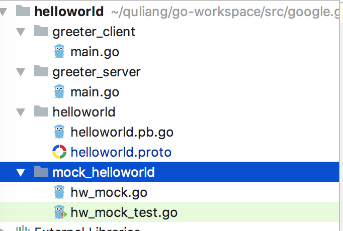

# Go Quick Start
<!-- TOC -->

- [Go Quick Start](#go-quick-start)
  - [先决条件](#%E5%85%88%E5%86%B3%E6%9D%A1%E4%BB%B6)
    - [Go Version](#go-version)
    - [Install gRPC](#install-grpc)
    - [Install Protocol Buffers v3](#install-protocol-buffers-v3)
  - [Download the example](#download-the-example)
  - [Build the example](#build-the-example)
  - [Try it](#try-it)
  - [Update a gRPC service](#update-a-grpc-service)
  - [Generate gRPC code](#generate-grpc-code)
  - [Update and run the application](#update-and-run-the-application)
    - [Update the server](#update-the-server)
    - [Update the client](#update-the-client)
    - [Run](#run)
  - [NEXT](#next)

## 先决条件
<!-- /TOC -->
### Go Version

gRPC 要求go的版本是1.6或者更高

```shell
go version
```

### Install gRPC

使用下面的命令去安装gRPC

```shell
go get -u google.golang.org/grpc
```

如果国内的网络环境不允许的话，可以点击 [FAQ](https://github.com/grpc/grpc-go#FAQ)，查看相应的解决办法。

### Install Protocol Buffers v3

安装用于生成gRPC服务代码的protoc编译器.最简单的版本就是从这个地址  [https://github.com/protocolbuffers/protobuf/releases](https://github.com/protocolbuffers/protobuf/releases) 下载预编译好的二进制包,选择对应的平台以及版本就可以了。

解压到自己特定的目录，然后配置环境变量。

接下来，为Go安装protoc插件。

```shell
go get -u github.com/golang/protobuf/protoc-gen-go
```

这时，编译后的protoc插件会位于`$GOPATH/bin`目录下。可以到该目录下确认是否存在。

## Download the example

前面我们下载的 gRPC `go get google.golang.org/grpc`，同样包含了gRPC的example，位于 `$GOPATH/src/google.golang.org/grpc/examples` 目录下。

## Build the example

切换到 example 目录下

```shell
cd $GOPATH/src/google.golang.org/grpc/examples/helloworld
```

gRPC服务在 `.proto` 文件中定义，该文件用于生成相应的`.pb.go`文件。 `.pb.go`文件是通过使用protoc 编译器编译 `.proto` 文件生成的。

出于演示Demo的目的, `helloworld.pb.go` 文件已经被生成了 (通过编译 `helloworld.proto` ), 位于 `$GOPATH/src/google.golang.org/grpc/examples/helloworld/helloworld`.

`helloworld.pb.go` 文件包含两部分内容:

- 生成client和server端的代码
- 用于填充，序列化和检索`HelloRequest`和`HelloReply`消息类型的代码

这是example的代码目录结构。  



## Try it

下面我们就来真枪实弹的跑一下代码看看。

进入到 example的目录 `$GOPATH/src/google.golang.org/grpc/examples/helloworld`,首先运行server端代码。

```shell
go run greeter_server/main.go
```

然后另外开启一个终端，运行client端代码。

```shell
go run greeter_client/main.go

```

此时如果运行没有出现问题的话。client 端会输出 `Greeting: Hello world` .

## Update a gRPC service

接下来，如果我要更新应用程序添加新的接口给客户端调用，应该怎么做呢？gRPC服务默认是使用 `protocol buffers` 来定义的。可以点击[什么是 gRPC?](what-grpc.md) 和 [gRPC基础](grpc-basic.md)这两篇文章来 查看如何在 `.proto` 文件中定义一个服务。现在我们只需要之道，服务器和客户端都有一个SayHello RPC方法，该方法从客户端获取HelloRequest参数并从服务器返回HelloReply.它的定义是下面的样子.

位于 `helloworld/helloworld.proto` 文件中。

```protobuf
// The greeting service definition.
service Greeter {
  // Sends a greeting
  rpc SayHello (HelloRequest) returns (HelloReply) {}
}

// The request message containing the user's name.
message HelloRequest {
  string name = 1;
}

// The response message containing the greetings
message HelloReply {
  string message = 1;
}

```

接下来，我们给service 再加上一个方法。  

编辑`helloworld/helloworld.proto` 文件，添加一个 `SayHelloAgain` 的方法，它与 `SayHello` 方法接收同样的参数，有同样的返回值。

```protobuf

// The greeting service definition.
service Greeter {
  // Sends a greeting
  rpc SayHello (HelloRequest) returns (HelloReply) {}

  // Sends another greeting
  rpc SayHelloAgain (HelloRequest) returns (HelloReply) {}
}

// The request message containing the user's name.
message HelloRequest {
  string name = 1;
}

// The response message containing the greetings
message HelloReply {
  string message = 1;
}

```

## Generate gRPC code

接下来，我们更新我们的gRPC代码，让我们的应用采用新的方法定义。

```shell
protoc -I helloworld/ helloworld/helloworld.proto --go_out=plugins=grpc:helloworld
```

这个命令会让`helloworld.pb.go`自动生成我们刚才的改变。

## Update and run the application

刚才我们已经自动生成了 server 和 client 代码。但是我们仍然需要手动编写和调用这个新的方法。  

### Update the server

编辑 `greeter_server/main.go` 文件，添加下面的这样一个方法。

```go
func (s *server) SayHelloAgain(ctx context.Context, in *pb.HelloRequest) (*pb.HelloReply, error) {
        return &pb.HelloReply{Message: "Hello again " + in.Name}, nil
}
```

### Update the client

编辑 `greeter_client/main.go` 在main函数中添加下面这样一段代码。

```go
r, err = c.SayHelloAgain(ctx, &pb.HelloRequest{Name: name})
if err != nil {
        log.Fatalf("could not greet: %v", err)
}
log.Printf("Greeting: %s", r.Message)
```

### Run

接下来就可以运行了。开启两个终端分别运行 server和client.运行结果如下所示。

```shell
go run greeter_client/main.go
2019/06/02 19:25:56 Greeting: Hello world
2019/06/02 19:25:56 Greeting: Hello again world
```

## NEXT

- [What is gRPC](what-grpc.md)
- [gRPC Concepts](grpc-concepts.md)
