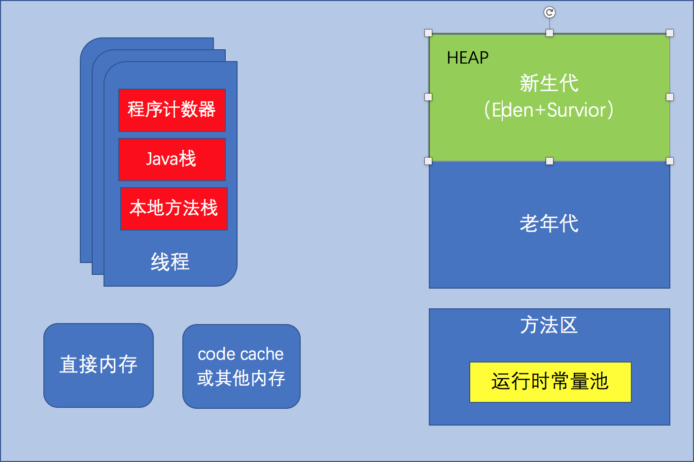
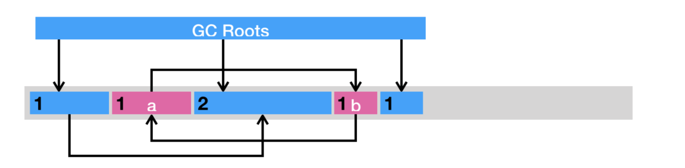
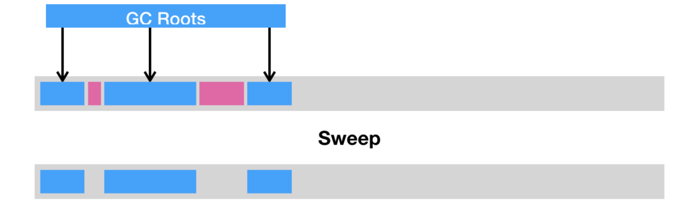
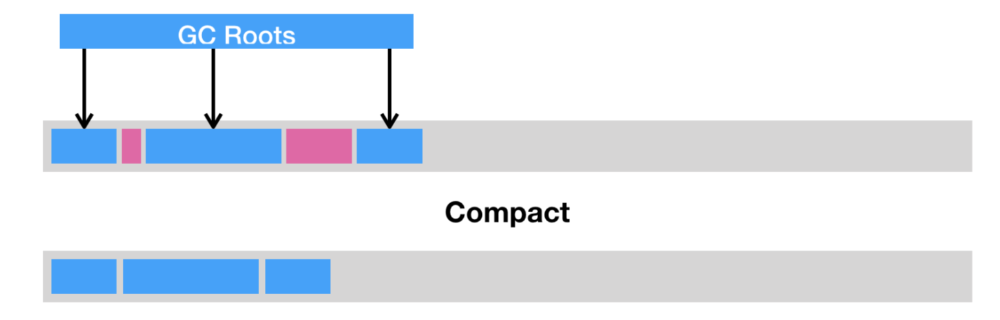
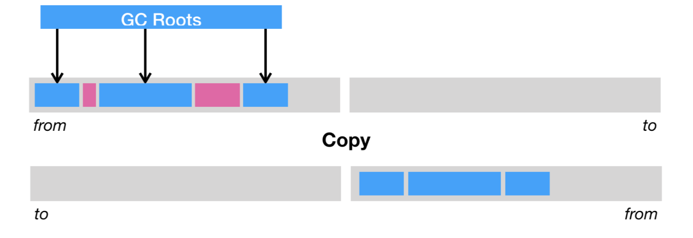
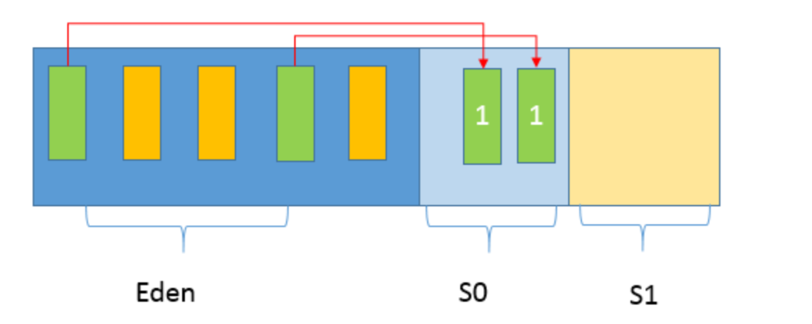
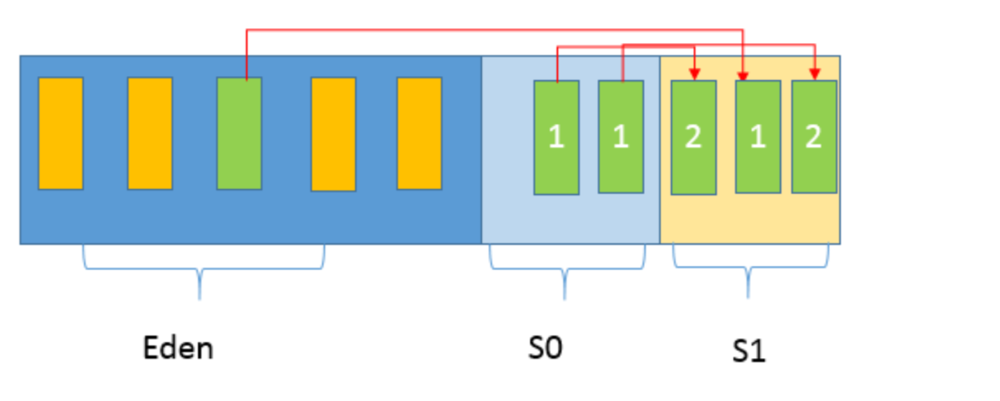
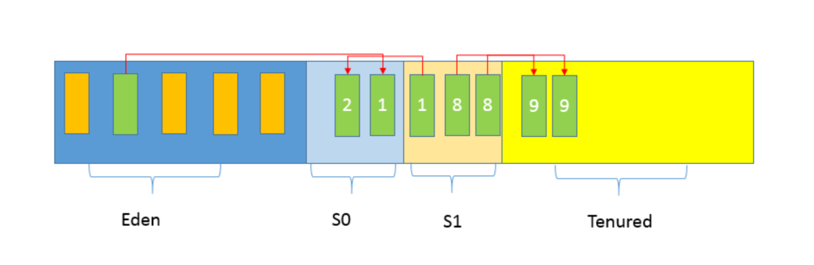
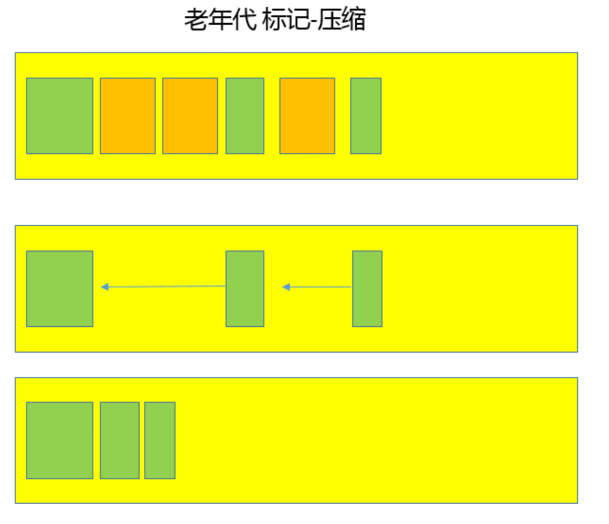

# JVM GC

## JVM 中的内存区域划分

[JVM规范](https://docs.oracle.com/javase/specs/jvms/se9/html/jvms-2.html#jvms-2.5)

### 第一，程序计数器(PC，Program Counter Register)。

在 JVM 规范中，每个线程都有它自 己的程序计数器，并且任何时间一个线程都只有一个方法在执行，也就是所谓的当前方法。程序计数器会存储当前线程正在执行的 Java 方法的 JVM 指令地址;或者，如果是在执行本地方 法，则是未指定值(undefined)。

### 第二，Java 虚拟机栈(Java Virtual Machine Stack)

早期也叫 Java 栈。每个线程在创建时 都会创建一个虚拟机栈，其内部保存一个个的栈帧(Stack Frame)，对应着一次次的 Java 方 法调用。
前面谈程序计数器时，提到了当前方法;同理，在一个时间点，对应的只会有一个活动的栈帧， 通常叫作当前帧，方法所在的类叫作当前类。如果在该方法中调用了其他方法，对应的新的栈帧 会被创建出来，成为新的当前帧，一直到它返回结果或者执行结束。JVM 直接对 Java 栈的操作 只有两个，就是对栈帧的压栈和出栈。
栈帧中存储着局部变量表、操作数(operand)栈、动态链接、方法正常退出或者异常退出的定 义等。

### 第三，堆(Heap)

它是 Java 内存管理的核心区域，用来放置 Java 对象实例，几乎所有创建 的 Java 对象实例都是被直接分配在堆上。堆被所有的线程共享，在虚拟机启动时，我们指定 的“Xmx”之类参数就是用来指定最大堆空间等指标。
理所当然，堆也是垃圾收集器重点照顾的区域，所以堆内空间还会被不同的垃圾收集器进行进一
步的细分，最有名的就是新生代、老年代的划分。

### 第四，方法区(Method Area)。

这也是所有线程共享的一块内存区域，用于存储所谓的元 (Meta)数据，例如类结构信息，以及对应的运行时常量池、字段、方法代码等。
由于早期的 Hotspot JVM 实现，很多人习惯于将方法区称为永久代(Permanent Generation)。Oracle JDK 8 中将永久代移除，同时增加了元数据区(Metaspace)。

### 第五，运行时常量池(Run-Time Constant Pool)

这是方法区的一部分。如果仔细分析过反 编译的类文件结构，你能看到版本号、字段、方法、超类、接口等各种信息，还有一项信息就是 常量池。Java 的常量池可以存放各种常量信息，不管是编译期生成的各种字面量，还是需要在 运行时决定的符号引用，所以它比一般语言的符号表存储的信息更加宽泛。

### 第六，本地方法栈(Native Method Stack)

它和 Java 虚拟机栈是非常相似的，支持对本地 方法的调用，也是每个线程都会创建一个。在 Oracle Hotspot JVM 中，本地方法栈和 Java 虚拟机栈是在同一块儿区域，这完全取决于技术实现的决定，并未在规范中强制。

上面各个区域的之间的关系，就可以使用下面的图来进行。


为了更加直观和清晰的理解，画出了下面的一张内存区域图。



## 引用计数法与可达性分析

垃圾回收，顾名思义，便是将已经分配出去的，但却不再使用的内存回收回来，以便能够再次分 配。在 Java 虚拟机的语境下，垃圾指的是死亡的对象所占据的堆空间。这里便涉及了一个关键 的问题:如何辨别一个对象是存是亡?

我们先来讲一种古老的辨别方法:引用计数法(reference counting)。它的做法是为每个对象 添加一个引用计数器，用来统计指向该对象的引用个数。一旦某个对象的引用计数器为 0，则说 明该对象已经死亡，便可以被回收了。

它的具体实现是这样子的:如果有一个引用，被赋值为某一对象，那么将该对象的引用计数器 +1。如果一个指向某一对象的引用，被赋值为其他值，那么将该对象的引用计数器 -1。也就是 说，我们需要截获所有的引用更新操作，并且相应地增减目标对象的引用计数器。

举个例子，假设对象 a 与 b 相互引用，除此之外没有其他引用指向 a 或者 b。在这种情况下，a 和 b 实际上已经死了，但由于它们的引用计数器皆不为 0，在引用计数法的心中，这两个对象 还活着。因此，这些循环引用对象所占据的空间将不可回收，从而造成了内存泄露。



目前 Java 虚拟机的主流垃圾回收器采取的是可达性分析算法。这个算法的实质在于将一系列 GC Roots 作为初始的存活对象合集(live set)，然后从该合集出发，探索所有能够被该集合 引用到的对象，并将其加入到该集合中，这个过程我们也称之为标记(mark)。最终，未被探 索到的对象便是死亡的，是可以回收的。

那么什么是 GC Roots 呢?我们可以暂时理解为由堆外指向堆内的引用，一般而言，GC Roots 包括(但不限于)如下几种:

- Java 方法栈桢中的局部变量;
- 已加载类的静态变量;
- JNI handles;
- 已启动且未停止的 Java 线程。

可达性分析可以解决引用计数法所不能解决的循环引用问题。举例来说，即便对象 a 和 b 相互 引用，只要从 GC Roots 出发无法到达 a 或者 b，那么可达性分析便不会将它们加入存活对象 合集之中。

虽然可达性分析的算法本身很简明，但是在实践中还是有不少其他问题需要解决的。

比如说，在多线程环境下，其他线程可能会更新已经访问过的对象中的引用，从而造成误报(将 引用设置为 null)或者漏报(将引用设置为未被访问过的对象)。

误报并没有什么伤害，Java 虚拟机至多损失了部分垃圾回收的机会。漏报则比较麻烦，因为垃 圾回收器可能回收事实上仍被引用的对象内存。一旦从原引用访问已经被回收了的对象，则很有 可能会直接导致 Java 虚拟机崩溃。

## Stop-the-world 以及安全点

怎么解决这个问题呢? 在 Java 虚拟机里，传统的垃圾回收算法采用的是一种简单粗暴的方式， 那便是 Stop-the-world，停止其他非垃圾回收线程的工作，直到完成垃圾回收。这也就造成了 垃圾回收所谓的暂停时间(GC pause)。

Java 虚拟机中的 Stop-the-world 是通过安全点(safepoint)机制来实现的。当 Java 虚拟机 收到 Stop-the-world 请求，它便会等待所有的线程都到达安全点，才允许请求 Stop-the-world 的线程进行独占的工作。

当然，安全点的初始目的并不是让其他线程停下，而是找到一个稳定的执行状态。在这个执行状 态下，Java 虚拟机的堆栈不会发生变化。这么一来，垃圾回收器便能够“安全”地执行可达性 分析。

## 垃圾回收的三种方式

当标记完所有的存活对象时，我们便可以进行死亡对象的回收工作了。主流的基础回收方式可分
为三种。

**第一种是清除(sweep)**，即把死亡对象所占据的内存标记为空闲内存，并记录在一个空闲列表 (free list)之中。当需要新建对象时，内存管理模块便会从该空闲列表中寻找空闲内存，并划 分给新建的对象。



清除这种回收方式的原理及其简单，但是有两个缺点。一是会造成内存碎片。由于 Java 虚拟机 的堆中对象必须是连续分布的，因此可能出现总空闲内存足够，但是无法分配的极端情况。

另一个则是分配效率较低。如果是一块连续的内存空间，那么我们可以通过指针加法(pointer bumping)来做分配。而对于空闲列表，Java 虚拟机则需要逐个访问列表中的项，来查找能够 放入新建对象的空闲内存。

**第二种是压缩(compact)**，即把存活的对象聚集到内存区域的起始位置，从而留下一段连续 的内存空间。这种做法能够解决内存碎片化的问题，但代价是压缩算法的性能开销。



**第三种则是复制(copy)**，即把内存区域分为两等分，分别用两个指针 from 和 to 来维护，并 且只是用 from 指针指向的内存区域来分配内存。当发生垃圾回收时，便把存活的对象复制到 to 指针指向的内存区域中，并且交换 from 指针和 to 指针的内容。复制这种回收方式同样能够 解决内存碎片化的问题，但是它的缺点也极其明显，即堆空间的使用效率极其低下



当然，现代的垃圾回收器往往会综合上述几种回收方式，综合它们优点的同时规避它们的缺点。

## Java 常见的垃圾收集器有哪些

实际上，垃圾收集器(GC，Garbage Collector)是和具体 JVM 实现紧密相关的，不同厂商 (IBM、Oracle)，不同版本的 JVM，提供的选择也不同。一般我们说的JVM指的就是Oracle JDK 的JVM.

**Serial GC**，它是最古老的垃圾收集器，“Serial”体现在其收集工作是单线程的，并且在进 行垃圾收集过程中，会进入臭名昭著的“Stop-The-World”状态。当然，其单线程设计也 意味着精简的 GC 实现，无需维护复杂的数据结构，初始化也简单，所以一直是 Client 模式 下 JVM 的默认选项。

从年代的角度，通常将其老年代实现单独称作 Serial Old，它采用了标记 - 整理(Mark-Compact)算法，区别于新生代的复制算法。

Serial GC 的对应 JVM 参数是:

```shell

-XX:+UseSerialGC

```

**ParNew GC**，很明显是个新生代 GC 实现，它实际是 Serial GC 的多线程版本，最常见的应 用场景是配合老年代的 CMS GC 工作，下面是对应参数

```shell

-XX:+UseConcMarkSweepGC -XX:+UseParNewGC

```

**CMS(Concurrent Mark Sweep) GC**，基于标记 - 清除(Mark-Sweep)算法，设计目标 是尽量减少停顿时间，这一点对于 Web 等反应时间敏感的应用非常重要，一直到今天，仍 然有很多系统使用 CMS GC。但是，CMS 采用的标记 - 清除算法，存在着内存碎片化问 题，所以难以避免在长时间运行等情况下发生 full GC，导致恶劣的停顿。另外，既然强调了 并发(Concurrent)，CMS 会占用更多 CPU 资源，并和用户线程争抢。

**Parrallel GC**，在早期 JDK 8 等版本中，它是 server 模式 JVM 的默认 GC 选择，也被称作 是吞吐量优先的 GC。它的算法和 Serial GC 比较相似，尽管实现要复杂的多，其特点是新生 代和老年代 GC 都是并行进行的，在常见的服务器环境中更加高效。
开启选项是:

```shell
-XX:+UseParallelGC
```

另外，Parallel GC 引入了开发者友好的配置项，我们可以直接设置暂停时间或吞吐量等目标， JVM 会自动进行适应性调整，例如下面参数:

```shell
-XX:MaxGCPauseMillis=value
-XX:GCTimeRatio=N // GC 时间和用户时间比例 = 1 / (N+1)
```

**G1 GC** ,这是一种兼顾吞吐量和停顿时间的 GC 实现，是 Oracle JDK 9 以后的默认 GC 选 项。G1 可以直观的设定停顿时间的目标，相比于 CMS GC，G1 未必能做到 CMS 在最好情 况下的延时停顿，但是最差情况要好很多。

G1 GC 仍然存在着年代的概念，但是其内存结构并不是简单的条带式划分，而是类似棋盘的 一个个 region。Region 之间是复制算法，但整体上实际可看作是标记 - 整理(Mark- Compact)算法，可以有效地避免内存碎片，尤其是当 Java 堆非常大的时候，G1 的优势更 加明显。

G1 吞吐量和停顿表现都非常不错，并且仍然在不断地完善，与此同时 CMS 已经在 JDK 9 中 被标记为废弃(deprecated)，所以 G1 GC 值得你深入掌握。

上面介绍了GC的分析，接下来就来看下JVM堆内存是如何进行分配和回收的。

## 垃圾回收过程的理解

在垃圾收集的过程，对应到 Eden、 Survivor、Tenured 等区域会发生什么变化呢?实际上取决于具体的 GC 方式，先来熟悉一下通常的垃圾收集流程.

第一，Java 应用不断创建对象，通常都是分配在 Eden 区域，当其空间占用达到一定阈值时， 触发 minor GC。仍然被引用的对象(绿色方块)存活下来，被复制到 JVM 选择的 Survivor 区 域，而没有被引用的对象(黄色方块)则被回收。注意，存活对象标记了“数字 1”，这是为了表明对象的存活时间。



第二， 经过一次 Minor GC，Eden 就会空闲下来，直到再次达到 Minor GC 触发条件，这时 候，另外一个 Survivor 区域则会成为 to 区域，Eden 区域的存活对象和 From 区域对象，都会 被复制到 to 区域，并且存活的年龄计数会被加 1。



第三， 类似第二步的过程会发生很多次，直到有对象年龄计数达到阈值，这时候就会发生所谓 的晋升(Promotion)过程，如下图所示，超过阈值的对象会被晋升到老年代。这个阈值是可 以通过参数指定:

```shell
-XX:MaxTenuringThreshold=<N>
```



后面就是老年代 GC，具体取决于选择的 GC 选项，对应不同的算法。下面是一个简单标记 - 整 理算法过程示意图，老年代中的无用对象被清除后， GC 会将对象进行整理，以防止内存碎片化。



通常我们把老年代 GC 叫作 Major GC，将对整个堆进行的清理叫作 Full GC，但是这个也没有 那么绝对，因为不同的老年代 GC 算法其实表现差异很大，例如 CMS，“concurrent”就体现 在清理工作是与工作线程一起并发运行的。

## 补充

JVM 的可配置参数列表 [java vmoptions](https://www.oracle.com/technetwork/articles/java/vmoptions-jsp-140102.html)

## 参考文献

[深入拆解JVM](https://time.geekbang.org/column/article/13091)
[JVM 垃圾回收](https://github.com/Snailclimb/JavaGuide/blob/master/docs/java/jvm/JVM%E5%9E%83%E5%9C%BE%E5%9B%9E%E6%94%B6.md)
[JVM 内存区域](https://github.com/Snailclimb/JavaGuide/blob/master/docs/java/jvm/Java%E5%86%85%E5%AD%98%E5%8C%BA%E5%9F%9F.md)
[JVM (Java Virtual Machine) Architecture](https://www.javatpoint.com/internal-details-of-jvm)
[Java 核心技术](https://time.geekbang.org/column/article/10325)
