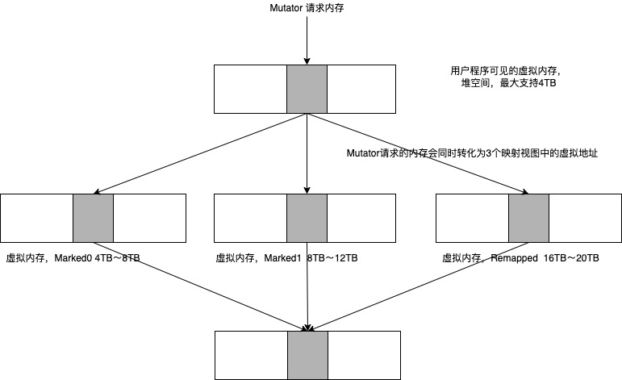
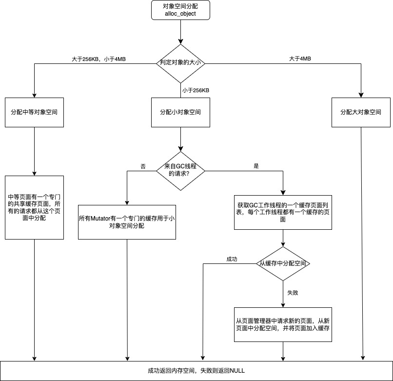
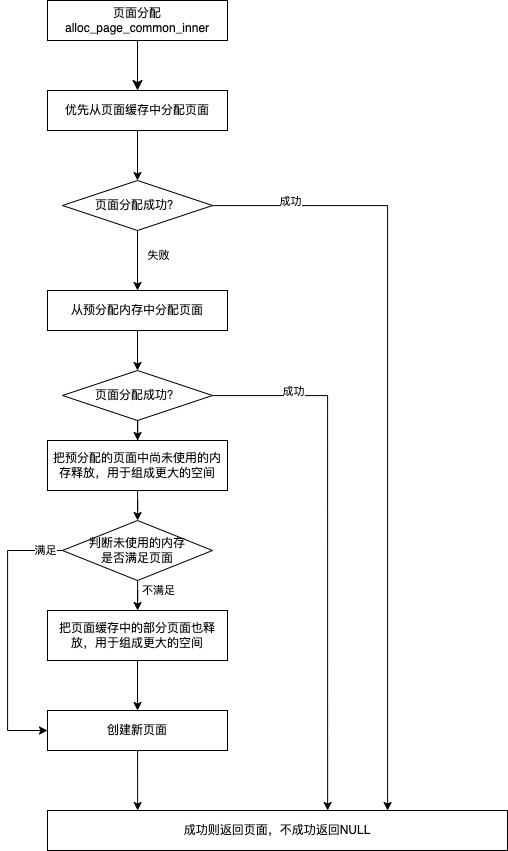

# ZGC 内存管理

<!-- TOC -->

- [ZGC 内存管理](#zgc-内存管理)
    - [ZGC 内存管理](#zgc-内存管理)
        - [页面设计](#页面设计)
    - [ZGC对象分配管理](#zgc对象分配管理)
        - [对象空间分配](#对象空间分配)
        - [页面分配](#页面分配)
    - [参考文献](#参考文献)

<!-- /TOC -->

对象的分配直接关系到内存的使用效率、垃圾回收的效率，不同的分配策略也会影响对象的分配速度，从而影响应用程序的运行。
ZGC为了支持太字节（TB)级内存，设计了基于页面（page)的分页管理（类似于G1的分区Region);为了能够快速地进行并发标记和并发移动，对内存空间重新进行了划分，这就是ZGC中新引入的Color Pointers;同时ZGC为了能更加高效地管理内存，设计了物理内存和虚拟内存两级内存管理。


## ZGC 内存管理
ZGC为了能高效、灵活地管理内存，实现了两级内存管理：虚拟内存和物理内存，并且实现了物理内存和虚拟内存的映射关系。这和操作系统中虚拟地址和物理地址设计思路基本一致。ZGC主要的改进点就是重新定义了虚拟内存和物理内存的映射关系。

我们先从一个问题出发。我们知道ZGC目前**仅支持64位Linux,最多管理4TB**的内存。但是我们知道，64位系统支持的内存远超过4TB,那么为什么我们一直强调它只能支持4TB的内存，为什么不使用更多的虚拟内存？

```

+--------------------------------+ 0x00007FFFFFFFFFFF (127TB)
-                                -
-                                -
-                                -
+--------------------------------+ 0x0000140000000000 (20TB)
| Remapped View                  |
+--------------------------------+ 0x0000100000000000 (16TB)
| (Reserved, but unused)         |
+--------------------------------+ 0x00000c0000000000 (12TB)
| Marked1 View                   |
+--------------------------------+ 0x0000080000000000 (8TB)
| Marked0 View                   |
+--------------------------------+ 0x0000040000000000 (4TB)

+--------------------------------+ 0x0000000000000000 

```

上面的示意图中提到了3个视图，分别是Marked0、Marked1和Remapped,这3个视图会映射到操作系统的同一物理地址。这就是ZGC中Color Pointers的概念，通过Color Pointers来区别不同的虚拟视图。
在ZGC中常见的几个虚拟空间有[0 ~ 4TB)、[4TB ~ 8TB)、[8TB ~ 12TB)和[16TB ~ 20TB)。其中[0 ~ 4TB)对应的是Java的堆空间；[4TB ~ 8TB)、[8TB ~ 12TB)和[16TB ~ 20TB)分别对应Marked0、Marked1和Remapped这3个视图。 这三个视图的关系，如下所示。



- 4TB是理论上最大的堆空间，其大小受限于JVM参数。
- 0 ~ 4TB的虚拟地址是ZGC提供给应用程序使用的虚拟空间，它并不会映射正的物理地址。
- 操作系统管理的虚拟内存为Marked0、Marked1和Remapped这3个空间，且对应同一物理空间。
- 在ZGC中这3个空间在同一时间点有且仅有一个空间有效。为什么这么设计就是ZGC的高明之处，利用虚拟空间换时间；
- 应用程序可见并使用的虚拟地址为0 ~ 4TB,经ZGC转化，真正使用的虚址为[4TB ~ 8TB)、[8TB ~ 12TB)和[16TB ~ 20TB),操作系统管理的虚拟也是[4TB ~ 8TB)、[8TB ~ 12TB)和[16TB ~ 20TB)。应用程序可见的虚拟[0 ~ 4TB)和物理内存直接的关联由ZGC来管理。

ZGC支持64位系统，我们看一下ZGC是如何使用64位地址的。ZGC中低42位（第0 ~ 41位）用于描述真正的虚拟地址（这就是图2-2中提到的应用程序可以使用的堆空间）,接着的4位（第42 ~ 45位）用于描述元数据，其实就是大家所说的Color Pointers,还有1位（第46位）目前暂时没有使用，最高17位（第47 ~ 63位）固定为0,具体如下所示。

```
 6                 4 4 4  4 4                                             0
 3                 7 6 5  2 1                                             0
+-------------------+-+----+-----------------------------------------------+
|00000000 00000000 0|0|1111|11 11111111 11111111 11111111 11111111 11111111|
+-------------------+-+----+-----------------------------------------------+
|                   | |    |
|                   | |    * 41-0 Object Offset (42-bits, 4TB address space)
|                   | |
|                   | * 45-42 Metadata Bits (4-bits)  0001 = Marked0
|                   |                                 0010 = Marked1
|                   |                                 0100 = Remapped
|                   |                                 1000 = Finalizable
|                   |
|                   * 46-46 Unused (1-bit, always zero)
|
* 63-47 Fixed (17-bits, always zero)
```
由于42位地址最大的寻址空间就是4TB,这就是ZGC一直宣称自己最大支持4TB内存的原因。这里还有视图的概念，Marked0、Marked1和Remapped就是3个视图，分别将第42、43、44位设置为1,就表示采用对应的视图。在ZGC中，这4位标记位的目的并不是用于地址寻址的，而是为了区分Marked0、Marked1和Remapped这3个视图。当然对于操作系统来说，这4位标记位代表了不同的虚拟地址空间，操作系统在寻址的时候会把标记位和虚拟地址结合使用。


### 页面设计

为了细粒度地控制内存的分配，和G1一样，ZGC将内存划分成小的分区，在ZGC中称为页面（page)。ZGC支持3种页面，分别为小页面、中页面和大页面。其中小页面指的是2MB的页面空间，中页面指32MB的页面空间，大页面指受操作系统控制的大页。

那操作系统所支持的大页是什么呢？

标准大页（huge page)是Linux Kemel2.6引入的，目的是通过使用大页内存来取代传统的4KB内存页面，以适应越来越大的系统内存，让操作系统可以支持现代硬件架构的大页面容量功能。它有两种大小：2MB和1GB。2MB页块大小适合用于G字节级的内存，1GB页块大小适合用于T字节级别的内存；2MB是默认的大页尺寸。在ZGC中还支持透明大页（Transparent Huge Pages,THP),这是RHEL6开始引入的一个功能，在Linux6上THP是默认启用的。由于设置大页比较麻烦，很难手动管理，而且通常需要对代码进行重大的更改才能有效地使用，因此RHEL6中开始引入了THP,它是一个抽象层，能够自动创建、管理和使用传统大页。

在ZGC中，不同对象的大小会使用不同的页面类型。下面的表格中列出了ZGC页面大小对象大小和对象对齐数据。
MinObjectAlignmentlnBytes的默认值是8,它由参数ObjectAlignmentIn-Bytes控制，大小在8 ~ 256之间，且为2的寡次。对象对齐的粒度影响的是对象的分配和访问速度以及内存空间的浪费，通常来说，粒度越大，处理器访问内存的速度越快，但可能导致过多的浪费。在实际中可以根据应用系统对象的平均大小来合理地设置该值。

|类型|  页面大小   | 页面内对象的大小  | 页面内对象对齐的粒度
|  --  |  ----  | ----  | ----  |
|  小页面 | 2MB |  小于等于256KB |  MinObjectAlignmentInBytes |  
|  中页面 | 32MB|  在256KB和4MB之间|  4KB |  
|  大页面 |  X*MB,受操作系统控制 |  大于4MB |  2MB |  

## ZGC对象分配管理

### 对象空间分配



这里稍微做一下解释：
- 分配小对象时，会判断对象的请求来自哪里。如果来自于应用线程，所有的应用线程根据所在的CPU从共享的页面中分配对象空间。如果请求来自工作线程，则每个工作线程都有一个缓存的页面，优先从缓存的页面分配，不成功则分配新的页面。这样设计的主要目的在于使工作线程分配对象只发生在对象的并发转移中，多个缓存能加快对象的转移。
- 分配中等对象的时候，所有的中等对象都共享一个中等页面，也就是说该函数会被并发访问（可能是工作线程和应用程序线程并发执行，也有可能是多个应用程序线程之间并发执行）,所以涉及竞争，需要额外的处理。ZGC中是先分配页面空间，再尝试设置新页面为共享页面，在设置过程中需要原子操作（通常在一个循环中处理）,如果不能成功设置，说明有多个线程并发执行，且有其他的线程已经成功申请到新的页面，此时要释放多申请的页面。从这里可以看出，如果应用程序中含有大量中等对象，ZGC在空间分配时很容易发生页面申请竞争，导致性能下降。
- 对于大对象来说，ZGC不会在一个大页面中共享多个大对象，也就是说每个大对象都独占一个大页面，当然大页面的大小可能不相同（主要取决于对象的大小）。
- 还有一点，在上述的流程图中并没有体现，在ZGC中有一个参数ZStallOnOut-OfMemory,用于控制当发生OOM时终止程序还是等待垃圾回收器回收空间后继续运行。该参数在页面分配时使用，


### 页面分配




## 参考文献

- 《新一代垃圾回收器-ZGC设计与实现》-- 彭成寒
