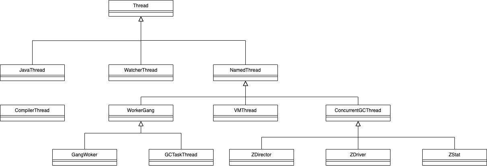
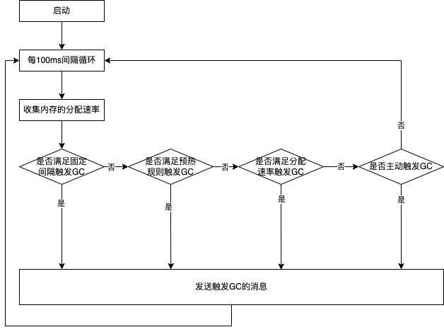
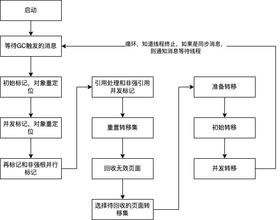

# ZGC 线程

<!-- TOC -->

- [ZGC 线程](#zgc-线程)
    - [控制线程](#控制线程)
        - [时钟触发器 -- ZDirector 的触发流程](#时钟触发器----zdirector-的触发流程)
        - [时钟触发器 -- ZStat的统计流程](#时钟触发器----zstat的统计流程)
        - [消息触发 -- ZDriver](#消息触发----zdriver)
        - [VMThread（TODO）](#vmthreadtodo)
    - [工作线程 （TODO）](#工作线程-todo)
    - [垃圾回收触发的时机](#垃圾回收触发的时机)
        - [1. 基于固定时间间隔触发](#1-基于固定时间间隔触发)
        - [2. 预热规则触发](#2-预热规则触发)
        - [3. 根据分配速率](#3-根据分配速率)
        - [4. 主动触发](#4-主动触发)
        - [5. 阻塞内存分配请求触发](#5-阻塞内存分配请求触发)
        - [6. 外部触发](#6-外部触发)
        - [7. 元数据分配触发](#7-元数据分配触发)

<!-- /TOC -->

**ZGC 中涉及到了下面几类线程**

- JavaThread:要执行的Java代码的线程，比如一个Java代码启动后会变成一个JavaThread运行；对于Java代码的启动线程，通过JNI_CreateJavaVM来创建一个JavaThread,而对于一般的Java线程，都是调用java.lang.thread里面的start方法，这个方法通过JNI调用创建JavaThread对象，完成真正的线程创建。
- CompilerThread:执行JIT的线程。
- NameThread:是JVM内部使用的线程。
- VMThread:JVM执行垃圾回收的同步线程，是JVM最关键的线程之一，主要的用途之一是处理垃圾回收。简单地说，所有的垃圾回收操作都是从VMThread触发的，如果是多线程回收，则启动多个线程，如果是单线程回收，则使用VMThread进行。VMThread提供了一个队列（queue),任何要执行垃圾回收的操作都实现了VM_GC_Operation,在JavaThread中执行VMThread:execute(VM_GC_Operation)把垃圾回收操作放入队列中，然后在VMThread的run方法中轮询这个队列就可以了。当这个队列有内容时，它就开始尝试进入安全点，然后执行相应的垃圾回收任务，完成垃圾回收任务后会退出安全点。
- ConcurrentGCThread:并发执行垃圾回收任务的线程，控制线程ZDirector、ZDriver和ZStat都继承于该线程，实现并发执行。
- Gang Worker:工作线程，在ZGC中ZWorkers就包含了多个GangWorker,这个线程是并行执行的（个数一般和CPU个数相关）,所以可以认为这是一个线程池。线程池里面的线程用于执行任务（如执行ZMarkRootsTask、ZMarkTask等任务）,进行垃圾回收。

## 控制线程

- ZDirector：控制什么时候启动垃圾回收
- ZDriver：控制垃圾回收执行的步骤，ZGC垃圾回收一共分10步，串行执行。
- ZStat：收集JVM在运行过程中回收垃圾时各个阶段的数据，同时控制统计信息的输出。

### 时钟触发器 -- ZDirector 的触发流程
ZDirector 和 ZStat 都是通过时钟触发器来判断是否执行业务。

ZDirector 提供了4种触发垃圾回收的方法，分别是基于固定时间间隔，预热规则，分配速率和主动触发规则。ZDirector依次按照优先级由高到低判断4种规则是否满足。

ZDirector 虽然代码实现为并发线程，但在ZGC中只有一个，所ZDirector不会出现并发的问题。

### 时钟触发器 -- ZStat的统计流程

统计线程ZStat为每1s收集信息一次。但是在输出时统计线程会把收集到的数据进行聚合，目前提供了3种粒度的统计数据，分别为过去10s,过去10min和过去10h的统计数据。这3个粒度的数据可以定义为：统计线程最近10次运行的数据，60个过去10s的数据和60个过去10min的数据，所以实际需要存储的只有130个数据。

### 消息触发 -- ZDriver

在进行消息处理时，ZGC设计了两种消息处理方式：同步垃圾回收和异步垃圾回收。同步垃圾回收主要是保证垃圾回收一定会发生，并且直到垃圾回收完成才会继续执行；异步垃圾回收则是为了实现更高的吞吐量，如果有多个异步消息在同一垃圾回收周期到达，则只有一个请求被处理，即垃圾回收只会执行一次。

ZGC中触发垃圾回收的只要是由ZDirector产生的异步消息。

### VMThread（TODO）

## 工作线程 （TODO）

## 垃圾回收触发的时机

ZGC中，为了实现更高的性能，尽量避免进行同步垃圾回收，也就是说尽量避免发同步垃圾回收的消息。ZGC中触发同步消息的场景也比较少，总体以触发异步消息为主。异步消息主要由ZDirector根据规则判断是否可以触发，在ZDirector流程图中介绍了ZDirector有4种触发规则，主要介绍这4种规则是如何触发的，最后还会简要介绍其他的垃圾回收消息是如何触发的。

### 1.基于固定时间间隔触发

ZDirector提供的第一个规则就是基于固定时间间隔触发垃圾回收。这个规则的目的非常简单，就是希望ZGC的垃圾回收器以固定的频率触发。在这一些场景中非常有用,例如我们的应用程序在晚上请求量比较低的情况下运行了很长时间，但是ZGC不满足其他垃圾回收器的触发条件，所以一直不会触发垃圾回收，这通常没什么问题，如果在早上某一个时间点开始请求暴增，这可能导致内存使用也暴增，而垃圾回收器来不及回收垃圾对象，将降低应用系统的吞吐量。所以ZGC提供了基于固定时间间隔触发垃圾回收的规则。

这个规则的实现也非常简单，就是判断前一次垃圾回收结束到当前时间是否超过时间间隔的罔值，如果超过，则触发垃圾回收，如果不满足，则直接返回。
需要说明的是，时间间隔由一个参数ZCollectionInterval来控制，这个参数的默认值为0,表示不需要触发垃圾回收。
实际工作中，可以根据场景设置该参数。

### 2.预热规则触发
ZDirector提供的第二个规则是预热启动垃圾回收。为什么设计这一规则？设计这一规则的目的是当JVM刚启动时，还没有足够的数据来主动触发垃圾回收的启动，所以设置了预热规则。
预热规则指的是JVM启动后，当发现堆空间使用率达到10%、20%和30%时，主动地触发垃圾回收。ZGC设计前3次垃圾回收可由预热规则触发，也就是说当垃圾回收触发（无论是由预热规则，还是主动触发垃圾回收）的次数超过3次时，预执规再生效。

### 3.根据分配速率

ZDirector提供的第二个规则是根据分配速率来判断是否能触发垃圾回收。

**设计规则TODO**

### 4. 主动触发

ZDirector提供的第四个规则是主动触发规则，该规则是为了应用程序在吞吐量下降的情况下，当满足一定条件时，还可以执行垃圾回收。这里满足一定条件指的是：
- 1)从上一次垃圾回收完成到当前时间，应用程序新增使用的内存达到堆空间的10%。
- 2)从上一次垃圾回收完成到当前时间已经过去了5min,记为timeelapsed。

如果这两个条件同时满足，预测垃圾回收时间为timegc,定义规则：如果 numgc * timegc < timeelapsed,则触发垃圾回收。其中numgc是ZGC设计的常量，假设应用程序的吞吐率从50%下降到1%,需要触发一次垃圾回收。
这个规则实际上是为了弥补程序吞吐率骤降且长时间不执行垃圾回收而引入的。有一个诊断参数 ZProactive来控制是否开启和关闭主动规则，默认值是true,即默认打开主动触发规则。
实际上这个规则和第一个规则（基于固定时间间隔规则）在某些场景中有一定的重复，第一个规则只强调时间间隔，本规则除了考虑时间之外，还会考虑内存的增长和吞吐率下降的快慢程度。

### 5.阻塞内存分配请求触发

阻塞内存分配由参数ZStallOnOutOfMemory控制，当参数ZStallOnOutOfMemory为true时进行阻塞分配，如果不能成功分配内存，则触发阻塞内存分配。

### 6.外部触发
外部触发是指在Java代码中显式地调用System.gc()函数，在JVM执行该函数时，会触发垃圾回收。该触发请求是从用户代码主动触发的，从编程角度来看，说明程序员认为此时需要进行垃圾回收（当然首先是程序员正确使用System.gc()函数）,所以ZGC把该触发规则设计为同步请求，只有在执行完垃圾回收后，才能进行后续代码的执行。

### 7.元数据分配触发
元数据分配失败时，ZGC会尝试进行垃圾回收以确保元数据能正确分配。
异步垃圾回收后会尝试是否可以分配元数据对象空间，如果不能，将尝试进行同步垃圾回后可以分配元数据对象空间，如果还不成功，则尝试扩展元数据空间，再分配成功则返回内存空间，不成功则返回NULL。

